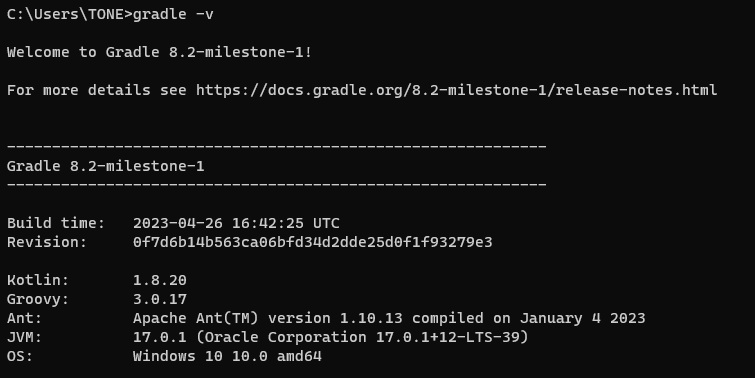

# Gradle安装

Gradle官网：https://gradle.org/

Gradle官方下载安装教程页面：https://gradle.org/install/

Gradle官方用户手册：https://docs.gradle.org/current/userguide/userguide.html

下载地址：http://services.gradle.org/distributions/

1. 下载你所需要的版本，本文以 gradle-8.2-milestone-1-all.zip 为例
2. 下载后解压，设置环境变量 GRADLE_HOME，GRADLE_USER_HOME

~~~
特别注意：这里我们接着再配置一GRALE_USER_HOME环境变量:GRALE_USER_HOME相当于配置Gradle本地仓库位置和GradleWrapper缓存目录。
GRALE_USER_HOME 名字固定切勿修改，此处和maven 仓库是一个地址；(根据自己本地情况而定)
~~~
3. 之后在Path变量中配置bin路径：

4. 最后通过cmd查看

## 修改maven 下载源

Gradle自带的Maven源地址是国外的，该Maven源在国内的访问速度是很慢的，除非使用了特别的手段。一般情况下，
我们建议使用国内的第三方开放的Maven源或企业内部自建Maven源。

认识init.d文件夹

我们可以在gradle的init.d目录下创建以.gradle结尾的文件，.gradle文件可以实现在build开始之前执行，所以你可以在这个文件配置一些你想预先加载的操作。

allprojects :针对所有的功能
repositories ：下载项目指定jar包
buildscript：构建脚本使用

按照顺序去下载：

mavenLocal 配置下面到maven 本地仓库需要配置M2_HOME

在init.d文件夹创建init.gradle文件
~~~
allprojects {
    repositories {
        mavenLocal()
        maven { name "Alibaba" ; url "https://maven.aliyun.com/repository/public/" } 
        mavenCentral()
    }
    
    buildscript {
        repositories {
            maven { name "Alibaba" ; url 'https://maven.aliyun.com/repository/public/' } 
            maven { name "M2" ; url 'https://plugins.gradle.org/m2/' }
        }
    }
}
~~~

### 拓展 1 ：启用init.gradle文件的方法有：

1. 在命令行指定文件,例如：gradle --init-script yourdir/init.gradle -q taskName。你可以多次输入此命令来指定多个init文件
2. 把init.gradle文件放USER_HOME/.gradle/ 目录下
3. 把以.gradle结尾的文件放到 USER_HOME/.gradle/init.d/ 目录下
4. 把以.gradle结尾的文件放到 GRADLE_HOME/init.d/ 目录下

如果存在上面的4种方式的2种以上，gradle会按上面的1-4序号依次执行这些文件，如果给定目录下存在多个init脚本，会按拼音a-z顺序执行这些脚本，每个init脚本都存在一个对应的gradle实例,你在这个文件中调用的所有方法和属性，都会委托给这个gradle实例，每个init脚本都实现了Script接口。

### 拓展 2 ：仓库地址说明

mavenLocal():
指定使用maven本地仓库，而本地仓库在配置maven时settings文件指定的仓库位置。如E:/repository，gradle
查找jar包顺序如下：USER_HOME/.m2/settings.xml >>
M2_HOME/conf/settings.xml >>
USER_HOME/.m2/repository

maven { url 地址}，指定maven仓库，一般用私有仓库地址或其它的第三方库【比如阿里镜像仓库地址】。
mavenCentral()：这是Maven的中央仓库，无需配置，直接声明就可以使用。
jcenter():JCenter中央仓库，实际也是是用的maven搭建的，但相比Maven仓库更友好，通过CDN分发，并且支持https访问,在新版本中已经废弃了，替换为了mavenCentral()。

gradle可以通过指定仓库地址为本地maven仓库地址和远程仓库地址相结合的方式，避免每次都会去远程仓库下载依赖库。这种方式也有一定的问题，如果本地maven仓库有这个依赖，就会从直接加载本地依赖，如果本地仓库没有该依赖，那么还是会从远程下载。但是下载的jar不是存储在本地maven仓库中，而是放在自己的缓存目录中，默认在USER_HOME/.gradle/caches目录,当然如果我们配置过GRADLE_USER_HOME环境变量，则会放在GRADLE_USER_HOME/caches目录,那么可不可以将gradle caches指向maven repository。这是不行的，caches下载文件不是按照maven仓库中存放的方式。

### 拓展 3 ：阿里云仓库地址请参考：https://developer.aliyun.com/mvn/guide
