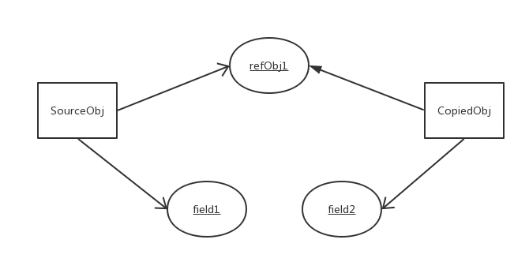

# 深拷贝和浅拷贝

Java中的对象拷贝(Object Copy)指的是将一个对象的所有属性（成员变量）
拷贝到另一个有着相同类类型的对象中去。
开发过程中，拷贝对象是很常见的，
主要是为了在新的上下文环境中复用现有对象的部分或全部数据。

比如说对象 s1 和对象 s2 ，二者都是 S 的对象，具有成员变量 a 和 b ，
现在对对象 s1 进行拷贝赋值给 s2 ，也就是 s2.a = sz.a; s2.b = s1.b 
这时再去改变 s2 的属性 a 或者 b 时，可能会遇到问题：假设 a 是基础数据类型，b 是引用类型。
当改变 s2.a 的值时，没有问题，当改变 s2.b 的值时，同时也会改变 s1.b 的值，
因为其实上面的例子中只是把 s1.b 赋值给了 s2.b，因为是 b 引用类型的，
所以它们是指向同一个地址的。这可能就会给我们使用埋下隐患。

Java 中的数据类型分为基本数据类型和引用数据类型。
对于这两种数据类型，在进行赋值操作、用作方法参数或返回值时，
会有值传递和引用（地址）传递的差别。

Java中的对象拷贝主要分为：浅拷贝(Shallow Copy)、深拷贝(Deep Copy)。

## 浅拷贝（Shallow Copy）：

1. 对于数据类型是基本数据类型的成员变量，浅拷贝会直接进行值传递，
也就是将该属性值复制一份给新的对象。因为是两份不同的数据，
所以对其中一个对象的该成员变量值进行修改，不会影响另一个对象拷贝得到的数据。

2. 对于数据类型是引用数据类型的成员变量，比如说成员变量是某个数组、某个类的对象等，
那么浅拷贝会进行引用传递，也就是只是将该成员变量的引用值（内存地址）复制一份给新的对象。
因为实际上两个对象的该成员变量都指向同一个实例。
在这种情况下，在一个对象中修改该成员变量会影响到另一个对象的该成员变量值。

具体模型如图所示：可以看到基本数据类型的成员变量，对其值创建了新的拷贝。
而引用数据类型的成员变量的实例仍然是只有一份，两个对象的该成员变量都指向同一个实例。

