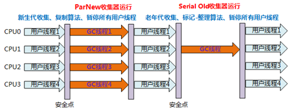
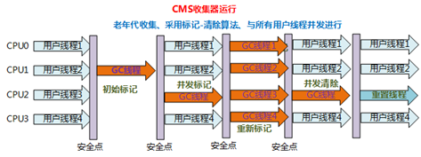

#垃圾收集器 
Java 堆内存被划分为新生代和年老代两部分，
新生代主要使用复制和标记-清除垃圾回收算法；
年老代主要使用标记-整理垃圾回收算法，
因此 java 虚拟中针对新生代和年老代分别提供了多种不同的垃圾收集器，
JDK7/8后，HotSpot虚拟机所有收集器及组合（连线），如下图：

  

### 
Serial 垃圾收集器（单线程、复制算法）

Serial（英文连续）是最基本垃圾收集器，使用复制算法，
曾经是JDK1.3.1 之前新生代唯一的垃圾收集器。
Serial 是一个单线程的收集器，它不但只会使用一个 CPU 或一条线程去完成垃圾收集工
作，并且在进行垃圾收集的同时，必须暂停其他所有的工作线程，直到垃圾收集结束。
Serial 垃圾收集器虽然在收集垃圾过程中需要暂停所有其他的工作线程，
但是它简单高效，对于限定单个 CPU 环境来说，没有线程交互的开销，
可以获得最高的单线程垃圾收集效率，
因此 Serial垃圾收集器依然是 java 虚拟机运行在 Client 模式下默认的新生代垃圾收集器。

Serial/Serial Old组合收集器运行示意图如下：

  

### 
ParNew 垃圾收集器（Serial+多线程）

ParNew 垃圾收集器其实是 Serial 收集器的多线程版本，也使用复制算法，
除了使用多线程进行垃圾收集之外，其余的行为和 Serial 收集器完全一样，
ParNew 垃圾收集器在垃圾收集过程中同样也要暂停所有其他的工作线程。
ParNew 收集器默认开启和 CPU 数目相同的线程数，
可以通过-XX:ParallelGCThreads 参数来限制垃圾收集器的线程数。【Parallel：平行的】
ParNew虽然是除了多线程外和Serial 收集器几乎完全一样，
但是ParNew垃圾收集器是很多 java虚拟机运行在 Server 模式下新生代的默认垃圾收集器。

ParNew/Serial Old组合收集器运行示意图如下：

  

### 
Parallel Scavenge 收集器（多线程复制算法、高效）

Parallel Scavenge 收集器也是一个新生代垃圾收集器，同样使用复制算法，
也是一个多线程的垃圾收集器，它重点关注的是程序达到一个可控制的吞吐量
（Thoughput，CPU 用于运行用户代码的时间/CPU 总消耗时间，
即吞吐量=运行用户代码时间/(运行用户代码时间+垃圾收集时间)），
高吞吐量可以最高效率地利用 CPU 时间，尽快地完成程序的运算任务，
主要适用于在后台运算而不需要太多交互的任务。
自适应调节策略也是 ParallelScavenge 收集器与 ParNew 收集器的一个重要区别。

### 
Serial Old 收集器（单线程标记整理算法 ）

Serial Old 是 Serial 垃圾收集器年老代版本，
它同样是个单线程的收集器，使用标记-整理算法，
这个收集器也主要是运行在 Client 默认的 java 虚拟机默认的年老代垃圾收集器。 
在 Server 模式下，主要有两个用途：
1. 在 JDK1.5 之前版本中与新生代的 Parallel Scavenge 收集器搭配使用。
2. 作为年老代中使用 CMS 收集器的后备垃圾收集方案。

新生代 Serial 与年老代 Serial Old 搭配垃圾收集过程图：

  

### 
Parallel Old 收集器（多线程标记整理算法）

Parallel Old 收集器是Parallel Scavenge的年老代版本，
使用多线程的标记-整理算法，在 JDK1.6才开始提供。在 JDK1.6 之前，
新生代使用 ParallelScavenge 收集器只能搭配年老代的 Serial Old 收集器，
只能保证新生代的吞吐量优先，
无法保证整体的吞吐量，Parallel Old 正是为了在年老代同样提供吞
吐量优先的垃圾收集器，如果系统对吞吐量要求比较高，
可以优先考虑新生代 Parallel Scavenge和年老代 Parallel Old 收集器的搭配策略。

新生代 Parallel Scavenge 和年老代 Parallel Old 收集器搭配运行过程图：

  

### 
CMS 收集器（多线程标记清除算法）

Concurrent mark sweep(CMS)收集器是一种年老代垃圾收集器，其最主要目标是获取最短垃圾
回收停顿时间，和其他年老代使用标记-整理算法不同，它使用多线程的标记-清除算法。
最短的垃圾收集停顿时间可以为交互比较高的程序提高用户体验。
CMS 工作机制相比其他的垃圾收集器来说更复杂，整个过程分为以下 4 个阶段：

1. 初始标记
    - 只是标记一下 GC Roots 能直接关联的对象，速度很快，仍然需要暂停所有的工作线程。
2. 并发标记
    - 进行 GC Roots 跟踪的过程，和用户线程一起工作，不需要暂停工作线程。
3. 重新标记
    - 为了修正在并发标记期间，
    因用户程序继续运行而导致标记产生变动的那一部分对象的标记记录，
    仍然需要暂停所有的工作线程。
4. 并发清除
    - 清除 GC Roots 不可达对象，和用户线程一起工作，不需要暂停工作线程。
    由于耗时最长的并发标记和并发清除过程中，
    垃圾收集线程可以和用户现在一起并发工作，
    所以总体上来看CMS 收集器的内存回收和用户线程是一起并发地执行。

CMS 收集器运行示意图如下：

  

### 
G1 收集器

Garbage first 垃圾收集器是目前垃圾收集器理论发展的最前沿成果，
相比与 CMS 收集器，G1 收集器两个最突出的改进是：
1. 基于标记-整理算法，不产生内存碎片。
2. 可以非常精确控制停顿时间，在不牺牲吞吐量前提下，实现低停顿垃圾回收。

G1 收集器避免全区域垃圾收集，它把堆内存划分为大小固定的几个独立区域，
并且跟踪这些区域的垃圾收集进度，同时在后台维护一个优先级列表，
每次根据所允许的收集时间，优先回收垃圾最多的区域。
区域划分和优先级区域回收机制，确保 G1 收集器可以在有限时间获得最高的垃圾收集效率。

G1 收集器运行示意图如下：

  

