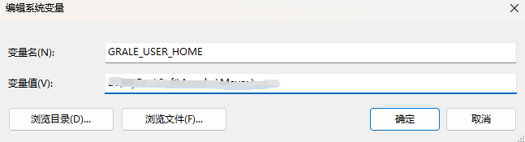
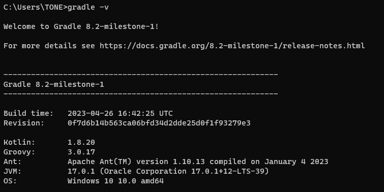

# Gradle 
`Gradle`官网：https://gradle.org/

`Gradle`官方下载安装教程页面：https://gradle.org/install/

`Gradle`官方用户手册：https://docs.gradle.org/current/userguide/userguide.html

下载地址：http://services.gradle.org/distributions/

## Windows安装

下载你所需要的版本，本文以`gradle-8.2-milestone-1-all.zip`为例

下载后解压，设置环境变量`GRADLE_HOME，GRADLE_USER_HOME`

~~~
特别注意：这里我们接着再配置一GRALE_USER_HOME环境变量:GRALE_USER_HOME相当于配置Gradle本地仓库位置和GradleWrapper缓存目录。
GRALE_USER_HOME 名字固定切勿修改，此处和maven 仓库是一个地址；(根据自己本地情况而定)
~~~

之后在`Path`变量中配置`bin`路径：

最后通过`cmd`命令查看

## 修改`maven`下载源

`Gradle`自带的`Maven`源地址是国外的，该`Maven`源在国内的访问速度是很慢的，除非使用魔法。
一般情况下，建议使用国内的第三方开放的`Maven`源或企业内部自建`Maven`源(私有`Maven`库，例如：`Nexus`此类的)。

认识`init.d`文件夹

我们可以在`gradle`的`init.d`目录下创建以`.gradle`结尾的文件，`.gradle`文件可以实现在`build`开始之前执行，所以你可以在这个文件配置一些你想预先加载的操作。

`allprojects`：针对所有的功能
`repositories`：下载项目指定jar包
`buildscript`：构建脚本使用

按照顺序去下载：

`mavenLocal`配置下面到`maven`本地仓库需要配置`M2_HOME`

在`init.d`文件夹创建`init.gradle`文件
~~~
allprojects {
    repositories {
        mavenLocal()
        maven { name "Alibaba" ; url "https://maven.aliyun.com/repository/public/" } 
        mavenCentral()
    }
    
    buildscript {
        repositories {
            maven { name "Alibaba" ; url 'https://maven.aliyun.com/repository/public/' } 
            maven { name "M2" ; url 'https://plugins.gradle.org/m2/' }
        }
    }
}
~~~

### 拓展 1 ：启用`init.gradle`文件的方法有：

1. 在命令行指定文件,例如：`gradle --init-script yourDir/init.gradle -q taskName`。你可以多次输入此命令来指定多个`init`文件
2. 把`init.gradle`文件放`USER_HOME/.gradle/`目录下
3. 把以`.gradle`结尾的文件放到`USER_HOME/.gradle/init.d/`目录下
4. 把以`.gradle`结尾的文件放到`GRADLE_HOME/init.d/`目录下

如果存在上面的`4`种方式的`2`种以上，`gradle`会按上面的`1-4`序号依次执行这些文件，
如果给定目录下存在多个`init`脚本，会按拼音`a-z`顺序执行这些脚本，每个`init`脚本都存在一个对应的`gradle`实例，
你在这个文件中调用的所有方法和属性，都会委托给这个`gradle`实例，每个`init`脚本都实现了`Script`接口。

### 拓展 2 ：仓库地址说明

`mavenLocal()`：
指定使用`maven`本地仓库，而本地仓库在配置`maven`时`settings`文件指定的仓库位置。如`E:/repository`，
`gradle`查找`jar`包顺序如下：
`USER_HOME/.m2/settings.xml` >> `M2_HOME/conf/settings.xml` >> `USER_HOME/.m2/repository`

`maven`{`url`地址}，指定`maven`仓库，一般用私有仓库地址或其它的第三方库【比如阿里镜像仓库地址】。

`mavenCentral()`：这是`Maven`的中央仓库，无需配置，直接声明就可以使用。

`jcenter()`：`JCenter`中央仓库，实际也是是用的`maven`搭建的，但相比`Maven`仓库更友好，通过`CDN`分发，并且支持`https`访问,在新版本中已经废弃了，替换为了`mavenCentral()`。

`gradle`可以通过指定仓库地址为本地`maven`仓库地址和远程仓库地址相结合的方式，避免每次都会去远程仓库下载依赖库。
这种方式也有一定的问题，如果本地`maven`仓库有这个依赖，就会从直接加载本地依赖，如果本地仓库没有该依赖，那么还是会从远程下载。
但是下载的`jar`不是存储在本地`maven`仓库中，而是放在自己的缓存目录中，默认在`USER_HOME/.gradle/caches`目录，
当然如果我们配置过`GRADLE_USER_HOME`环境变量，则会放在`GRADLE_USER_HOME/caches`目录，
`gradle caches`不可以指向`maven repository`，`caches`下载文件不是按照`maven`仓库中存放的方式。

### 拓展 3 ：阿里云仓库地址请参考：https://developer.aliyun.com/mvn/guide
