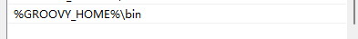
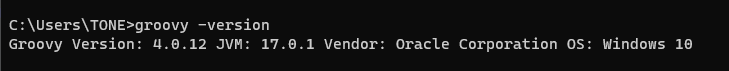

# Groovy

`Groovy`是一种基于`Java`平台的动态编程语言，它结合了`Python`、`Ruby`和`Smalltalk`等语言的特性。

- 语法：`Groovy`的语法与`Java`类似，但更加简洁和灵活。它支持静态类型和动态类型，并且可以直接在`Java`代码中使用。
- 数据类型：`Groovy`支持`Java`的所有数据类型，包括基本类型和引用类型。此外，`Groovy`还提供了一些额外的数据类型，如闭包（`Closure`）和元编程（`Metaprogramming`）。
- 字符串处理：`Groovy`提供了强大的字符串处理功能。它支持使用单引号或双引号定义字符串，并且可以使用美元符号`$`来插入变量或表达式。
- 集合操作：`Groovy`提供了丰富的集合操作方法，如遍历、过滤、映射等。它还支持使用闭包来对集合进行处理。
- 元编程：`Groovy`支持元编程，即在运行时修改和扩展代码。通过元编程，可以动态地添加方法、属性和注解等。
- 脚本语言：`Groovy`可以作为脚本语言使用，无需编译即可直接执行。它可以与`Java`代码无缝集成，并且可以使用`Java`的类库。
- 测试框架：`Groovy`提供了一个强大的测试框架，称为`Spock`。`Spock`使用`Groovy`的特性来编写简洁、可读性强的测试代码。

## <a id="hjpz">`Groovy`环境变量的配置</a>
- 下载`Groovy`，下载地址：https://groovy.apache.org/download.html
- 下载完毕后，将zip包解压到本地目录。
- 配置环境变量，点击此电脑鼠标右键，显示出属性，点击高级系统设置，配置`GROOVY_HOME`

- 之后在Path变量中配置`bin`路径：

- 验证`groovy`的环境变量是否配置成功，打开`cmd`，输入`groovy -version`

----
