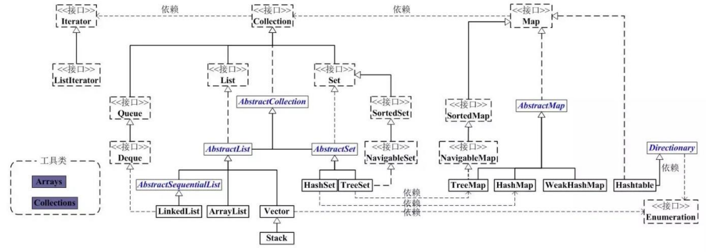
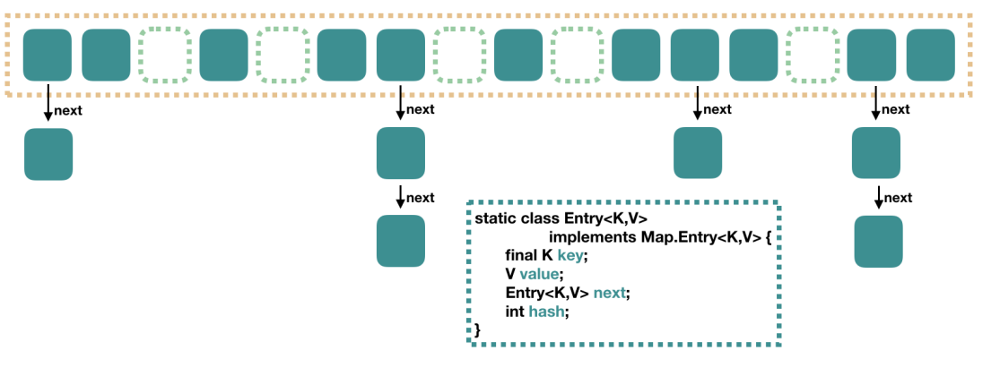
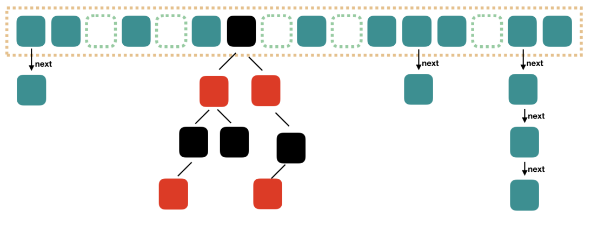
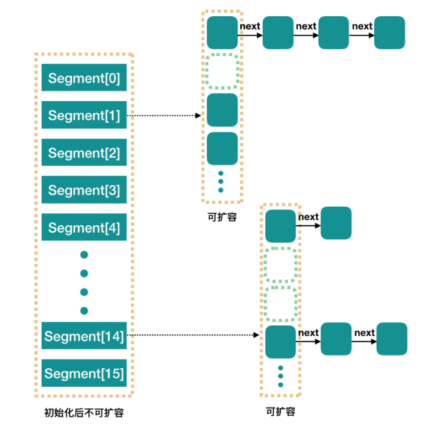
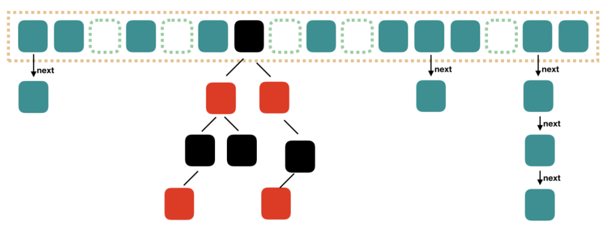

# 集合

集合类存放于 Java.util 包中，主要有 3 种：set(集)、list(列表包含 Queue)和 map(映射)。

1. Collection：Collection 是集合 List、Set、Queue 的最基本的接口。
2. Iterator：迭代器，可以通过迭代器遍历集合中的数据
3. Map：是映射表的基础接口

## <a id="jh_szdqb">`List`，`Set`，`Queue`，`Map`四者的区别？</a>

- `List`(对付顺序的好帮⼿): 存储的元素是有序的、可重复的。
  - `ArrayList`
    - `Object[]`数组
    - 排列有序，可以重复
    - 新增删除慢，`getter setter`快
    - 线程不安全
    - 扩容：容量*1.5+1
  - `Vector`
    - `Object[]`数组
    - 排列有序，可以重复
    - 新增删除慢
    - 线程安全，效率低
    - 扩容：容量*2
  - `LinkedList`
    - 双向链表(`JDK1.6`之前为循环链表，`JDK1.7`取消了循环)
    - 排列有序，可以重复
    - 新增删除快，查询慢
    - 线程不安全
- `Set`(注重独⼀⽆⼆的性质): 存储的元素是⽆序的、不可重复的。
  - `HashSet`(⽆序，唯⼀)
    - 基于`HashMap`实现的，底层采⽤`HashMap`来保存元素，`hash`表实现
    - 排列无序，不可以重复
    - 存取速度快
  - `LinkedHashSet`
    - `LinkedHashSet`是`HashSet`的⼦类，并且其内部是通过`LinkedHashMap`来实现的。
  - `TreeSet`(有序，唯⼀)
    - 内部是`TreeMap`的`SortedSet`实现，底层采⽤红⿊树(⾃平衡的排序⼆叉树)
    - 排列无序，不可以重复，排列存储
- `Queue`(实现排队功能的叫号机)：按特定的排队规则来确定先后顺序，存储的元素是有序的、可重复的。
  - `PriorityQueue`
    - `Object[]`数组来实现⼆叉堆
  - `ArrayQueue`
    - `Object[]`数组 + 双指针
- `Map`(⽤`key`来搜索的专家)
  - `HashMap`
    - `JDK1.8`之前`HashMap`由数组+链表组成的，数组是`HashMap`的主体，链表则
      是主要为了解决哈希冲突⽽存在的(“拉链法”解决冲突)。`JDK1.8`以后在解决哈希冲突时有了
      ᫾⼤的变化，当链表⻓度⼤于阈值(默认为 8)(将链表转换成红⿊树前会判断，如果当前数组
      的⻓度⼩于`64`，那么会选择先进⾏数组扩容，⽽不是转换为红⿊树)时，将链表转化为红⿊
      树，以减少搜索时间
    - `key`不可以重复，`value`可以重复，都可以为`null`
    - 线程不安全
    - `LinkedHashMap`
      - `LinkedHashMap`继承⾃`HashMap`，所以它的底层仍然是基于拉链式散列结构即由数组和链表或红⿊树组成。
        另外，`LinkedHashMap`在上⾯结构的基础上，增加了⼀条双向链表，使得上⾯的结构可以保持键值对的插⼊顺序，同时通过对链表进⾏相应的操作，实现了访问顺序相关逻辑。
  - `Hashtable`
    - 数组+链表组成的，数组是`Hashtable`的主体，链表则是主要为了解决哈希冲突而存在的
    - `key`不可以重复，`value`可以重复，都不可以为`null`
    - 线程安全
  - `TreeMap`
    - 红⿊树(⾃平衡的排序⼆叉树)
    - `key`不可以重复，`value`可以重复

## <a id="jh_hashmap">`HashMap`(数组+链表+红黑树)</a>

`HashMap`根据键的`hashCode`值存储数据，大多数情况下可以直接定位到它的值，因而具有很快的访问速度，但遍历顺序却是不确定的。

`HashMap`最多只允许一条记录的键为`null`，允许多条记录的值为`null`。

`HashMap`非线程安全，即任一时刻可以有多个线程同时写`HashMap`，可能会导致数据的不一致。

如果需要满足线程安全，可以用`Collections`的`synchronizedMap`方法使`HashMap`具有线程安全的能力，或者使用`ConcurrentHashMap`。

### `HashMap`1.8之前

大方向上，`HashMap`里面是一个数组，然后数组中每个元素是一个单向链表。
上图中，每个绿色的实体是嵌套类`Entry`的实例，`Entry`包含四个属性：`key`，`value`，`hash`值和用于单向链表的`next`。

1. `capacity`：当前数组容量，始终保持`2^n`，可以扩容，扩容后数组大小为当前的`2`倍。
2. `loadFactor`：负载因子，默认为`0.75`。
3. `threshold`：扩容的阈值，等于`capacity`*`loadFactor`

### `HashMap`1.8之后
`Java8`对`HashMap`进行了一些修改，最大的不同就是利用了红黑树，所以其由`数组+链表+红黑树`组成。

根据`HashMap`1.8之前的介绍，我们知道，查找的时候，根据`hash`值我们能够快速定位到数组的具体下标，但是之后的话，需要顺着链表一个个比较下去才能找到我们需要的，时间复杂度取决于链表的长度，为`O(n)`。

为了降低这部分的开销，在`Java8`中，当链表中的元素超过了`8`个以后，会将链表转换为红黑树，在这些位置进行查找的时候可以降低时间复杂度为`O(logN)`。

### <a id="fzyz">负载因子为什么是`0.75`？</a>
`HashMap`的加载因子(`load factor`，直译为加载因子，意译为负载因子)是指哈希表中填充元素的个数与桶的数量的比值，当元素个数达到负载因子与桶的数量的乘积时，就需要进行扩容。

这个值一般选择`0.75`，是因为这个值可以在时间和空间成本之间做到一个折中，使得哈希表的性能达到较好的表现。

如果负载因子过大，填充因子较多，那么哈希表中的元素就会越来越多地聚集在少数的桶中，这就导致了冲突的增加，这些冲突会导致查找、插入和删除操作的效率下降。

同时，这也会导致需要更频繁地进行扩容，进一步降低了性能。

如果负载因子过小，那么桶的数量会很多，虽然可以减少冲突，但是在空间利用上面也会有浪费，因此选择`0.75`是为了取得一个平衡点，即在时间和空间成本之间取得一个比较好的平衡点。

总之，选择`0.75`这个值是为了在时间和空间成本之间达到一个较好的平衡点，既可以保证哈希表的性能表现，又能够充分利用空间。

## <a id="jh_concurrenthashmap">`ConcurrentHashMap`</a>
`ConcurrentHashMap`和`HashMap`思路是差不多的，但是因为它支持并发操作，所以要复杂一些。

### <a id="segment">`Segment`段</a>
整个`ConcurrentHashMap`由一个个`Segment`组成，`Segment`代表”部分“或”一段“的意思，所以很多地方都会将其描述为分段锁。

### 线程安全(`Segment`继承`ReentrantLock`加锁)
简单理解就是，`ConcurrentHashMap`是一个`Segment`数组，`Segment`通过继承`ReentrantLock`来进行加锁，
所以每次需要加锁的操作锁住的是一个`segment`，这样只要保证每个`Segment`是线程安全的，也就实现了全局的线程安全。

### 并行度(默认 16)
`concurrencyLevel`：并行级别、并发数、`Segment`数。默认是`16`，也就是说`ConcurrentHashMap`有`16`个`Segments`，
所以理论上，这个时候，最多可以同时支持`16`个线程并发写，只要它们的操作分别分布在不同的`Segment`上。
这个值可以在初始化的时候设置为其他值，但是一旦初始化以后，它是不可以扩容的。
再具体到每个`Segment`内部，其实每个`Segment`很像之前介绍的`HashMap`，不过它要保证线程安全，所以处理起来要麻烦些。

#### `Java8`对`ConcurrentHashMap`进行了比较大的改动,`Java8`也引入了红黑树。

### <a id="java8_before">`Java8`之前</a>

### <a id="java8_after">`Java8`之后</a>

----
