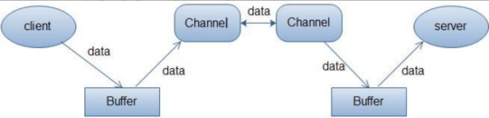

# `I/O`流

`I/O`即`Input/Output`，输⼊和输出。数据输⼊到计算机内存的过程即输⼊，反之输出到外部存储（⽐如数据库，⽂件，远程主机）的过程即输出。
数据传输过程类似于⽔流，因此称为`IO`流。`IO`流在`Java`中分为输⼊流和输出流，⽽根据数据的处理⽅式⼜分为字节流和字符流。
`Java IO`流的 40 多个类都是从如下 4 个抽象类基类中派⽣出来的。

- `InputStream`/`Reader`: 所有的输⼊流的基类，前者是字节输⼊流，后者是字符输⼊流。
- `OutputStream`/`Writer`: 所有输出流的基类，前者是字节输出流，后者是字符输出流。

## `I/O`流为什么要分为字节流和字符流呢?
问题本质想问：不管是⽂件读写还是⽹络发送接收，信息的最⼩存储单元都是字节，那为什么`I/O`流
操作要分为字节流操作和字符流操作呢？

主要有两点原因：
- 字符流是由`Java`虚拟机将字节转换得到的，这个过程还算是比较耗时
- 如果我们不知道编码类型的话，使⽤字节流的过程中很容易出现乱码问题

# <a id="io_mx">`I/O`的模型</a>

`UNIX`系统下，`IO`模型一共有 5 种：同步阻塞、同步非阻塞、多路复用、信号驱动和异步。

## 同步阻塞
最传统的一种`IO`模型，即在读写数据过程中会发生阻塞现象。
当用户线程发出`IO`请求之后，内核会去查看数据是否就绪，如果没有就绪就会等待数据就绪， 而用户线程就会处于阻塞状态，用户线程交出`CPU`。
当数据就绪之后，内核会将数据拷贝到用户线程，并返回结果给用户线程，用户线程才解除`block`状态。
典型的阻塞`IO`模型的例子为：`data = socket.read();`如果数据没有就绪，就会一直阻塞在`read`方法。

## 同步非阻塞
当用户线程发起一个`read`操作后，并不需要等待，而是马上就得到了一个结果。
如果结果是一个`error`时，它就知道数据还没有准备好，于是它可以再次发送`read`操作。
一旦内核中的数据准备好了，并且又再次收到了用户线程的请求，那么它马上就将数据拷贝到了用户线程，然后返回。
所以事实上，在非阻塞`IO`模型中，用户线程需要不断地询问内核数据是否就绪，也就说非阻塞`IO`不会交出`CPU`，而会一直占用`CPU`。

## 多路复用
多路复用`IO`模型是目前使用得比较多的模型。`Java NIO`实际上就是多路复用`IO`。
在多路复用`IO`模型中，会有一个线程不断去轮询多个`socket`的状态，只有当`socket`真正有读写事件时，才真正调用实际的`IO`读写操作。

因为在多路复用`IO`模型中，只需要使用一个线程就可以管理多个`socket`，系统不需要建立新的进程或者线程，
也不必维护这些线程和进程，并且只有在真正有`socket`读写事件进行时，才会使用`IO`资源，所以它大大减少了资源占用。

在`Java NIO`中，是通过`selector.select()`去查询每个通道是否有到达事件，如果没有事件，则一直阻塞在那里，因此这种方式会导致用户线程的阻塞。
多路复用`IO`模式，通过一个线程就可以管理多个`socket`，只有当`socket`真正有读写事件发生才会占用资源来进行实际的读写操作。
因此，多路复用`IO`比较适合连接数比较多的情况。

另外多路复用`IO`为何比非阻塞`IO`模型的效率高是因为在非阻塞`IO`中，不断地询问`socket`状态时通过用户线程去进行的，
而在多路复用`IO`中，轮询每个`socket`状态是内核在进行的，这个效率要比用户线程要高的多。

不过要注意的是，多路复用`IO`模型是通过轮询的方式来检测是否有事件到达，并且对到达的事件逐一进行响应。
因此对于多路复用`IO`模型来说，一旦事件响应体很大，那么就会导致后续的事件迟迟得不到处理，并且会影响新的事件轮询。

## 信号驱动
在信号驱动`IO`模型中，当用户线程发起一个`IO`请求操作，会给对应的`socket`注册一个信号函数，然后用户线程会继续执行，
当内核数据就绪时会发送一个信号给用户线程，用户线程接收到信号之后，便在信号函数中调用`IO`读写操作来进行实际的`IO`请求操作。

## 异步
异步`IO`模型才是最理想的`IO`模型，在异步`IO`模型中，当用户线程发起 read 操作之后，立刻就可以开始去做其它的事。
而另一方面，从内核的角度，当它受到一个`asynchronous read`之后，它会立刻返回，
说明`read`请求已经成功发起了，因此不会对用户线程产生任何`block`。

然后，内核会等待数据准备完成，然后将数据拷贝到用户线程，当这一切都完成之后，内核会给用户线程发送一个信号，告诉它`read`操作完成了。
也就说用户线程完全不需要实际的整个`IO`操作是如何进行的，只需要先发起一个请求，当接收内核返回的成功信号时表示`IO`操作已经完成，可以直接去使用数据了。

也就说在异步`IO`模型中，IO 操作的两个阶段都不会阻塞用户线程，这两个阶段都是由内核自动完
成，然后发送一个信号告知用户线程操作已完成。用户线程中不需要再次调用`IO`函数进行具体的
读写。这点是和信号驱动模型有所不同的，在信号驱动模型中，当用户线程接收到信号表示数据
已经就绪，然后需要用户线程调用`IO`函数进行实际的读写操作；而在异步`IO`模型中，收到信号
表示`IO`操作已经完成，不需要再在用户线程中调用`IO`函数进行实际的读写操作。

注意，异步`IO`是需要操作系统的底层支持，在`Java 7`中，提供了`Asynchronous IO`。

# <a id="bio_nio_aio">BIO、NIO、AIO</a>
## `BIO`
`BIO`属于同步阻塞`IO`模型。
在客户端连接数量不高的情况下，是没问题的。
但是，当面对十万甚至百万级连接的时候，传统的`BIO`模型是无能为力的。
因此，我们需要一种更高效的`I/O`处理模型来应对更高的并发量。

## `NIO`
`NIO`属于多路复用`IO`模型。
`NIO`主要有三大核心部分：`Channel`(通道)，`Buffer`(缓冲区), `Selector`(选择区)。
传统`IO`基于字节流和字符流进行操作，而`NIO`基于`Channel`(通道)和`Buffer`(缓冲区)进行操作，数据总是从通道读取到缓冲区中，或者从缓冲区写入到通道中。
`Selector`(选择区)用于监听多个通道的事件（比如：连接打开，数据到达）。
因此，单个线程可以监听多个数据通道。

`NIO`和传统`IO`之间第一个最大的区别是，`IO`是面向流的，`NIO`是面向缓冲区的。

### `NIO`的缓冲区
`IO`面向流意味着每次从流中读一个或多个字节，直至读取所有字节，它们没有被缓存在任何地方。
此外，它不能前后移动流中的数据。如果需要前后移动从流中读取的数据，需要先将它缓存到一个缓冲区。

`NIO`的缓冲导向方法不同。数据读取到一个它稍后处理的缓冲区，需要时可在缓冲区中前后移动。
这就增加了处理过程中的灵活性。但是，还需要检查是否该缓冲区中包含所有您需要处理的数据。
而且，需确保当更多的数据读入缓冲区时，不要覆盖缓冲区里尚未处理的数据。

### `NIO`的非阻塞
`IO`的各种流是阻塞的。
这意味着，当一个线程调用`read()`或`write()`时，该线程被阻塞，直到有一些数据被读取，或数据完全写入。该线程在此期间不能再干任何事情了。

`NIO`的非阻塞模式，使一个线程从某通道发送请求读取数据，但是它仅能得到目前可用的数据，如果目前没有数据可用时，就什么都不会获取。
而不是保持线程阻塞，所以直至数据变的可以读取之前，该线程可以继续做其他的事情。

非阻塞写也是如此。一个线程请求写入一些数据到某通道，但不需要等待它完全写入，这个线程同时可以去做别的事情。
线程通常将非阻塞`IO`的空闲时间用于在其它通道上执行`IO`操作，所以一个单独的线程现在可以管理多个输入和输出通道（`channel`）。

### `Channel`
`Channel`，大多翻译成`通道`。`Channel`和`IO`中的`Stream`(流)是差不多一个等级的。

只不过`Stream`是单向的，譬如：`InputStream`，`OutputStream`，而`Channel`是双向的，既可以用来进行读操作，又可以用来进行写操作。

`NIO`中的`Channel`的主要实现有：
1. `FileChannel`
2. `DatagramChannel`
3. `SocketChannel`
4. `ServerSocketChannel`

分别可以对应文件`IO`、`UDP`和`TCP`（`Server`和`Client`）。

### `Buffer`
`Buffer`，翻译成缓冲区。实际上是一个容器，是一个连续数组。
`Channel`提供从文件、网络读取数据的渠道，但是读取或写入的数据都必须经由`Buffer`。

上面的图描述了从一个客户端向服务端发送数据，然后服务端接收数据的过程。

客户端发送数据时，必须先将数据存入`Buffer`中，然后将`Buffer`中的内容写入通道。
服务端这边接收数据必须通过`Channel`将数据读入到`Buffer`中，然后再从`Buffer`中取出数据来处理。

在`NIO`中，`Buffer`是一个顶层父类，它是一个抽象类，常用的`Buffer`的子类有：
`ByteBuffer`、`IntBuffer`、`CharBuffer`、`LongBuffer`、`DoubleBuffer`、`FloatBuffer`、
`ShortBuffer`

### `Selector`
`Selector`，翻译成选择器。`Selector`是`NIO`的核心类，它用于监控`Channel`的就绪状态。

`Selector`能够检测多个注册的通道上是否有事件发生，如果有事件发生，便获取事件然后针对每个事件进行相应的响应处理。
这样一来，只是用一个单线程就可以管理多个通道，也就是管理多个连接。

这样使得只有在连接真正有读写事件发生时，才会调用函数来进行读写，就大大地减少了系统开销，
并且不必为每个连接都创建一个线程，不用去维护多个线程，并且避免了多线程之间的上下文切换导致的开销。

## `AIO`
`AIO`属于异步`IO`模型。也是`NIO 2`
异步`IO`是基于事件和回调机制实现的，也就是应用操作之后会直接返回，不会堵塞在那里，当后台处理完成，操作系统会通知相应的线程进行后续的操作。
目前`AIO`真实使用的并不广泛，`Netty`之前也尝试使用过`AIO`，不过又放弃了。

### `AIO`注册事件监听和执行回调是如何实现的？
以注册监听`read`为例`clientChannel.read(...)`

它主要的核心流程是：`注册事件 -> 监听事件 -> 处理事件`。

每一次`IO`读写都要经历的这三个事件是一次性的，也就是在处理事件完，本次流程就结束了，如果想继续下一次的IO读写，就得从头开始再来一遍。

这样就会存在所谓的死亡回调（回调方法里再添加下一个回调方法），这对于编程的复杂度大大提高了。

### `AIO`的本质是什么？
`AIO`的本质，就是只在用户态实现了异步。

由于内核态无法直接调用用户态函数，`Java AIO`的本质，就是只在用户态实现异步，并没有达到理想意义上的异步。

#### 理想中的异步：
这里举个网购的例子。

两个角色，消费者A、快递员B：

- A在网上购物时，填好家庭地址付款提交订单，这个相当于注册监听事件；

- 商家发货，B把东西送到A家门口，这个相当于回调。

A在网上下完单，后续的发货流程就不用他来操心了，可以继续做其他事。
B送货也不关心A在不在家，反正就把货扔到家门口就行了，两个人互不依赖，互不相干扰。

假设A购物是用户态来做，B送快递是内核态来做，这种程序运行方式过于理想了，实际中实现不了。

#### 现实中的异步：
A住的是高档小区，不能随意进去，快递只能送到小区门口。

A买了一件比较重的商品，比如一台电视，因为A要上班不在家里，所以找了一个好友C帮忙把电视搬到他家。

A出门上班前，跟门口的保安D打声招呼，说今天有一台电视送过来，送到小区门口时，请电话联系C，让他过来拿。

具体就是：
- 此时，A下单并跟D打招呼，相当于注册事件。在`AIO`中就是`EPoll.ctl(...)`注册事件；
- 保安在门口蹲着相当于监听事件，在`AIO`中就是`Thread-0`线程，做`EPoll.wait(..)`；
- 快递员把电视送到门口，相当于有`IO`事件到达；
- 保安通知C电视到了，C过来搬电视，相当于处理事件（在`AIO`中就是`Thread-0`往任务队列提交任务，`Thread-1 ~n`去取数据，并执行回调方法）。

整个过程中，保安D必须一直蹲着，寸步不能离开，否则电视送到门口，就被人偷了。

好友C也必须在A家待着，受人委托，东西到了，人却不在现场，这有点失信于人。

所以实际的异步和理想中的异步，在互不依赖，互不干扰，这两点相违背了。保安的作用最大，这是他人生的高光时刻。

异步过程中的注册事件、监听事件、处理事件，还有开启多线程，这些过程的发起者全是用户态一手操办。所以说`Java AIO`本质只是在用户态实现了异步，这个和`BIO`、`NIO`先阻塞，阻塞唤醒后开启异步线程处理的本质一致。

### `AIO`的总结
`Java AIO`跟`NIO`一样：在各个平台的底层实现方式也不同，
在`Linux`是用`epoll`、`Windows`是`IOCP`、`Mac OS`是`KQueue`。
原理是大同小异，都是需要一个用户线程阻塞等待IO事件，一个线程池从队列里处理事件。

`Netty`之所以移除掉`AIO`：很大的原因是在性能上`AIO`并没有比`NIO`高。
`Linux`虽然也有一套原生的`AIO`实现（类似`Windows`上的`IOCP`），但`Java AIO`在`Linux`并没有采用，而是用`epoll`来实现。

`Java AIO`不支持`UDP`。

`AIO`编程方式略显复杂，比如`死亡回调`。

# <a id="io_sycj">`IO`的使用场景</a>
以下是一些常见的开源组件和框架，它们使用了不同的`I/O`模型：
- `Nginx`：使用事件驱动的`I/O`多路复用模型，通过`epoll`或`kqueue`实现高并发的网络通信。
- `Node.js`：使用非阻塞`I/O`模型和事件驱动架构，基于`JavaScript`运行时环境实现高性能的`I/O`操作。
- `Netty`：一个基于`Java NIO`的异步事件驱动的网络应用框架，适用于快速开发高性能的网络通信程序。
- `Apache MINA`：一个基于`Java NIO`的网络应用框架，提供了高性能的网络通信解决方案。
- `libuv`：一个跨平台的异步`I/O`库，最初由`Node.js`使用，后来也被其他项目采用。
- `Redis`：使用多路复用模型和非阻塞`I/O`，实现高性能的内存数据库服务。
- `Kafka`：使用了多路复用模型和异步`I/O`，为分布式流处理平台提供了高吞吐量的消息传递功能。
