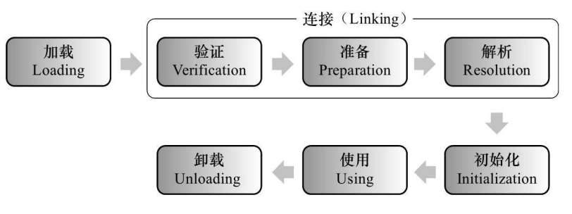
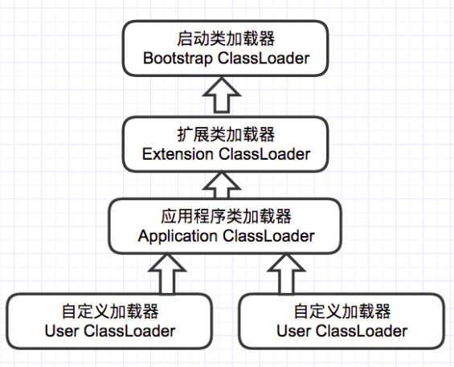
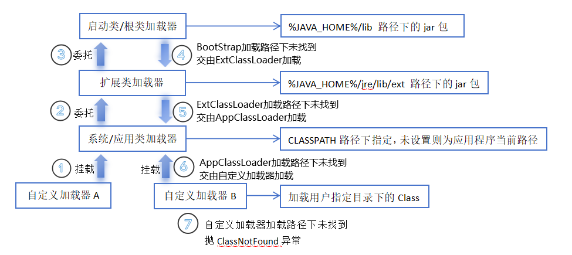

## JVM 类加载

JVM 类加载机制分为五个部分：加载，验证，准备，解析，初始化

### 加载

加载是类加载过程中的一个阶段，这个阶段会在内存中生成一个代表这个类的 java.lang.Class 对象， 作为方法区这个类的各种数据的入口。
注意这里不一定非得要从一个 Class 文件获取，这里既可以从 ZIP 包中读取（比如从 jar 包和 war 包中读取），
也可以在运行时计算生成（动态代理），也可以由其它文件生成（比如将 JSP 文件转换成对应的 Class 类）。

### 验证

这一阶段的主要目的是为了确保 Class 文件的字节流中包含的信息是否符合当前虚拟机的要求，并且不会危害虚拟机自身的安全。

### 准备

准备阶段是正式为类变量分配内存并设置类变量的初始值阶段，即在方法区中分配这些变量所使用的内存空间。
注意这里所说的初始值概念，比如一个类变量定义为：public static int v = 8080;
实际上变量 v 在准备阶段过后的初始值为 0 而不是 8080，将 v 赋值为 8080 的 put static 指令是程序被编译后，存放于类构造器<client>方法之中。 
但是注意如果声明为：public static final int v = 8080;
在编译阶段会为 v 生成 ConstantValue 属性，在准备阶段虚拟机会根据 ConstantValue 属性将 v 赋值为 8080。

### 解析

解析阶段是指虚拟机将常量池中的符号引用替换为直接引用的过程。符号引用就是 class 文件中的：
1. CONSTANT_Class_info
2. CONSTANT_Field_info
3. CONSTANT_Method_info 等类型的常量。

#### 符号引用

符号引用与虚拟机实现的布局无关，引用的目标并不一定要已经加载到内存中。各种虚拟机实现的内存布局可以各不相同，但是它们能接受的符号引用必须是一致的，因为符号引用的字面量形式明确定义在 Java 虚拟机规范的 Class 文件格式中。

#### 直接引用

直接引用可以是指向目标的指针，相对偏移量或是一个能间接定位到目标的句柄。如果有了直接引用，那引用的目标必定已经在内存中存在。

### 初始化

初始化阶段是类加载最后一个阶段，前面的类加载阶段之后，除了在加载阶段可以自定义类加载器以外，其它操作都由 JVM 主导。到了初始阶段，才开始真正执行类中定义的 Java 程序代码。

#### 类构造器<client>

初始化阶段是执行类构造器<client>方法的过程。<client>方法是由编译器自动收集类中的类变量的赋值操作和静态语句块中的语句合并而成的。
虚拟机会保证子<client>方法执行之前，父类的<client>方法已经执行完毕，如果一个类中没有对静态变量赋值也没有静态语句块，那么编译器可以不为这个类生成<client>()方法。

注意以下几种情况不会执行类初始化：
1. 通过子类引用父类的静态字段，只会触发父类的初始化，而不会触发子类的初始化。
2. 定义对象数组，不会触发该类的初始化。
3. 常量在编译期间会存入调用类的常量池中，本质上并没有直接引用定义常量的类，不会触发定义常量所在的类。
4. 通过类名获取 Class 对象，不会触发类的初始化。
5. 通过 Class.forName 加载指定类时，如果指定参数 initialize 为 false 时，也不会触发类初始化，其实这个参数是告诉虚拟机，是否要对类进行初始化。
6. 通过 ClassLoader 默认的 loadClass 方法，也不会触发初始化动作。

## 类加载器
   虚拟机设计团队把加载动作放到 JVM 外部实现，以便让应用程序决定如何获取所需的类，JVM 提
   供了 3 种类加载器：

- 启动类加载器(Bootstrap ClassLoader)
    - 负责加载 JAVA_HOME\lib 目录中的，或通过-Xbootclasspath 参数指定路径中的，且被虚拟机认可（按文件名识别，如 rt.jar）的类。
- 扩展类加载器(Extension ClassLoader)
  - 负责加载 JAVA_HOME\lib\ext 目录中的，或通过 java.ext.dirs 系统变量指定路径中的类库。
- 应用程序类加载器(Application ClassLoader)：
  - 负责加载用户路径（classpath）上的类库。

### 双亲委派
JVM 通过双亲委派模型进行类的加载，当然我们也可以通过继承 java.lang.ClassLoader 实现自定义的类加载器。

当一个类收到了类加载请求，他首先不会尝试自己去加载这个类，而是把这个请求委派给父类去完成，每一个层次类加载器都是如此，
因此所有的加载请求都应该传送到启动类加载其中，只有当父类加载器反馈自己无法完成这个请求的时候（在它的加载路径下没有找到所需加载的Class），子类加载器才会尝试自己去加载。

采用双亲委派的一个好处是比如加载位于 rt.jar 包中的类 java.lang.Object，不管是哪个加载器加载这个类，
最终都是委托给顶层的启动类加载器进行加载，这样就保证了使用不同的类加载器最终得到的都是同样一个 Object 对象。

