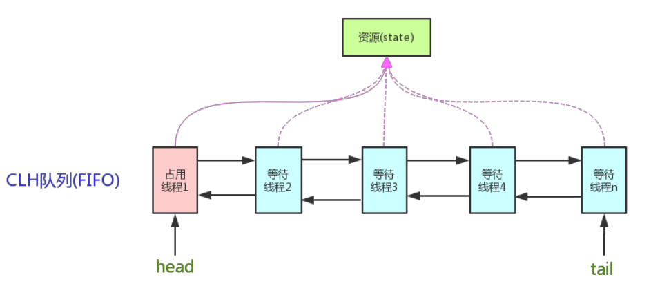

# 锁`Lock`

## `Lock`接口的主要方法
- `void lock()`: 执行此方法时, 如果锁处于空闲状态, 当前线程将获取到锁. 相反, 如果锁已经被其他线程持有, 将禁用当前线程, 直到当前线程获取到锁.
- `boolean tryLock()`：如果锁可用, 则获取锁, 并立即返回`true`, 否则返回`false`。
   该方法和`lock()`的区别在于, `tryLock()`只是"试图"获取锁, 如果锁不可用, 不会导致当前线程被禁用, 当前线程仍然继续往下执行代码。
   而`lock()`方法则是一定要获取到锁, 如果锁不可用, 就一直等待, 在未获得锁之前,当前线程并不继续向下执行。
- `void unlock()`：执行此方法时, 当前线程将释放持有的锁. 锁只能由持有者释放, 如果线程并不持有锁, 却执行该方法, 可能导致异常的发生。
- `Condition newCondition()`：条件对象，获取等待通知组件。
  该组件和当前的锁绑定，当前线程只有获取了锁，才能调用该组件的`await()`方法，而调用后，当前线程将缩放锁。
- `getHoldCount()`：查询当前线程保持此锁的次数，也就是执行此线程执行`lock`方法的次数。
- `getQueueLength()`：返回正等待获取此锁的线程估计数，比如启动`10`个线程，`1`个线程获得锁，此时返回的是`9`。
- `getWaitQueueLength`：(`Condition condition`)返回等待与此锁相关的给定条件的线程估计数。
   比如`10`个线程，用同一个`condition`对象，并且此时这`10`个线程都执行了`condition`对象的`await`方法，那么此时执行此方法返回`10`。
- `hasWaiters(Condition condition)`：查询是否有线程等待与此锁有关的给定条件(`condition`)，对于指定`condition`对象，有多少线程执行了`condition.await`方法。
- `hasQueuedThread(Thread thread)`：查询给定线程是否等待获取此锁。
- `hasQueuedThreads()`：是否有线程等待此锁。
- `isFair()`：该锁是否公平锁。
- `isHeldByCurrentThread()`：当前线程是否保持锁锁定，线程的执行`lock`方法的前后分别是`false`和`true`。
- `isLock()`：此锁是否有任意线程占用。
- `lockInterruptibly()`：如果当前线程未被中断，获取锁。
- `tryLock()`：尝试获得锁，仅在调用时锁未被线程占用，获得锁。
- `tryLock(long timeout, TimeUnit unit)`：如果锁在给定等待时间内没有被另一个线程保持， 则获取该锁。

## <a id="lgs">乐观锁</a>
乐观锁是一种乐观思想，即认为读多写少，遇到并发写的可能性低，每次去拿数据的时候都认为别人不会修改，所以不会上锁，
但是在更新的时候会判断一下在此期间别人有没有去更新这个数据，采取在写时先读出当前版本号。

然后加锁操作(比较跟上一次的版本号，如果一样则更新)，如果失败则要重复读-比较-写的操作。
`Java`中的乐观锁基本都是通过`CAS`操作实现的，`CAS`是一种更新的原子操作，比较当前值跟传入值是否一样，一样则更新，否则失败。

## <a id="bgs">悲观锁</a>
悲观锁是就是悲观思想，即认为写多，遇到并发写的可能性高，每次去拿数据的时候都认为别人会修改，
所以每次在读写数据的时候都会上锁，这样别人想读写这个数据就会`block`直到拿到锁。

`Java`中的悲观锁就是`Synchronized`，`AQS`框架下的锁则是先尝试`CAS`乐观锁去获取锁，获取不到，才会转换为悲观锁，如`RetreenLock`。

## <a id="zxs">自旋锁</a>
自旋锁原理非常简单，如果持有锁的线程能在很短时间内释放锁资源，那么那些等待竞争锁的线程就不需要做内核态和用户态之间的切换进入阻塞挂起状态，
它们只需要等一等(自旋)，等持有锁的线程释放锁后即可立即获取锁，这样就避免用户线程和内核的切换的消耗。

线程自旋是需要消耗`CPU`的，说白了就是让`CPU`在做无用功，如果一直获取不到锁，那线程也不能一直占用`CPU`自旋做无用功，所以需要设定一个自旋等待的最大时间。

如果持有锁的线程执行的时间超过自旋等待的最大时间扔没有释放锁，就会导致其它争用锁的线程在最大等待时间内还是获取不到锁，这时争用线程会停止自旋进入阻塞状态。

### 自旋锁的优缺点
自旋锁尽可能的减少线程的阻塞，这对于锁的竞争不激烈，且占用锁时间非常短的代码块来说性能能大幅度的提升，
因为自旋的消耗会小于线程阻塞挂起再唤醒的操作的消耗，这些操作会导致线程发生两次上下文切换！

但是如果锁的竞争激烈，或者持有锁的线程需要长时间占用锁执行同步块，这时候就不适合使用自旋锁了，
因为自旋锁在获取锁前一直都是占用`CPU`做无用功，占着`XX`不`XX`，同时有大量线程在竞争一个锁，会导致获取锁的时间很长，线程自旋的消耗大于线程阻塞挂起操作的消耗，
其它需要`CPU`的线程又不能获取到`CPU`，造成`CPU`的浪费。所以这种情况下我们要关闭自旋锁。

### 自旋锁时间阈值(`1.6`引入了适应性自旋锁)
自旋锁的目的是为了占着`CPU`的资源不释放，等到获取到锁立即进行处理。

**但是如何去选择自旋的执行时间呢？**

如果自旋执行时间太长，会有大量的线程处于自旋状态占用`CPU`资源，进而会影响整体系统的性能。因此自旋的周期选的额外重要！

`JVM`对于自旋周期的选择，`jdk1.5`这个限度是一定的写死的，在`1.6`引入了适应性自旋锁，
适应性自旋锁意味着自旋的时间不在是固定的了，而是由前一次在同一个锁上的自旋时间以及锁的拥有者的状态来决定，
基本认为一个线程上下文切换的时间是最佳的一个时间

同时`JVM`还针对当前`CPU`的负荷情况做了较多的优化，
- 如果平均负载小于`CPUs`则一直自旋，如果有超过(`CPUs/2`)个线程正在自旋，则后来线程直接阻塞
- 如果正在自旋的线程发现`Owner`发生了变化则延迟自旋时间(自旋计数)或进入阻塞
- 如果`CPU`处于节电模式则停止自旋，自旋时间的最坏情况是`CPU`的存储延迟(`CPU A`存储了一个数据，到`CPU B`得知这个数据直接的时间差)，自旋时会适当放弃线程优先级之间的差异

### 自旋锁的开启
- `JDK1.6`中`-XX:+UseSpinning`开启
- `-XX:PreBlockSpin=10`为自旋次数
- `JDK1.7`后，去掉此参数，由`jvm`控制

## <a id="tbs">`Synchronized`同步锁</a>
`Synchronized`它可以把任意一个非`NULL`的对象当作锁。他属于独占式的悲观锁，同时属于可重
入锁。

### `Synchronized`作用范围
- 作用于方法时，锁住的是对象的实例(`this`)。
- 当作用于静态方法时，锁住的是`Class`实例，又因为`Class`的相关数据存储在方法区(`Method Area`)
  方法区是全局共享的，因此静态方法锁相当于类的一个全局锁，会锁所有调用该方法的线程。
- `Synchronized`作用于一个对象实例时，锁住的是所有以该对象为锁的代码块。它有多个队列，
  当多个线程一起访问某个对象监视器的时候，对象监视器会将这些线程存储在不同的容器中。

### `Synchronized`核心组件
- `Wait Set`：哪些调用`wait`方法被阻塞的线程被放置在这里。
- `Contention List`：竞争队列，所有请求锁的线程首先被放在这个竞争队列中。
- `Entry List`：`Contention List`中那些有资格成为候选资源的线程被移动到`Entry List`中。
- `OnDeck`：任意时刻，最多只有一个线程正在竞争锁资源，该线程被成为`OnDeck`。
- `Owner`：当前已经获取到所资源的线程被称为`Owner`。
- `!Owner`：当前释放锁的线程。

## <a id="reentrantlock">`ReentrantLock`</a>
`ReentrantLock`继承接口`Lock`并实现了接口中定义的方法，他是一种可重入锁，除了能完成`synchronized`所能完成的所有工作外，
还提供了诸如可响应中断锁、可轮询锁请求、定时锁等避免多线程死锁的方法。

`ReentrantLock`在构造函数中提供了是否公平锁的初始化方式，默认为非公平锁。
非公平锁实际执行的效率要远远超出公平锁，除非程序有特殊需要，否则最常用非公平锁的分配机制。

### `ReentrantLock`与`Synchronized`
- `ReentrantLock`通过方法`lock()`与`unlock()`来进行加锁与解锁操作，与`Synchronized`会被`JVM`自动解锁机制不同，`ReentrantLock`加锁后需要手动进行解锁。
  为了避免程序出现异常而无法正常解锁的情况，使用`ReentrantLock`必须在`finally`控制块中进行解锁操作。
- `ReentrantLock`相比`Synchronized`的优势是可中断、公平锁、多个锁。这种情况下需要使用`ReentrantLock`。

### `Condition`类和`Object`类锁方法区别区别
- `Condition`类的`awiat`方法和`Object`类的`wait`方法等效
- `Condition`类的`signal`方法和`Object`类的`notify`方法等效
- `Condition`类的`signalAll`方法和`Object`类的`notifyAll`方法等效
- `ReentrantLock`类可以唤醒指定条件的线程，而`object`的唤醒是随机的

### `tryLock`和`lock`和`lockInterruptibly`的区别
- `tryLock`能获得锁就返回`true`，不能就立即返回`false`，`tryLock(long timeout,TimeUnit unit)`，可以增加时间限制，如果超过该时间段还没获得锁，返回`false`
- `lock`能获得锁就返回`true`，不能的话一直等待获得锁
- `lock`和`lockInterruptibly`，如果两个线程分别执行这两个方法，但此时中断这两个线程，`lock`不会抛出异常，而`lockInterruptibly`会抛出异常。

## <a id="atomicInteger">`AtomicInteger`</a>
`AtomicInteger`，一个提供原子操作的`Integer`的类，
常见的还有：`AtomicBoolean`、`AtomicInteger`、`AtomicLong`、`AtomicReference`等

他们的实现原理相同，区别在与运算对象类型的不同，还可以通过`AtomicReference<V>`将一个对象的所有操作转化成原子操作。

在多线程程序中，诸如`++i`或`i++`等运算不具有原子性，是不安全的线程操作之一。

通常会使用`synchronized`将该操作变成一个原子操作，但`JVM`为此类操作特意提供了一些同步类，使得使用更方便，且使程序运行效率变得更高。

通过相关资料显示，通常`AtomicInteger`的性能是`ReentrantLock`的好几倍。

## <a id="semaphore">`Semaphore`信号量</a>
`Semaphore`是一种基于计数的信号量。它可以设定一个阈值，基于此，多个线程竞争获取许可信号，做完自己的申请后归还，超过阈值后，线程申请许可信号将会被阻塞。

`Semaphore`可以用来构建一些对象池，资源池之类的，比如数据库连接池实现互斥锁(计数器为`1`)

也可以创建计数为`1`的`Semaphore`，将其作为一种类似互斥锁的机制，这也叫二元信号量，表示两种互斥状态。

### `Semaphore`与`ReentrantLock`
- `Semaphore`基本能完成`ReentrantLock`的所有工作，使用方法也与之类似，通过`acquire()`与`release()`方法来获得和释放临界资源。
- `Semaphore.acquire()`方法默认为可响应中断锁，与`ReentrantLock.lockInterruptibly()`作用效果一致，也就是说在等待临界资源的过程中可以被`Thread.interrupt()`方法中断。
- `Semaphore`也实现了可轮询的锁请求与定时锁的功能，除了方法名`tryAcquire`与`tryLock`不同，其使用方法与`ReentrantLock`几乎一致。
- `Semaphore`也提供了公平与非公平锁的机制，也可在构造函数中进行设定。
- `Semaphore`的锁释放操作也由手动进行，因此与`ReentrantLock`一样，为避免线程因抛出异常而无法正常释放锁的情况发生，释放锁的操作也必须在`finally`代码块中完成。

## <a id="kcrs">可重入锁</a>
可重入锁，也叫做递归锁，指的是同一线程外层函数获得锁之后，内层递归函数仍然有获取该锁的代码，但不受影响。

在`JAVA`环境下`ReentrantLock`和`Synchronized`都是 可重入锁。

## <a id="gps_fgps">公平锁与非公平锁</a>
- 公平锁
  - 加锁前检查是否有排队等待的线程，优先排队等待的线程，先来先得
- 非公平锁
  - 加锁时不考虑排队等待问题，直接尝试获取锁，获取不到自动到队尾等待

非公平锁性能比公平锁高`5~10`倍，因为公平锁需要在多核的情况下维护一个队列。

`Java`中的`Synchronized`是非公平锁，`ReentrantLock`默认的`lock()`方法采用的是非公平锁。


## <a id="dxs">`ReadWriteLock`读写锁</a>
为了提高性能，`Java`提供了读写锁，在读的地方使用读锁，在写的地方使用写锁，灵活控制，
如果没有写锁的情况下，读是无阻塞的,在一定程度上提高了程序的执行效率。
读写锁分为读锁和写锁，多个读锁不互斥，读锁与写锁互斥，这是由`jvm`自己控制的，你只要上好相应的锁即可。
- 读锁
  - 如果你的代码只读数据，可以很多人同时读，但不能同时写，那就上读锁
- 写锁
  - 如果你的代码修改数据，只能有一个人在写，且不能同时读取，那就上写锁。总之，读的时候上读锁，写的时候上写锁！

`Java`中读写锁有个接口`java.util.concurrent.locks.ReadWriteLock`，也有具体的实现`ReentrantReadWriteLock`。


## <a id="gxs_dzs">共享锁和独占锁</a>
`Java`并发包提供的加锁模式分为共享锁和独占锁。
- 共享锁
  - 共享锁则允许多个线程同时获取锁，并发访问 共享资源，如：`ReadWriteLock`。
  - 共享锁则是一种乐观锁，它放宽了加锁策略，允许多个执行读操作的线程同时访问共享资源。
- 独占锁
  - 独占锁模式下，每次只能有一个线程能持有锁，`ReentrantLock`就是以独占方式实现的互斥锁。
  - 独占锁是一种悲观保守的加锁策略，它避免了读/读冲突，如果某个只读线程获取锁，则其他读线程都只能等待，这种情况下就限制了不必要的并发性，因为读操作并不会影响数据的一致性。

`AQS`的内部类`Node`定义了两个常量`SHARED`和`EXCLUSIVE`，他们分别标识`AQS`队列中等待线程的锁获取模式。

`Java`的并发包中提供了`ReadWriteLock`，读-写锁。它允许一个资源可以被多个读操作访问，或者被一个写操作访问，但两者不能同时进行。

## <a id="sdzt">锁的状态</a>
锁的状态总共有四种：无锁状态、偏向锁、轻量级锁和重量级锁。

随着锁的竞争，锁可以升级：偏向锁 -> 轻量级锁 -> 重量级锁 

但是锁的升级是单向的，也就是说只能从低到高升级，不会出现锁的降级。

### <a id="pxs">偏向锁</a>
`Hotspot`的作者经过以往的研究发现大多数情况下锁不仅不存在多线程竞争，而且总是由同一线程多次获得。

偏向锁的目的是在某个线程获得锁之后，消除这个线程锁重入(`CAS`)的开销，看起来让这个线程得到了偏护。

引入偏向锁是为了在无多线程竞争的情况下尽量减少不必要的轻量级锁执行路径，因为轻量级锁的获取及释放依赖多次`CAS`原子指令。

而偏向锁只需要在置换`ThreadID`的时候依赖一次`CAS`原子指令(由于一旦出现多线程竞争的情况就必须撤销偏向锁，所以偏向锁的撤销操作的性能损耗必须小于节省下来的`CAS`原子指令的性能消耗)。

轻量级锁是为了在线程交替执行同步块时提高性能，而偏向锁则是在只有一个线程执行同步块时进一步提高性能。

### <a id="qljs">轻量级锁</a>
"轻量级"是相对于使用操作系统互斥量来实现的传统锁而言的。

轻量级锁并不是用来代替重量级锁的，它的本意是在没有多线程竞争的前提下，减少传统的重量级锁使用产生的性能消耗。

轻量级锁所适应的场景是线程交替执行同步块的情况，如果存在同一时间访问同一锁的情况，就会导致轻量级锁膨胀为重量级锁。

### <a id="zljs">重量级锁</a>
`Synchronized`是通过对象内部的一个叫做监视器锁(`monitor`)来实现的。

但是监视器锁本质又是依赖于底层的操作系统的`Mutex Lock`来实现的。

而操作系统实现线程之间的切换这就需要从用户态转换到核心态，这个成本非常高，状态之间的转换需要相对比较长的时间，这就是为什么`Synchronized`效率低的原因。

因此，这种依赖于操作系统`Mutex Lock`所实现的锁称之为"重量级锁"。

`JDK`中对`Synchronized`做的种种优化，其核心都是为了减少这种重量级锁的使用。

`JDK1.6`以后，为了减少获得锁和释放锁所带来的性能消耗，提高性能，引入了“轻量级锁”和"偏向锁"。


## <a id="fds">分段锁</a>
分段锁也并非一种实际的锁，而是一种设计

[`ConcurrentHashMap`](collection.md#jh_concurrenthashmap)是学习分段锁的最好实践

## <a id="fbss">分布式锁</a>

对于单机多线程，在`Java`中，我们通常使用`ReentrantLock`这类`JDK`⾃带的`本地锁`来控制本地多个线程对本地共享资源的访问。

讲到分布式，这里可以先了解下以下`2`个理论
- [`CAP`理论](../other/cap_base.md#cap)
- [`BASE`理论](../other/cap_base.md#base)

对于分布式系统，我们通常使⽤`分布式锁`来控制多个服务对共享资源的访问。

⼀个最基本的分布式锁需要满⾜：
- 互斥：任意⼀个时刻，锁只能被⼀个线程持有。
- ⾼可⽤：锁服务是⾼可⽤的。并且，即使客户端的释放锁的代码逻辑出现问题，锁最终⼀定还是会被释放，不会影响其他线程对共享资源的访问。

⼀般会选择基于`Redis`实现分布式锁。

## <a id="sdyh">锁的优化</a>
- 减少锁持有时间
  - 只用在有线程安全要求的程序上加锁
- 减小锁粒度
  - 将大对象（这个对象可能会被很多线程访问），拆成小对象，大大增加并行度，降低锁竞争。
  - 降低了锁的竞争，偏向锁，轻量级锁成功率才会提高。
  - 最最典型的减小锁粒度的案例就是`ConcurrentHashMap`。
- 锁分离
  - 最常见的锁分离就是读写锁`ReadWriteLock`，根据功能进行分离成读锁和写锁，这样读读不互斥，读写互斥，写写互斥，即保证了线程安全，又提高了性能，
  - 读写分离思想可以延伸，只要操作互不影响，锁就可以分离。
  - `LinkedBlockingQueue`从头部取出，从尾部放数据
- 锁粗化
  - 通常情况下，为了保证多线程间的有效并发，会要求每个线程持有锁的时间尽量短，即在使用完公共资源后，应该立即释放锁。
  - 如果对同一个锁不停的进行请求、同步和释放，其本身也会消耗系统宝贵的资源，反而不利于性能的优化 。
- 锁消除
  - 锁消除是在编译器级别的事情。在即时编译器时，如果发现不可能被共享的对象，则可以消除这些对象的锁操作，多数是因为程序员编码不规范引起。

## <a id="cas">`CAS`（比较并交换-乐观锁机制-锁自旋）</a>
`CAS`（Compare And Swap/Set）比较并交换，`CAS`算法的过程是这样：

它包含`3`个参数`CAS`(`V`,`E`,`N`)。

`V`表示要更新的变量(内存值)，`E`表示预期值(旧的)，`N`表示新值。

当且仅当`V`值等于`E`值时，才会将`V`的值设为`N`，

如果`V`值和`E`值不同，则说明已经有其他线程做了更新，则当前线程什么都不做。

最后，`CAS`返回当前`V`的真实值。

`CAS`操作是抱着乐观的态度进行的(乐观锁)，它总是认为自己可以成功完成操作。
当多个线程同时使用`CAS`操作一个变量时，只有一个会胜出，并成功更新，其余均会失败。 

失败的线程不会被挂起，仅是被告知失败，并且允许再次尝试，当然也允许失败的线程放弃操作。
基于这样的原理，`CAS`操作即使没有锁，也可以发现其他线程对当前线程的干扰，并进行恰当的处理。

### <a id="atomic">原子包`java.util.concurrent.atomic`（锁自旋）</a>
`JDK1.5`的原子包：`java.util.concurrent.atomic`这个包里面提供了一组原子类。

其基本的特性就是在多线程环境下，当有多个线程同时执行这些类的实例包含的方法时，具有排他性，即当某个线程进入方法，
执行其中的指令时，不会被其他线程打断，而别的线程就像自旋锁一样，一直等到该方法执行完成，
才由 JVM 从等待队列中选择一个另一个线程进入，这只是一种逻辑上的理解。

相对于对于`synchronized`这种阻塞算法，`CAS`是非阻塞算法的一种常见实现。由于一般`CPU`切换时间比`CPU`指令集操作更加长，所以`J.U.C`在性能上有了很大的提升。

如下代码：
```java
public class AtomicInteger extends Number implements java.io.Serializable {
    private volatile int value;
    
    public final int get() {
        return value;
    }
    
    public final int getAndIncrement() {
        for (;;) { //CAS 自旋，一直尝试，直达成功
            int current = get();
            int next = current + 1;
            if (compareAndSet(current, next))
                return current;
        }
    }
    
    public final boolean compareAndSet(int expect, int update) {
        return unsafe.compareAndSwapInt(this, valueOffset, expect, update);
    }
}
```
`getAndIncrement`采用了`CAS`操作，每次从内存中读取数据然后将此数据和`+1`后的结果进行`CAS`操作，如果成功就返回结果，否则重试直到成功为止。
而`compareAndSet`利用`JNI`来完成`CPU`指令的操作。

### <a id="aba">`ABA`问题</a>
`CAS`会导致"`ABA`问题"。`CAS`算法实现一个重要前提需要取出内存中某时刻的数据，而在下时刻比较并替换，那么在这个时间差类会导致数据的变化。

比如说一个线程`one`从内存位置`V`中取出`A`，这时候另一个线程`two`也从内存中取出`A`，
并且`two`进行了一些操作变成了`B`，然后`two`又将`V`位置的数据变成`A`，

这时候线程`one`进行`CAS`操作发现内存中仍然是`A`，然后`one`操作成功。

尽管线程`one`的`CAS`操作成功，但是不代表这个过程就是没有问题的。

部分乐观锁的实现是通过版本号（`version`）的方式来解决`ABA`问题，乐观锁每次在执行数据的修改操作时，都会带上一个版本号，

一旦版本号和数据的版本号一致就可以执行修改操作并对版本号执行`+1`操作，否则就执行失败。

因为每次操作的版本号都会随之增加，所以不会出现`ABA`问题，因为版本号只会增加不会减少。

## <a id="aqs">`AQS`（抽象的队列同步器）</a>
`AbstractQueuedSynchronizer`类如其名，抽象的队列式的同步器，
`AQS`定义了一套多线程访问共享资源的同步器框架，许多同步类实现都依赖于它，如常用的`ReentrantLock`、`Semaphore`、`CountDownLatch`。



它维护了一个`volatile int state`（代表共享资源）和一个`FIFO`线程等待队列（多线程争用资源被阻塞时会进入此队列）。这里`volatile`是核心关键词。

`state`的访问方式有三种:`getState()`、`setState()`、`compareAndSetState()`

**`AQS`定义两种资源共享方式**
- `Exclusive`独占资源-（独占，只有一个线程能执行，如`ReentrantLock`）
- `Share`共享资源-（共享，多个线程可同时执行，如`Semaphore`、`CountDownLatch`）。

`AQS`只是一个框架，具体资源的获取、释放方式交由自定义同步器去实现，`AQS`这里只定义了一个接口，
具体资源的获取交由自定义同步器去实现了（通过`state`的`get`、`set`、`CAS`)之所以没有定义成`abstract`，
是因为独占模式下只用实现`tryAcquire-tryRelease`，而共享模式下只用实现`tryAcquireShared-tryReleaseShared`。

如果都定义成`abstract`，那么每个模式也要去实现另一模式下的接口。

不同的自定义同步器争用共享资源的方式也不同。

自定义同步器在实现时只需要实现共享资源`state`的获取与释放方式即可，至于具体线程等待队列的维护（如获取资源失败入队、唤醒出队等），`AQS`已经在顶层实现好了。

**自定义同步器实现时主要实现以下几种方法：**
- `isHeldExclusively()`：该线程是否正在独占资源。只有用到`condition`才需要去实现它。
- `tryAcquire(int)`：独占方式。尝试获取资源，成功则返回`true`，失败则返回`false`。
- `tryRelease(int)`：独占方式。尝试释放资源，成功则返回`true`，失败则返回`false`。
- `tryAcquireShared(int)`：共享方式。尝试获取资源。负数表示失败；`0`表示成功，但没有剩余可用资源；正数表示成功，且有剩余资源。
- `tryReleaseShared(int)`：共享方式。尝试释放资源，如果释放后允许唤醒后续等待结点返回`true`，否则返回`false`。

**同步器的实现是`ABS`核心（`state`资源状态计数）**

同步器的实现是`ABS`核心，以`ReentrantLock`为例，`state`初始化为`0`，表示未锁定状态。
`A`线程`lock()`时，会调用`tryAcquire()`独占该锁并将`state+1`。
此后，其他线程再`tryAcquire()`时就会失败，直到`A`线程`unlock()`到`state=0`（即释放锁）为止，其它线程才有机会获取该锁。

释放锁之前，`A`线程自己是可以重复获取此锁的（`state`会累加），这就是可重入的概念。

要注意，获取多少次就要释放多么次，这样才能保证`state`是能回到零态的。

以`CountDownLatch`以例，任务分为`N`个子线程去执行，`state`也初始化为`N`（注意`N`要与线程个数一致）。
这`N`个子线程是并行执行的，每个子线程执行完后`countDown()`一次，`state`会`CAS`减`1`。
等到所有子线程都执行完后(即`state=0`)，会`unpark()`主调用线程，然后主调用线程就会从`await()`函数返回，继续后余动作。

**`ReentrantReadWriteLock`实现独占和共享两种方式**

一般来说，自定义同步器要么是独占方法，要么是共享方式，他们也只需实现`tryAcquire`、`tryRelease`、`tryAcquireShared-tryReleaseShared`中的一种即可。

但`AQS`也支持自定义同步器同时实现独占和共享两种方式，如`ReentrantReadWriteLock`。


----
