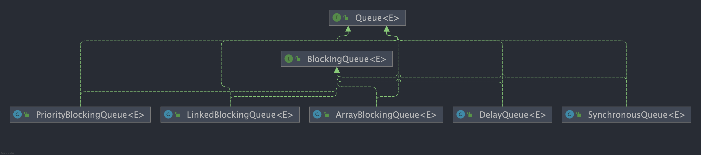

# <a id="queue">`Queue`</a>
`Queue`是单端队列，只能从一端插入元素，另一端删除元素，遵循先进先出(`FIFO`)规则。

`Queue`扩展了`Collection`的接口，**因为容量问题而导致操作失败后处理方式的不同**可以分为两类方法：一种在操作失败后会抛出异常，另一种则会返回特殊值。

| `Queue`接口 | 抛出异常        | 返回特殊值        |
|-----------|-------------|--------------|
| 插入队尾      | `add(E e)`  | `offer(E e)` |
| 删除队首      | `remove()`  | `poll()`     |
| 查询队首元素    | `element()` | `peek()`     |

# <a id="deque">`Deque`</a>
`Deque`是双端队列，在队列的两端均可以插入或删除元素。

`Deque`扩展了`Queue`的接口, 增加了在队首和队尾进行插入和删除的方法，同样根据失败后处理方式的不同分为两类：

| `Deque`接口 | 抛出异常            | 返回特殊值             |
|-----------|-----------------|-------------------|
| 插入队首      | `addFirst(E e)` | `offerFirst(E e)` |
| 插入队尾      | `addLast(E e)`  | `offerLast(E e)`  |
| 删除队首      | `removeFirst()` | `pollFirst()`     |
| 删除队尾      | `removeLast()`  | `pollLast()`      |
| 查询队首元素    | `getFirst()`    | `peekFirst()`     |
| 查询队尾元素    | `getLast()`     | `peekLast()`      |

`Deque`还提供有`push()`和`pop()`等其他方法，可用于模拟栈。

## `ArrayDeque`与`LinkedList`
`ArrayDeque`和`LinkedList`都实现了`Deque`接口，两者都具有队列的功能。

- `ArrayDeque`是基于可变长的数组和双指针来实现，而`LinkedList`则通过链表来实现。
- `ArrayDeque`不支持存储`NULL`数据，但`LinkedList`支持。
- `ArrayDeque`是在`JDK1.6`被引入的，`LinkedList`在`JDK1.2`时就已经存在。
- `ArrayDeque`插入时可能存在扩容过程, 不过均摊后的插入操作依然为`O(1)`。`LinkedList`不需要扩容，但是每次插入数据时均需要申请新的堆空间，均摊性能相比更慢。

**从性能的角度上，选用`ArrayDeque`来实现队列要比`LinkedList`更好。`ArrayDeque`也可以用于实现栈。**

# <a id="priorityqueue">`PriorityQueue`</a>
`PriorityQueue`是在`JDK1.5`中被引入的, 其与`Queue`的区别在于元素出队顺序是与优先级相关的，即总是优先级最高的元素先出队。

- `PriorityQueue`利用了二叉堆的数据结构来实现的，底层使用可变长的数组来存储数据`PriorityQueue`通过堆元素的上浮和下沉，实现了在`O(logn)`的时间复杂度内插入元素和删除堆顶元素。
- `PriorityQueue`是非线程安全的，且不支持存储`NULL`和`non-comparable`的对象。
- `PriorityQueue`默认是小顶堆，但可以接收一个`Comparator`作为构造参数，从而来自定义元素优先级的先后。

# <a id="blockingqueue">`BlockingQueue`</a>
`BlockingQueue`（阻塞队列）是一个接口，继承自`Queue`。

阻塞队列，关键字是阻塞，先理解阻塞的含义，在阻塞队列中，线程阻塞有这样的两种情况：

1. 当队列中没有数据的情况下，消费者端的所有线程都会被自动阻塞（挂起），直到有数据放入队列。
2. 当队列中填满数据的情况下，生产者端的所有线程都会被自动阻塞（挂起），直到队列中有空的位置，线程被自动唤醒。

### `BlockingQueue`的实现类


## 阻塞队列的主要方法
| 方法 | 抛出异常        | 返回特殊值        | 阻塞         | 超时                                     |
|----|-------------|--------------|------------|----------------------------------------|
| 插入 | `add(E e)`  | `offer(E e)` | `put(E e)` | `offer(E e, long time, TimeUnit unit)` |
| 移除 | `remove()`  | `poll()`     | `take()`   | `poll(long time, TimeUnit unit)`       |
| 检查 | `element()` | `peek()`     | 不可用        | 不可用                                    |

- 抛出异常：抛出一个异常
- 特殊值：返回一个特殊值（`null`或`false`,视情况而定）
- 则塞：在成功操作之前，一直阻塞线程
- 超时：放弃前只在最大的时间内阻塞

### 插入操作
- `public abstract boolean add(E paramE)`：将指定元素插入此队列中（如果立即可行且不会违反容量限制），
成功时返回`true`，如果当前没有可用的空间，则抛出`IllegalStateException`。如果该元素是`NULL`，则会抛出`NullPointerException`异常。
- `public abstract boolean offer(E paramE)`：将指定元素插入此队列中（如果立即可行且不会违反容量限制），成功时返回`true`，如果当前没有可用的空间，则返回`false`。
- `public abstract void put(E paramE) throws InterruptedException`： 将指定元素插入此队列中，将等待可用的空间（如果有必要）
    ```java
    public void put(E paramE) throws InterruptedException {
        checkNotNull(paramE);
        ReentrantLock localReentrantLock = this.lock;
        localReentrantLock.lockInterruptibly();
        try {
            while (this.count == this.items.length)
            this.notFull.await();//如果队列满了，则线程阻塞等待
            enqueue(paramE);
            localReentrantLock.unlock();
        } finally {
            localReentrantLock.unlock();
        }
    }
    ```
- `offer(E e, long timeout, TimeUnit unit)`：可以设定等待的时间，如果在指定的时间内，还不能往队列中加入`BlockingQueue`，则返回失败。

### 获取数据操作
- `poll(time)`：取走`BlockingQueue`里排在首位的对象,若不能立即取出,则可以等`time`参数规定的时间,取不到时返回`null`
- `poll(long timeout, TimeUnit unit)`：从`BlockingQueue`取出一个队首的对象，如果在指定时间内，队列一旦有数据可取，则立即返回队列中的数据。
否则直到时间超时还没有数据可取，返回失败。
- `take()`：取走`BlockingQueue`里排在首位的对象,若`BlockingQueue`为空,阻断进入等待状态直到`BlockingQueue`有新的数据被加入。
- `drainTo()`：一次性从`BlockingQueue`获取所有可用的数据对象（还可以指定获取数据的个数），通过该方法，可以提升获取数据效率；不需要多次分批加锁或释放锁。

## `Java`中的阻塞队列
- `ArrayBlockingQueue`：由数组结构组成的有界阻塞队列。在创建时需要指定容量大小，并支持公平和非公平两种方式的锁访问机制。
- `LinkedBlockingQueue`：由链表结构组成的有界阻塞队列。
- `PriorityBlockingQueue`：支持优先级排序的无界阻塞队列。
- `DelayQueue`：使用优先级队列实现的无界阻塞队列。
- `SynchronousQueue`：不存储元素的阻塞队列。
- `LinkedTransferQueue`：由链表结构组成的无界阻塞队列。
- `LinkedBlockingDeque`：由链表结构组成的双向阻塞队列

## <a id="arrayblockingqueue">`ArrayBlockingQueue`（公平、非公平）</a>
用数组实现的有界阻塞队列。此队列按照先进先出（`FIFO`）的原则对元素进行排序。

默认情况下不保证访问者公平的访问队列，所谓公平访问队列是指阻塞的所有生产者线程或消费者线程，当队列可用时，可以按照阻塞的先后顺序访问队列，
即先阻塞的生产者线程，可以先往队列里插入元素，先阻塞的消费者线程，可以先从队列里获取元素。
通常情况下为了保证公平性会降低吞吐量。

```java
ArrayBlockingQueue fairQueue = new ArrayBlockingQueue(1000,true);
```

## <a id="linkedblockingqueue">`LinkedBlockingQueue`（两个独立锁提高并发）</a>
基于链表的阻塞队列，同`ArrayListBlockingQueue`类似，此队列按照先进先出（`FIFO`）的原则对元素进行排序。

`LinkedBlockingQueue`之所以能够高效的处理并发数据，还因为其对于生产者端和消费者端分别采用了独立的锁来控制数据同步，
在高并发的情况下生产者和消费者可以并行地操作队列中的数据，以此来提高整个队列的并发性能。

`LinkedBlockingQueue`会默认一个类似无限大小的容量（`Integer.MAX_VALUE`）。

## <a id="priorityblockingqueue">`PriorityBlockingQueue`（`compareTo`排序实现优先）</a>
是一个支持优先级的无界队列。默认情况下元素采取自然顺序升序排列。

可以自定义实现`compareTo()`方法来指定元素进行排序规则，或者初始化`PriorityBlockingQueue`时，指定构造参数`Comparator`来对元素进行排序。

需要注意的是不能保证同优先级元素的顺序。

## <a id="delayqueue">`DelayQueue`（缓存失效、定时任务 ）</a>
是一个支持延时获取元素的无界阻塞队列。队列使用`PriorityQueue`来实现。

队列中的元素必须实现`Delayed`接口，在创建元素时可以指定多久才能从队列中获取当前元素。
只有在延迟期满时才能从队列中提取元素。

可以将`DelayQueue`运用在以下应用场景：
- 缓存系统的设计：可以用`DelayQueue`保存缓存元素的有效期，使用一个线程循环查询`DelayQueue`，一旦能从`DelayQueue`中获取元素时，表示缓存有效期到了。
- 定时任务调度：使用`DelayQueue`保存当天将会执行的任务和执行时间，一旦从`DelayQueue`中获取到任务就开始执行，比如`TimerQueue`就是使用`DelayQueue`实现的。

## <a id="synchronousqueue">`SynchronousQueue`（不存储数据、可用于传递数据）</a>
是一个不存储元素的阻塞队列。每一个`put`操作必须等待一个`take`操作，否则不能继续添加元素。

`SynchronousQueue`可以看成是一个传球手，负责把生产者线程处理的数据直接传递给消费者线程。
队列本身并不存储任何元素，非常适合于传递性场景,比如在一个线程中使用的数据，传递给另外一个线程使用

`SynchronousQueue`的吞吐量高于`LinkedBlockingQueue`和`ArrayBlockingQueue`。

## <a id="linkedtransferqueue">`LinkedTransferQueue`</a>
是一个由链表结构组成的无界阻塞`TransferQueue`队列。

相对于其他阻塞队列，`LinkedTransferQueue`多了`tryTransfer`和`transfer`方法。
- `transfer`方法：如果当前有消费者正在等待接收元素（消费者使用`take()`方法或带时间限制的`poll()`方法时），
  `transfer`方法可以把生产者传入的元素立刻`transfer`（传输）给消费者。
  如果没有消费者在等待接收元素，`transfer`方法会将元素存放在队列的`tail`节点，并等到该元素被消费者消费了才返回。
- `tryTransfer`方法。则是用来试探下生产者传入的元素是否能直接传给消费者。如果没有消费者等待接收元素，则返回`false`。
  和`transfer`方法的区别是`tryTransfer`方法无论消费者是否接收，方法立即返回。
  而`transfer`方法是必须等到消费者消费了才返回。
  对于带有时间限制的`tryTransfer(E e, long timeout, TimeUnit unit)`方法，则是试图把生产者传入的元素直接传给消费者，
  但是如果没有消费者消费该元素则等待指定的时间再返回，如果超时还没消费元素，则返回`false`，如果在超时时间内消费了元素，则返回`true`。

## <a id="linkedblockingdeque">`LinkedBlockingDeque`</a>
是一个由链表结构组成的双向阻塞队列。所谓双向队列指的你可以从队列的两端插入和移出元素。

双端队列因为多了一个操作队列的入口，在多线程同时入队时，也就减少了一半的竞争。

相比其他的阻塞队列，`LinkedBlockingDeque`多了`addFirst`，`addLast`，`offerFirst`，`offerLast`，`peekFirst`，`peekLast`等方法

以`First`单词结尾的方法，表示插入，获取（`peek`）或移除双端队列的第一个元素。

以`Last`单词结尾的方法，表示插入，获取或移除双端队列的最后一个元素。

插入方法`add`等同于`addLast`，移除方法`remove`等效于`removeFirst`，`take`方法等同于`takeFirst`，

在初始化`LinkedBlockingDeque`时可以设置容量防止其过渡膨胀。


----
