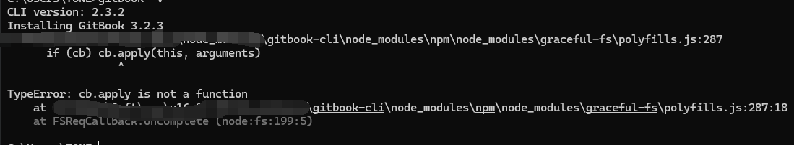
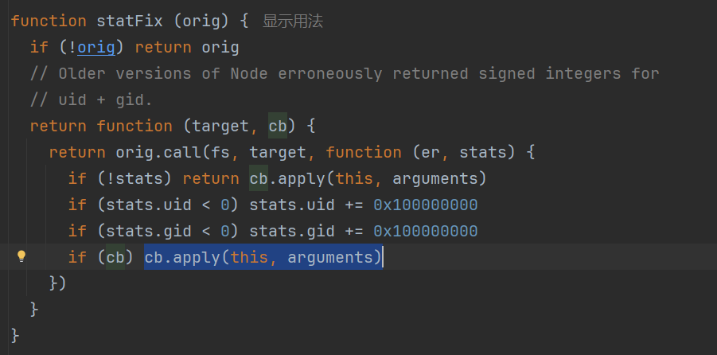
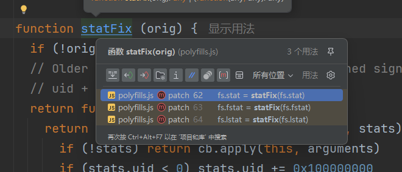
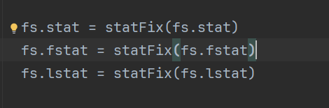
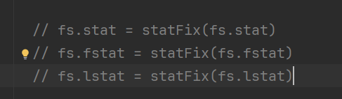
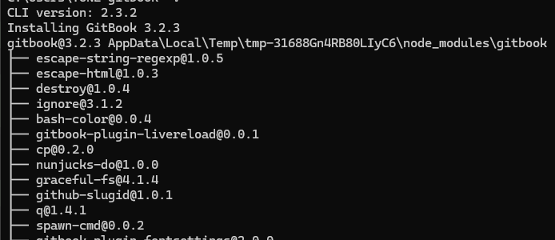
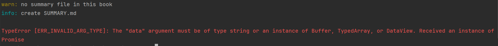
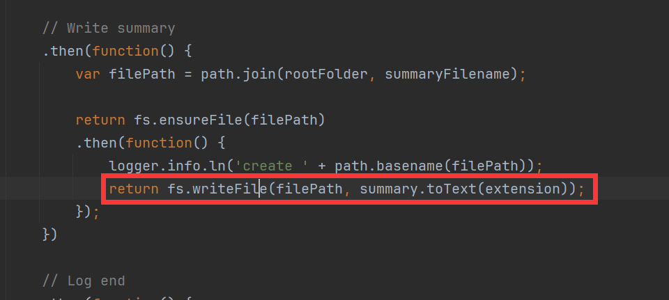
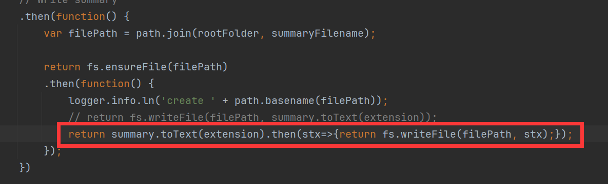
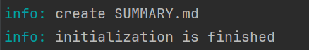

# GitBook 安装和使用

安装环境要求

`NodeJS`（推荐使用v4.0.0及以上版本）
`Windows`，`Linux`，`Unix` 或 `Mac OS X`

通过`NPM`安装

安装`GitBook`的最好是通过`NPM`。在终端提示符下，只需运行以下命令即可安装`GitBook`：

```
npm install gitbook-cli -g
```

`gitbook-cli`是`GitBook`的一个命令行工具。它将自动安装所需版本的`GitBook`来构建一本书。

执行下面的命令，查看`GitBook`版本，以验证安装成功。

```
gitbook -V
```

如果此处有错误


根据错误信息找到对应的文件：`xxx\gitbook-cli\node_modules\npm\node_modules\graceful-fs\polyfills.js`

并找到报错行数的函数

基于函数找到3个调用



这3行调用都注释掉


然后保存，再重新执行`gitbook -V`命令，出现以下情况就是正常的


## 使用

### 初始化

在对应目录执行：`gitbook init`

若出现此错误：


找到`C:\Users\xxx\.gitbook\versions\3.2.3\lib\init.js`文件

找到这一行


改成：`return summary.toText(extension).then(stx=>{return fs.writeFile(filePath, stx);});`


保存后，重新执行`gitbook init`命令，可以看到已经好了


### `gitbook`的目录结构说明

- `README.md`是默认首页文件，相当于网站的首页`index.html`，一般是介绍文字或相关导航链接
- `SUMMARY.md`是默认概括文件，主要是根据该文件内容生成相应的目录结构，同`README.md`一样都是被`gitbook init`初始化默认创建的重要文件
- `_book`是默认的输出目录，存放着原始`markdown`渲染完毕后的`html`
  文件，可以直接打包到服务器充当静态网站使用。一般是执行`gitbook build`或`gitbook serve`自动生成的
- `book.json`是配置文件，用于个性化调整`gitbook`的相关配置，如定义电子书的标题，封面，作者等信息。虽然是手动创建但一般是必选的
- `GLOSSARY.md`是默认的词汇表，主要说明专业词汇的详细解释，这样阅读到专业词汇时就会有相应提示信息，也是手动创建但是可选的
- `LANGS.md`是默认的语言文件，用于国际化版本翻译，和`GLOSSARY.md`一样是手动创建但是可选的

### gitbook 常用配置

在与`SUMMARY.md`同一目录下创建`book.json`文件

```json
{
"title": "我的笔记仓库",
"author": "HaoHaoDaYouXi",
"description": "个人的一些知识笔记和各类学习资料",
"language": "zh-hans",
"gitbook": "3.2.3",
"links": {
    "sidebar": {
          "GitHub": "https://github.com/HaoHaoDaYouXi/H-Notes"
        }
    }
}
```

### 启动本地服务

启动服务：`gitbook serve`，程序无报错则可以在浏览器预览电子书效果: http://localhost:4000

### 构建静态网页

`gitbook build`，默认生成文件存放在`_book/`目录，当然输出目录是可配置的

`gitbook serve ./ ./docs` or `gitbook build ./ ./docs`

`./`是源文件目录，`./docs` 是输出目录

### 错误

若出现`cb.apply is not a function`错误
```
...\node_modules\gitbook-cli\node_modules\npm\node_modules\graceful-fs\polyfills.js:287
      if (cb) cb.apply(this, arguments)
                 ^

TypeError: cb.apply is not a function
...
```
此类报错可以找到对应文件`graceful-fs\polyfills.js`，把3个调用注释掉之后就正常了
```
// fs.stat = statFix(fs.stat)
// fs.fstat = statFix(fs.fstat)
// fs.lstat = statFix(fs.lstat)
```


----
