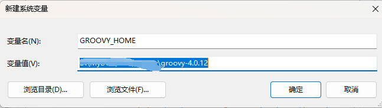
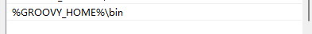
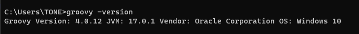

## groovy
Groovy环境变量的配置
1. 第一步，下载Groovy，下载地址：https://groovy.apache.org/download.html
2. 下载完毕后，将zip包解压到本地目录。
4. 下面我们来配置环境变量，点击此电脑鼠标右键，显示出属性，点击高级系统设置，配置GROOVY_HOME

5. 之后在Path变量中配置bin路径：

6. 验证groovy的环境变量是否配置成功，打开cmd，输入groovy -version：

