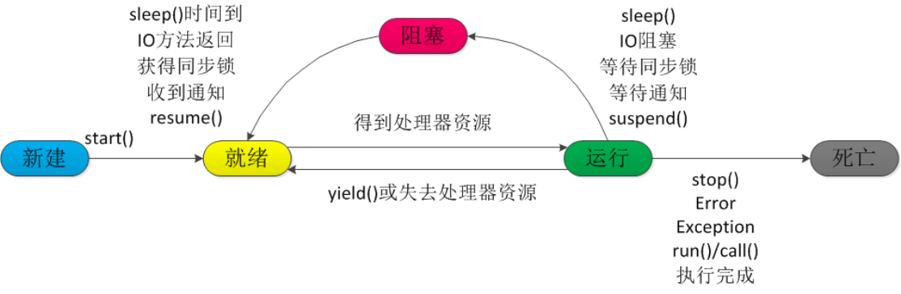
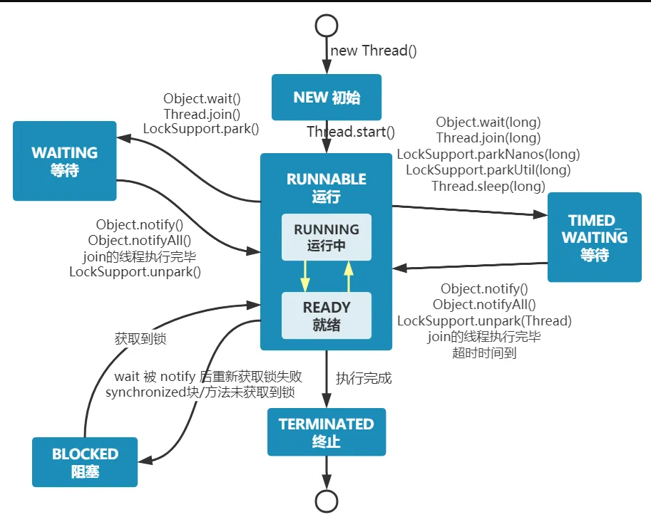

# 线程

## <div id="xc_jc">线程和进程</div>
### 进程
进程是程序的⼀次执⾏过程，是系统运⾏程序的基本单位，因此进程是动态的。系统运⾏⼀个程序即
是⼀个进程从创建，运⾏到消亡的过程。

在`Java`中，当我们启动`main`函数时其实就是启动了⼀个`JVM`的进程，⽽`main`函数所在的线程就
是这个进程中的⼀个线程，也称主线程。
### 线程
线程与进程相似，但线程是⼀个⽐进程更⼩的执⾏单位。⼀个进程在其执⾏的过程中可以产⽣多个线程。
与进程不同的是同类的多个线程共享进程的堆和⽅法区资源，但每个线程有⾃⼰的程序计数器、虚拟机栈和本地⽅法栈，
所以系统在产⽣⼀个线程，或是在各个线程之间作切换⼯作时，负担要⽐进程⼩得多，也正因为如此，线程也被称为轻量级进程。

`Java`程序天⽣就是多线程程序，我们可以通过`JMX`来看看⼀个普通的`Java`程序有哪些线程
```
// 获取 Java 线程管理 MXBean
ThreadMXBean threadMXBean = ManagementFactory.getThreadMXBean();
// 不需要获取同步的 monitor 和 synchronizer 信息，仅获取线程和线程堆栈信息
ThreadInfo[] threadInfos = threadMXBean.dumpAllThreads(false, false);
// 遍历线程信息，仅打印线程 ID 和线程名称信息
for (ThreadInfo threadInfo : threadInfos) {
    System.out.println("[" + threadInfo.getThreadId() + "] " +
    threadInfo.getThreadName());
}
```
程序输出
```
[5] Attach Listener //添加事件
[4] Signal Dispatcher // 分发处理给 JVM 信号的线程
[3] Finalizer //调⽤对象 finalize ⽅法的线程
[2] Reference Handler //清除 reference 线程
[1] main //main 线程,程序⼊⼝
```
从上⾯的输出内容可以看出：**⼀个 Java 程序的运⾏是 main 线程和多个其他线程同时运⾏。**

## <div id="xc_smzq">线程的生命周期</div>
当线程被创建并启动以后，它既不是一启动就进入了执行状态，也不是一直处于执行状态。
在线程的生命周期中，它要经过新建(`New`)、就绪(`Runnable`)、运行(`Running`)、阻塞(`Blocked`)和死亡(`Dead`)5 种状态。
尤其是当线程启动以后，它不可能一直"霸占"着`CPU`独自运行，所以`CPU`需要在多条线程之间切换，于是线程状态也会多次在运行、阻塞之间切换。

**线程的生命周期：`NEW`、`RUNNABLE`、`RUNNING`、`BLOCKED`、`DEAD`**

1. 建(`New`)：当程序使用`new`关键字创建了一个线程对象之后，该线程就处于新建状态，此时仅由`JVM`为其分配内存，并初始化其成员变量的值。

2. 就绪(`Runnable`)：当线程对象调用了`start()`方法之后，该线程处于就绪状态。`Java`虚拟机会为其创建方法调用栈和程序计数器，等待调度运行。

3. 运行(`Running`)：如果处于就绪状态的线程获得了`CPU`，开始执行`run()`方法的线程执行体，则该线程处于运行状态。

4. 阻塞(`Blocked`)：阻塞状态是指线程因为某种原因放弃了`cpu`使用权，也即让出了`cpu timeslice`，暂时停止运行。直到线程进入可运行(`runnable`)状态，才有机会再次获得`cpu timeslice`转到运行(`running`)状态。
   - 阻塞的情况分三种：
      - 等待阻塞 (`o.wait -> 等待对列`)：运行(`running`)的线程执行`o.wait()`方法，`JVM`会把该线程放入等待队列(`waitting queue`) 中。
      - 同步阻塞 (`lock -> 锁池`)：运行(`running`)的线程在获取对象的同步锁时，若该同步锁被别的线程占用，则`JVM`会把该线程放入锁池 (`lock pool`) 中。
      - 其他阻塞 (`sleep/join`)：运行(`running`)的线程执行`Thread.sleep(long ms)`或`t.join()`方法，或者发出了`I/O`请求时，`JVM`会把该线程置为阻塞状态。当`sleep()`状态超时、`join()`等待线程终止或者超时、或者`I/O`处理完毕时，线程重新转入可运行(`runnable`)状态。

5. 线程死亡(`Dead`)：线程会以下面三种方式结束，结束后就是死亡状态。　

正常结束：`run()`或`call()`方法执行完成，线程正常结束。

异常结束：线程抛出一个未捕获的`Exception`或`Error`。

调用`stop`：直接调用该线程的`stop()`方法来结束该线程—该方法通常容易导致死锁，不推荐使用。



## <div id="xc_zt">线程的状态</div>
`Java`线程在运⾏的⽣命周期中的指定时刻只可能处于下⾯ 6 种不同状态的其中⼀个状态：

- `NEW`：初始状态，线程被创建出来但没有被调⽤`start()`。
- `RUNNABLE`：运⾏状态，线程被调⽤了`start()`等待运⾏的状态。
- `BLOCKED`：阻塞状态，需要等待锁释放。
- `WAITING`：等待状态，表示该线程需要等待其他线程做出⼀些特定动作（通知或中断）。
- `TIME_WAITING`：超时等待状态，可以在指定的时间后⾃⾏返回⽽不是像`WAITING`那样⼀直等待。
- `TERMINATED`：终⽌状态，表示该线程已经运⾏完毕。线程在⽣命周期中并不是固定处于某⼀个状态⽽是随着代码的执⾏在不同状态之间切换。

- 

## <div id="xc_sx">线程实现</div>

### 继承`Thread`类
`Thread`类本质上是实现了`Runnable`接口的一个实例，代表一个线程的实例。启动线程的唯一方
法就是通过`Thread`类的`start()`实例方法。`start()`方法是一个`native`方法，它将启动一个新线程，并执行`run()`方法。

```
public class MyThread extends Thread {
    public void run() {
        System.out.println("MyThread.run()");
    }
}
MyThread myThread1 = new MyThread();
myThread1.start();
```

### 实现`Runnable`接口。
如果自己的类已经`extends`另一个类，就无法直接`extends Thread`，此时，可以实现一个`Runnable`接口。

```
public class MyThread extends OtherClass implements Runnable {
    public void run() {
        System.out.println("MyThread.run()");
    }
}

//启动 MyThread，需要首先实例化一个 Thread，并传入自己的 MyThread 实例：
MyThread myThread = new MyThread(); 
Thread thread = new Thread(myThread); 
thread.start(); 
//事实上，当传入一个 Runnable target 参数给 Thread 后，Thread 的 run()方法就会调用
target.run()
public void run() { 
    if (target != null) { 
        target.run(); 
    } 
} 
```

### `ExecutorService`、`Callable<Class>`、`Future`有返回值线程
有返回值的任务必须实现`Callable`接口，类似的，无返回值的任务必须`Runnable`接口。
执行`Callable`任务后，可以获取一个`Future`的对象，在该对象上调用`get`就可以获取到`Callable`任务返回的`Object`了，
再结合线程池接口`ExecutorService`就可以实现传说中有返回结果的多线程了。

```
//创建一个线程池
ExecutorService pool = Executors.newFixedThreadPool(taskSize);
// 创建多个有返回值的任务
List<Future> list = new ArrayList<Future>(); 
for (int i = 0; i < taskSize; i++) { 
    Callable c = new MyCallable(i + " "); 
    // 执行任务并获取 Future 对象
    Future f = pool.submit(c); 
    list.add(f); 
} 
// 关闭线程池
pool.shutdown(); 
// 获取所有并发任务的运行结果
for (Future f : list) { 
    // 从 Future 对象上获取任务的返回值，并输出到控制台
    System.out.println("res：" + f.get().toString()); 
}
```

### 基于线程池的方式
线程和数据库连接这些资源都是非常宝贵的资源。那么每次需要的时候创建，不需要的时候销毁，是非常浪费资源的。
那么我们就可以使用缓存的策略，也就是使用线程池。

```
// 创建线程池
ExecutorService threadPool = Executors.newFixedThreadPool(10);
while(true) {
    threadPool.execute(new Runnable() { // 提交多个线程任务，并执行
        @Override
        public void run() {
            System.out.println(Thread.currentThread().getName() + " is running ..");
            try {
                Thread.sleep(3000);
            } catch (InterruptedException e) {
                e.printStackTrace();
            }
        }
    });
}
```

## <div id="xc_xcc">线程池</div>
线程池就是管理一系列线程的资源池，其提供了一种限制和管理线程资源的方式。
每个线程池还维护一些基本统计信息，例如已完成任务的数量。

**线程池的好处：**
- 降低资源消耗：通过重复利用已创建的线程降低线程创建和销毁造成的消耗。
- 提高响应速度：当任务到达时，任务可以不需要等到线程创建就能立即执行。
- 提高线程的可管理性：线程是稀缺资源，如果无限制的创建，不仅会消耗系统资源，还会降低系统的稳定性，使用线程池可以进行统一的分配，调优和监控。

**线程池一般用于执行多个不相关联的耗时任务，没有多线程的情况下，任务顺序执行，使用了线程池的话可让多个不相关联的任务同时执行。**

`Java`里面线程池的顶级接口是`Executor`，但是严格意义上讲`Executor`并不是一个线程池，而只是一个执行线程的工具。
真正的线程池接口是`ExecutorService`。

### `newCachedThreadPool`
创建一个可根据需要创建新线程的线程池，但是在以前构造的线程可用时将重用它们。
对于执行很多短期异步任务的程序而言，这些线程池通常可提高程序性能。
调用`execute`将重用以前构造的线程(如果线程可用)。如果现有线程没有可用的，则创建一个新线程并添加到池中。
终止并从缓存中移除那些已有`60`秒钟未被使用的线程。因此，长时间保持空闲的线程池不会使用任何资源。

### `newFixedThreadPool`
创建一个可重用固定线程数的线程池，以共享的无界队列方式来运行这些线程。
在任意点，在大多数`nThreads`线程会处于处理任务的活动状态。
如果在所有线程处于活动状态时提交附加任务，则在有可用线程之前，附加任务将在队列中等待。
如果在关闭前的执行期间由于失败而导致任何线程终止，那么一个新线程将代替它执行后续的任务(如果需要)。
在某个线程被显式地关闭之前，池中的线程将一直存在。

### `newScheduledThreadPool`
创建一个线程池，它可安排在给定延迟后运行命令或者定期地执行。
```
ScheduledExecutorService scheduledThreadPool= Executors.newScheduledThreadPool(3);
scheduledThreadPool.schedule(newRunnable(){
    @Override
    public void run() {
        System.out.println("延迟三秒");
    }
}, 3, TimeUnit.SECONDS);

scheduledThreadPool.scheduleAtFixedRate(newRunnable(){
    @Override
    public void run() {
        System.out.println("延迟 1 秒后每三秒执行一次");
    }
},1,3,TimeUnit.SECONDS);
```

### `newSingleThreadExecutor`
`Executors.newSingleThreadExecutor()`返回一个线程池(这个线程池只有一个线程)，
这个线程池可以在线程死后(或发生异常时)重新启动一个线程来替代原来的线程继续执行下去！

## <div id="xc_start_run">`start`和`run`的区别</div>

`start()`方法来启动线程，真正实现了多线程运行。
这时无需等待`run`方法体代码执行完毕，可以直接继续执行后续的代码。

通过调用`Thread`类的`start()`方法来启动一个线程，这时此线程是处于就绪状态，并没有运行。

方法`run()`称为线程体，它包含了要执行的这个线程的内容，线程就进入了运行状态，开始运行`run`函数当中的代码。`Run`方法运行结束，此线程终止。然后`CPU`再调度其它线程。

## <div id="xc_sleep_wait">`sleep`和`wait`的区别</div>

对于`sleep()`方法，我们首先要知道该方法是属于`Thread`类中的。而`wait()`方法，则是属于`Object`类中的。

`sleep()`方法导致了程序暂停执行指定的时间，让出`cpu`该其他线程，但是他的监控状态依然保持者，当指定的时间到了又会自动恢复运行状态。

在调用`sleep()`方法的过程中，线程不会释放对象锁。

而当调用`wait()`方法的时候，线程会放弃对象锁，进入等待此对象的等待锁定池，只有针对此对象调用`notify()`方法后本线程才进入对象锁定池准备获取对象锁进入运行状态。

## <div id="xc_htxc">后台线程</div>
1. 定义：守护线程--也称“服务线程”，他是后台线程，它有一个特性，即为用户线程提供公共服务，在没有用户线程可服务时会自动离开。
2. 优先级：守护线程的优先级比较低，用于为系统中的其它对象和线程提供服务。
3. 设置：通过`setDaemon(true)`来设置线程为“守护线程”；将一个用户线程设置为守护线程的方式是在 线程对象创建 之前 用线程对象的`setDaemon`方法。
4. 在`Daemon`线程中产生的新线程也是`Daemon`的。
5. 线程则是`JVM`级别的，以`Tomcat`为例，如果你在`Web`应用中启动一个线程，这个线程的生命周期并不会和`Web`应用程序保持同步。
   也就是说，即使你停止了`Web`应用，这个线程依旧是活跃的。
6. `example`: 垃圾回收线程就是一个经典的守护线程，当我们的程序中不再有任何运行的`Thread`，程序就不会再产生垃圾，垃圾回收器也就无事可做，
   所以当垃圾回收线程是`JVM`上仅剩的线程时，垃圾回收线程会自动离开。
   它始终在低级别的状态中运行，用于实时监控和管理系统中的可回收资源。
7. 生命周期：守护进程(`Daemon`)是运行在后台的一种特殊进程。
   它独立于控制终端并且周期性地执行某种任务或等待处理某些发生的事件。
   也就是说守护线程不依赖于终端，但是依赖于系统，与系统“同生共死”。
   当`JVM`中所有的线程都是守护线程的时候，`JVM`就可以退出了；如果还有一个或以上的非守护线程则`JVM`不会退出。

## <div id="xc_gxsj">线程共享数据</div>


----
