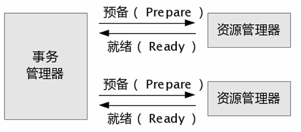
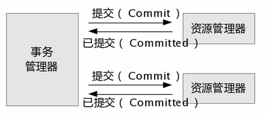

# Spring Data JPA

`Spring Data JPA`，事务是计算机应用中不可或缺的组件模型，它保证了用户操作的原子性 (`Atomicity`)、一致性(`Consistency`)、隔离性 (`Isolation`) 和持久性 (`Durability`)。

> 原子性（`Atomicity`）
>> 原子性，是指事务包含的所有操作，要么全部成功，要么全部失败回滚。因此，事务的操作如果成功就必须要完全持久化到数据库，如果操作失败则不能对数据库有任何影响。

> 一致性（`Consistency`）
>> 一致性，是指事务必须使数据库从一个一致性状态变换到另一个一致性状态，也就是说一个事务执行之前和执行之后都必须处于一致性状态。</br>
>> 例如：假设A和B两者的钱加起来一共是100，那么不管A和B之间如何转账，转几次账，事务结束后两个用户的钱相加起来应该还是100，这即是事务的一致性。

> 隔离性（`Isolation`）
>> 隔离性，是当多个用户并发访问数据库时，比如操作同一张表时，数据库为每一个用户开启的事务，不能被其他事务的操作所干扰，多个并发事务之间要相互隔离。</br>
>> 即要达到这么一种效果：对于任意两个并发的事务T1和T2，在事务T1看来，T2要么在T1开始之前就已经结束，要么在T1结束之后才开始，这样每个事务都感觉不到有其他事务在并发地执行。

> 持久性（`Durability`）
>> 持久性，是指一个事务一旦被提交了，那么对数据库中的数据的改变就是永久性的，即便是在数据库系统遇到故障的情况下也不会丢失提交事务的操作。</br>
>> 例如我们在使用JDBC操作数据库时，在提交事务方法后，提示用户事务操作完成，当我们程序执行完成直到看到提示后，就可以认定事务以及正确提交，即使这时候数据库出现了问题，也必须要将我们的事务完全执行完成，否则就会造成我们看到提示事务处理完毕，但是数据库因为故障而没有执行事务的重大错误。

## <div id="cbxw">Spring事物的传播行为</div>
事务的传播行为说的是，当多个事务同时存在的时候，`Spring`如何处理这些事务的行为。
- `PROPAGATION_REQUIRED`：如果当前没有事务，就创建一个新事务，如果当前存在事务，就加入该事务，`Spring`默认事务级别。
  - 执行`ServiceA.methodA`的时候，`ServiceA.methodA`已经起了事务，这时调用`ServiceB.methodB`，</br>
    `ServiceB.methodB`看到自己已经运行在`ServiceA.methodA`的事务内部，就不再起新的事务。</br>
    而假如`ServiceA.methodA`运行的时候发现自己没有在事务中，他就会为自己分配一个事务。</br>
    这样，在`ServiceA.methodA`或者在`ServiceB.methodB`内的任何地方出现异常，事务都被回滚。</br>
    即使`ServiceB.methodB`的事务已经被提交，但是`ServiceA.methodA`在接下来`error`要回滚，`ServiceB.methodB`也要回滚。
- `PROPAGATION_SUPPORTS`：支持当前事务，如果当前存在事务，就加入该事务，如果当前不存在事务，就以非事务执行。
- `PROPAGATION_MANDATORY`：支持当前事务，如果当前存在事务，就加入该事务，如果当前不存在事务，就抛出异常。
- `PROPAGATION_REQUIRES_NEW`：创建新事务，无论当前存不存在事务，都创建新事务。
  - `ServiceA.methodA`的事务级别为`PROPAGATION_REQUIRED`，`ServiceB.methodB`的事务级别为`PROPAGATION_REQUIRES_NEW`，</br>
    那么当执行到`ServiceB.methodB`的时候，`ServiceA.methodA`所在的事务就会挂起，`ServiceB.methodB`会起一个新的事务，</br>
    等待`ServiceB.methodB`的事务完成以后，`A`才继续执行。他与`PROPAGATION_REQUIRED`的事务区别在于事务的回滚程度了。</br>
    因为`ServiceB.methodB`是新起一个事务，那么就是存在两个不同的事务。</br>
    如果`ServiceB.methodB`已经提交，那么`ServiceA.methodA`失败回滚，`ServiceB.methodB`是不会回滚的。</br>
    如果`ServiceB.methodB`失败回滚，如果他抛出的异常被`ServiceA.methodA`捕获，`ServiceA.methodA`事务仍然可能提交。
- `PROPAGATION_NOT_SUPPORTED`：以非事务方式执行操作，如果当前存在事务，就把当前事务挂起。
- `PROPAGATION_NEVER`：以非事务方式执行，如果当前存在事务，则抛出异常。
- `PROPAGATION_NESTED`：如果当前存在事务，则在嵌套事务内执行。如果当前没有事务，则按`PROPAGATION_REQUIRED`属性执行。
  - 与`PROPAGATION_REQUIRES_NEW`的区别是`NESTED`的事务和他的父事务是相依的，它的提交是要等父事务一块提交。也就是说，如果父事务最后回滚，它也要回滚。

## <div id="gljb">事物的隔离级别</div>
在介绍数据库提供的各种隔离级别之前，先看看如果不考虑事务的隔离性，会发生的几种问题：
> 脏读
>> 脏读是指在一个事务处理过程里读取了另一个未提交的事务中的数据。</br>
>> 当一个事务正在多次修改某个数据，而在这个事务中这多次的修改都还未提交，这时一个并发的事务来访问该数据，就会造成两个事务得到的数据不一致。

> 不可重复读
>> 不可重复读是指在对于数据库中的某个数据，一个事务范围内多次查询却返回了不同的数据值，这是由于在查询间隔，被另一个事务修改并提交了。</br>
>> 不可重复读和脏读的区别是，脏读是某一事务读取了另一个事务未提交的脏数据，而不可重复读则是读取了前一事务提交的数据。</br>
>> 在某些情况下，不可重复读并不是问题，比如我们多次查询某个数据当然以最后查询得到的结果为主。但在另一些情况下就有可能发生问题，例如对于同一个数据A和B依次查询就可能不同，A和B就可能打起来了……

> 幻读(虚读)
>> 幻读是事务非独立执行时发生的一种现象。</br>
>> 如事务T1对一个表中所有的行的某个数据项做了从“1”修改为“2”的操作，这时事务T2又对这个表中插入了一行数据项，而这个数据项的数值还是为“1”并且提交给数据库。</br>
>> 而操作事务T1的用户如果再查看刚刚修改的数据，会发现还有一行没有修改，其实这行是从事务T2中添加的，就好像产生幻觉一样，这就是发生了幻读。</br>
>> 幻读和不可重复读都是读取了另一条已经提交的事务（这点就脏读不同），所不同的是不可重复读查询的都是同一个数据项，而幻读针对的是一批数据整体（比如数据的个数）

关于事务的隔离性数据库提供了多种隔离级别，`MySQL`数据库为我们提供的四种隔离级别：
- `Serializable`(串行化)：可避免脏读、不可重复读、幻读的发生。
- `Repeatable read`(可重复读)：可避免脏读、不可重复读的发生。
- `Read committed`(读已提交)：可避免脏读的发生。
- `Read uncommitted`(读未提交)：最低级别，任何情况都无法保证。

以上四种隔离级别最高的是`Serializable`级别，最低的是`Read uncommitted`级别，当然级别越高，执行效率就越低。
像`Serializable`这样的级别，就是以锁表的方式(类似于`Java`多线程中的锁)使得其他的线程只能在锁外等待，所以平时选用何种隔离级别应该根据实际情况。

**`MySQL`数据库中默认的隔离级别为`Repeatable read`(可重复读)。**

在`MySQL`数据库中，支持上面四种隔离级别，默认的为`Repeatable read`(可重复读)；而在`Oracle`数据库中，只支持`Serializable`(串行化)级别和`Read committed`(读已提交)这两种级别，其中默认的为`Read committed`级别。

查看`mysql`数据库事务的默认隔离级别的`SQL`：
```sql
SELECT @@tx_isolation;
```

## <div id="glsw">`Spring`管理事务</div>

`Spring`事务管理主要包括3个接口：

- `PlatformTransactionManager`：事务管理器，主要用于平台相关事务的管理。主要包括三个方法：
  - `commit`：事务提交。
  - `rollback`：事务回滚。
  - `getTransaction`：获取事务状态。
- `TransactionDefinition`：事务定义信息，用来定义事务相关属性，给事务管理器`PlatformTransactionManager`使用这个接口有下面四个主要方法：
  - `getIsolationLevel`：获取隔离级别。
  - `getPropagationBehavior`：获取传播行为。
  - `getTimeout`获取超时时间。
  - `isReadOnly`：是否只读（保存、更新、删除时属性变为`false`--可读写，查询时为`true`--只读）事务管理器能够根据这个返回值进行优化，这些事务的配置信息，都可以通过配置文件进行配置。
- `TransactionStatus`：事务具体运行状态，事务管理过程中，每个时间点事务的状态信息。例如：
  - `hasSavepoint()`：返回这个事务内部是否包含一个保存点。
  - `isCompleted()`：返回该事务是否已完成，也就是说，是否已经提交或回滚。
  - `isNewTransaction()`：判断当前事务是否是一个新事务。

## <div id="sxfs">事物的实现方式</div>

### <div id="bdsw">本地事务</div>
紧密依赖于底层资源管理器(例如数据库连接)，事务处理局限在当前事务资源内。</br>
此种事务处理方式不存在对应用服务器的依赖，因而部署灵活却无法支持多数据源的分布式事务。</br>

在数据库连接中使用本地事务示例如下：
```java
public void transferAccount() {  
    Connection conn = null;  
    Statement stmt = null;  
    try{
        conn = getDataSource().getConnection();  
        // 将自动提交设置为 false，若设置为 true 则数据库将会把每一次数据更新认定为一个事务并自动提交
        conn.setAutoCommit(false);
        stmt = conn.createStatement();  
        // 将 A 账户中的金额减少 100  
        stmt.execute("update u_account set amount = amount - 100 where account_id = 'A'");
        // 将 B 账户中的金额增加 100  
        stmt.execute("update u_account set amount = amount + 100 where account_id = 'B'");
        // 提交事务
        conn.commit();
        // 事务提交：转账的两步操作同时成功
    } catch(SQLException sqle){     
        // 发生异常，回滚在本事务中的操做
        conn.rollback();
        // 事务回滚：转账的两步操作完全撤销
        stmt.close();  
        conn.close();  
    }  
}
```

### <div id="fbssw">分布式事务</div>
`Java`事务编程接口(`JTA`：`Java Transaction API`)和`Java`事务服务 (`JTS`：`Java Transaction Service`)为`J2EE`平台提供了分布式事务服务。

分布式事务(`Distributed Transaction`)包括事务管理器(`Transaction Manager`)和一个或多个支持`XA`协议的资源管理器 (`Resource Manager`)。

我们可以将资源管理器看做任意类型的持久化数据存储；事务管理器承担着所有事务参与单元的协调与控制。
```java
public void transferAccount() {  
    UserTransaction userTx = null;  
    Connection connA,connB = null; 
    Statement stmtA,stmtB = null;   
    try{  
        // 获得 Transaction 管理对象
        userTx = (UserTransaction)getContext().lookup("java:comp/UserTransaction");
        // 从数据库 A 中取得数据库连接
        connA = getDataSourceA().getConnection();
        // 从数据库 B 中取得数据库连接
        connB = getDataSourceB().getConnection();
        // 启动事务
        userTx.begin();   
        stmtA = connA.createStatement();// 将 A 账户中的金额减少 100  
        stmtA.execute("update u_account set amount = amount - 100 where account_id = 'A'");
        // 将 B 账户中的金额增加 100  
        stmtB = connB.createStatement();
        stmtB.execute("update u_account set amount = amount + 100 where account_id = 'B'");
        // 提交事务   
        userTx.commit();
        // 事务提交：转账的两步操作同时成功（数据库 A 和数据库 B 中的数据被同时更新）
    } catch(SQLException sqlE){  
        // 发生异常，回滚在本事务中的操纵
        userTx.rollback();// 事务回滚：数据库 A 和数据库 B 中的数据更新被同时撤销
    } catch(Exception ne){
        // 发生异常，回滚在本事务中的操纵
        userTx.rollback();// 事务回滚：数据库 A 和数据库 B 中的数据更新被同时撤销
    }  
}
```

#### <div id="ljdtj">两阶段提交</div>
两阶段提交主要保证了分布式事务的原子性：即所有结点要么全做要么全不做，所谓的两个阶段是指：
> 第一阶段：准备阶段；
>> 事务协调者(事务管理器)给每个参与者(资源管理器)发送 Prepare 消息，</br>
>> 每个参与者要么直接返回失败(如权限验证失败)，要么在本地执行事务，写本地的 redo 和 undo 日志，但不提交。</br>
>> 

> 第二阶段：提交阶段。
>> 如果协调者收到了参与者的失败消息或者超时，直接给每个参与者发送回滚(Rollback)消息；</br>
>> 否则，发送提交(Commit)消息；参与者根据协调者的指令执行提交或者回滚操作，释放所有事务处理过程中使用的锁资源。(必须在最后阶段释放锁资源)</br>
> 将提交分成两阶段进行的目的很明确，就是尽可能晚地提交事务，让事务在提交前尽可能地完成所有能完成的工作。</br>
>> 

**以上都是事务的实现原理，具体的实现有很多种，如`xml`、注解、tx-lcn、Seata、...**

### <div id="xmlpz">`xml`配置</div>
```xml
<!-- 管理事务的类,指定我们用谁来管理我们的事务-->  
<bean id="txManager" class="org.springframework.jdbc.datasource.DataSourceTransactionManager">  
  <!-- 对应自己数据源配置的名称 -->  
  <property name="dataSource" ref="dataSource"/>  
</bean>

<!-- 首先我们要把服务对象声明成一个 bean 例如 AService -->  
<bean id="AService" class="com.xxx.service.AService"/>  

<!-- 然后是声明一个事物建议tx:advice,spring为我们提供了事物的封装，这个就是封装在了<tx:advice/>中 -->
<!-- <tx:advice/>有一个transaction-manager属性，我们可以用它来指定我们的事物由谁来管理。默认：事务传播设置是 REQUIRED，隔离级别是DEFAULT -->
<tx:advice id="txAdvice" transaction-manager="txManager">  
    <!-- 配置这个事务建议的属性 -->  
    <tx:attributes>  
      <!-- 指定所有get开头的方法执行在只读事务上下文中 -->  
      <tx:method name="get*" read-only="true"/>  
      <!-- 其余方法执行在默认的读写上下文中 -->  
      <tx:method name="*"/>  
    </tx:attributes>
</tx:advice>  

<!-- 我们定义一个切面，它匹配FooService接口定义的所有操作 -->  
<aop:config>  
    <!-- <aop:pointcut/>元素定义AspectJ的切面表示法，这里是表示com.xxx.service.AService包下的任意方法。 -->
    <aop:pointcut id="AServiceOperation" expression="execution(* com.xxx.service.AService.*(..))"/>  
    <!-- 然后我们用一个通知器：<aop:advisor/>把这个切面和tx:advice绑定在一起，表示当这个切面：advice定义的通知逻辑将被执行 -->
    <aop:advisor advice-ref="txAdvice" pointcut-ref="AServiceOperation"/>  
</aop:config> 
```

#### `@Transactional`注解
这个注解还是有很多需要注意，如果使用不当会导致事务回滚失效

`@Transactional`可以作用在接口、类、类方法

- 作用于类：当把`@Transactional`注解放在类上时，表示所有该类的public方法都配置相同的事务属性信息。

- 作用于方法：当类配置了`@Transactional`，方法也配置了`@Transactional`，方法的事务会覆盖类的事务配置信息。

- 作用于接口：不推荐这种使用方法，因为一旦标注在`Interface`上并且配置了`Spring AOP`使用`CGLib`动态代理，将会导致`@Transactional`注解失效。

#### `@Transactional`属性
- `propagation`属性
  - `propagation`代表事务的传播行为，默认值为`Propagation.REQUIRED`
- `isolation`属性
  - `isolation`：事务的隔离级别，默认值为`Isolation.DEFAULT`
    - `Isolation.DEFAULT`：使用底层数据库默认的隔离级别。
    - `Isolation.READ_UNCOMMITTED`：读未提交
    - `Isolation.READ_COMMITTED`：读已提交
    - `Isolation.REPEATABLE_READ`：可重复读
    - `Isolation.SERIALIZABLE`：串行化
- `timeout`属性
  - `timeout`：事务的超时时间，默认值为 -1。如果超过该时间限制但事务还没有完成，则自动回滚事务。
- `readOnly`属性
  - `readOnly`：指定事务是否为只读事务，默认值为`false`；为了忽略那些不需要事务的方法，比如读取数据，可以设置`read-only`为`true`。
- `rollbackFor`属性
  - `rollbackFor`：用于指定能够触发事务回滚的异常类型，可以指定多个异常类型。
- `noRollbackFor`属性
  - `noRollbackFor`：抛出指定的异常类型，不回滚事务，也可以指定多个异常类型。

```java
@Transactional(rollbackFor = Exception.class)
public void transactionalTest(){
    // 只用正常些业务代码就可以了，一切交给 Spring 来处理，这里 @Transactional 注解用到的知识就是 AOP
    try {
        User user = new User().setName("HaoHaoDaYouXi");
        // 数据库操作
        userService.insertUser(user);
        // 手动设置异常
        int i = 1 / 0;
    } catch (Exception e) {
        log.error("执行事务异常，需要回滚",e);
        // 如果异常被 try 、 catch 吞了是不会回滚的，所有手动抛出去
        throw e;
    }
}
```

#### `@Transactional`失效场景

`@Transactional`应用在非`public`修饰的方法上

首先`JDK`动态代理肯定只能是`public`，因为接口的权限修饰符只能是`public`，所以其他的修饰符不可以使用，`cglib`代理的方式是可以代理`protected`方法的如果支持`protected`，大概率会造成当切换代理的实现方式时表现不同，所以会出现很多的`bug`，然后造成一系列的问题

`@Transactional`注解属性`propagation`设置错误

这种失效是由于配置错误，若是错误的配置以下三种`propagation`，事务将不会发生回滚。

`TransactionDefinition.PROPAGATION_SUPPORTS`：如果当前存在事务，则加入该事务；如果当前没有事务，则以非事务的方式继续运行。</br>
`TransactionDefinition.PROPAGATION_NOT_SUPPORTED`：以非事务方式运行，如果当前存在事务，则把当前事务挂起。</br>
`TransactionDefinition.PROPAGATION_NEVER`：以非事务方式运行，如果当前存在事务，则抛出异常。</br>

`@Transactional`注解属性`rollbackFor`设置错误

`rollbackFor`可以指定能够触发事务回滚的异常类型。</br>
`Spring`默认抛出了未检查`unchecked`异常（继承自`RuntimeException`的异常）或者`Error`才回滚事务；其他异常不会触发回滚事务。</br>
如果在事务中抛出其他类型的异常，但却期望`Spring`能够回滚事务，就需要指定`rollbackFor`属性。

同一个类中方法调用，导致`@Transactional`失效

开发中避免不了会对同一个类里面的方法调用，比如有一个类A，它的一个方法a，a再调用本类的方法b（不论方法b是用public还是private修饰），但方法a没有声明注解事务，而b方法有。
则外部调用方法a之后，方法b的事务是不会起作用的。这也是经常犯错误的一个地方。

这是由于使用`Spring AOP`代理造成的，因为只有当事务方法被当前类以外的代码调用时，才会由`Spring`生成的代理对象来管理。

使用该类的Spring代理对象就可以避免此问题

其他情况基本都是代码写法问题，多注意，按照标准写基本可以避免问题

----
