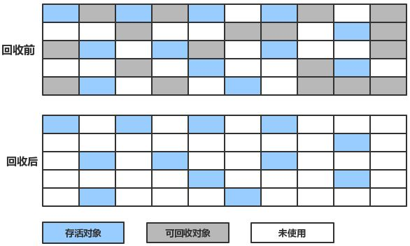
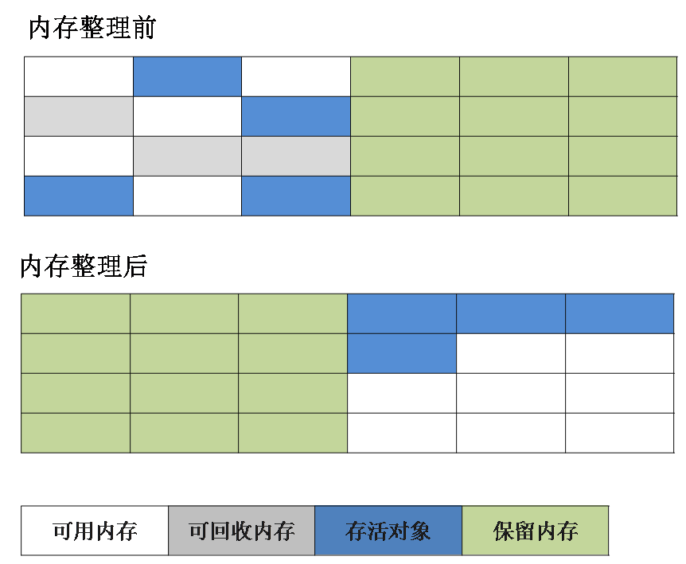
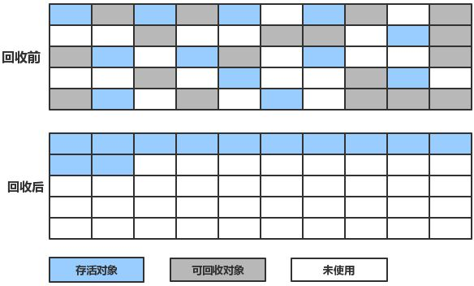
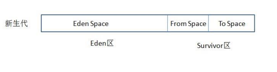

# 垃圾回收算法

### 标记清除算法 Mark-Sweep
最基础的垃圾回收算法，该方法实现分为两个阶段，标注和清除。

标记阶段标记出所有需要回收的对象，做个标记，
清除阶段遍历堆，把未被标记的对象回收。

如图所示：

  
从图中我们就可以发现，该算法最大的问题是内存碎片化严重，
后续可能发生大对象不能找到可利用空间的问题。

### 
复制算法 Copying

为了解决 标记清除算法(Mark-Sweep) 算法内存碎片化的缺陷而被提出的算法。
按内存容量将内存划分为等大小的两块。每次只使用其中一块，
当这一块内存满后将尚存活的对象复制到另一块上去，把已使用的内存清掉。

如图所示：

  
这种算法虽然实现简单，内存效率高，不易产生碎片，
但是最大的问题是可用内存被压缩到了原本的一半。
且存活对象增多的话，Copying 算法的效率会大大降低。

### 
标记整理算法 Mark-compact

结合了以上两个算法，为了避免缺陷而提出。
标记阶段和 Mark-Sweep 算法相同，标记后不是清理对象，
而是将存活对象移向内存的一端。然后清除端边界外的对象。

如图所示：

  

### 
分代回收算法

分代回收算法是目前大部分 JVM 所采用的方法，
其核心思想是根据对象存活的生命周期不同，将内存划分为不同的区域，
一般情况下将 GC 堆划分为新生代和老年代；

老年代的特点是：对象生命周期较长，每次垃圾回收时只有少量对象需要被回收；

新生代的特点是：对象大部分朝生夕死，生命周期短，
每次垃圾回收时都有大量对象需要被回收；
因此，可以根据不同区域选择不同的算法，使垃圾回收更加合理、高效，

如：新生代采用效率较高的复制算法，老年代采用不会产生内存碎片，
也不会发生内存浪费的标记整理算法。

### 新生代与复制算法
目前大部分 JVM 的 GC 对于新生代都采取 Copying 算法，因为新生代中每次垃圾回收都要
回收大部分对象，即要复制的操作比较少，但通常并不是按照 1：1 来划分新生代。一般将新生代
划分为一块较大的 Eden 空间和两个较小的 Survivor 空间(From Space, To Space)，每次使用
Eden 空间和其中的一块 Survivor 空间，当进行回收时，将该两块空间中还存活的对象复制到另
一块 Survivor 空间中。

如图所示：

  

### 老年代与标记复制算法
而老年代因为每次只回收少量对象，因而采用 Mark-Compact 算法。
1. JAVA 虚拟机提到过的处于方法区的永生代(Permanet Generation)，它用来存储 class 类，
常量，方法描述等。对永生代的回收主要包括废弃常量和无用的类。
2. 对象的内存分配主要在新生代的 Eden Space 和 Survivor Space 的 From Space(Survivor 目
前存放对象的那一块)，少数情况会直接分配到老生代。
3. 当新生代的 Eden Space 和 From Space 空间不足时就会发生一次 GC，进行 GC 后，Eden
Space 和 From Space 区的存活对象会被挪到 To Space，然后将 Eden Space 和 From
Space 进行清理。
4. 如果 To Space 无法足够存储某个对象，则将这个对象存储到老生代。
5. 在进行 GC 后，使用的便是 Eden Space 和 To Space 了，如此反复循环。
6. 当对象在 Survivor 区躲过一次 GC 后，其年龄就会+1。默认情况下年龄到达 15 的对象会被
移到老生代中。

# GC 分代收集算法 VS 分区收集算法

### 分代收集算法
当前主流 VM 垃圾收集都采用”分代收集”(Generational Collection)算法, 
这种算法会根据对象存活周期的不同将内存划分为几块, 
如 JVM 中的 新生代、老年代、永久代，
这样就可以根据各年代特点分别采用最适当的 GC 算法

### 在新生代-复制算法
每次垃圾收集都能发现大批对象已死, 只有少量存活. 因此选用复制算法, 
只需要付出少量存活对象的复制成本就可以完成收集.

### 在老年代-标记整理算法
因为对象存活率高、没有额外空间对它进行分配担保, 
就必须采用“标记—清理”或“标记—整理”算法来进行回收, 不必进行内存复制, 
且直接腾出空闲内存.

### 分区收集算法
分区算法则将整个堆空间划分为连续的不同小区间, 每个小区间独立使用, 
独立回收. 这样做的好处是可以控制一次回收多少个小区间 , 根据目标停顿时间, 
每次合理地回收若干个小区间(而不是整个堆), 从而减少一次 GC 所产生的停顿。
