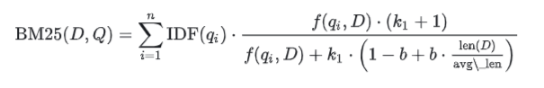
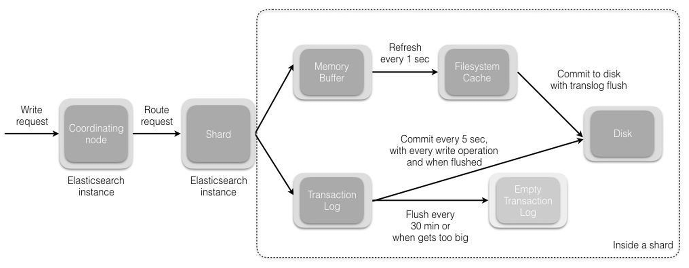
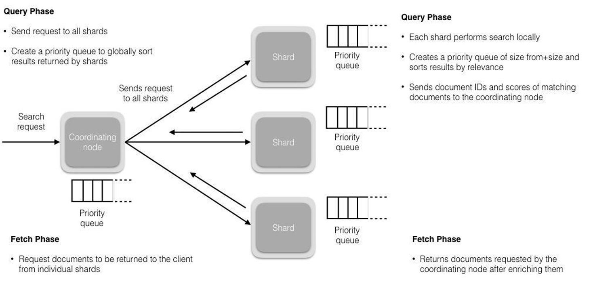

# 搜索引擎

现在的系统，基本都有通用查询功能，就例如：商城网站的搜索，要可以根据商品名称、商品描述等信息进行搜索。这时就需要搜索引擎了。

搜索引擎是一种根据用户需求与特定算法，运用多种技术检索出指定信息并反馈给用户的信息检索工具。

目前`Java`开发中涉及到的主流有：`Elasticsearch`、`Solr`

## <a id="elasticsearch">Elasticsearch</a>

`Elasticsearch`是一个分布式、`RESTful`风格的搜索和数据分析引擎，能够解决不断涌现出的各种用例。
作为`Elastic Stack`的核心，它集中存储您的数据，帮助您发现意料之中以及意料之外的情况。

`ElasticSearch`是基于`Lucene`的搜索服务器。它提供了一个分布式多用户能力的全文搜索引擎，基于`RESTful Web`接口。

`Elasticsearch`是用`Java`开发的，并作为`Apache`许可条款下的开放源码发布，是当前流行的企业级搜索引擎。

核心特点如下：
- 分布式的实时文件存储，每个字段都被索引且可用于搜索。
- 分布式的实时分析搜索引擎，海量数据下近实时秒级响应。
- 简单的`RESTful API`，天生的兼容多语言开发。
- 易扩展，处理`PB`级结构化或非结构化数据。

基本概念
- 文档（`Document`）：`Elasticsearch`中的基本单位，通常是一个`JSON`格式的对象。
- 索引（`Index`）：类似于数据库的概念，用于存储文档。
- 类型（`Type`）：在`Elasticsearch 7.x`版本之前，一个索引可以包含多个类型；`7.x`版本之后，一个索引只能包含一种类型。
- 映射（`Mapping`）：定义了文档的字段及其数据类型，类似于数据库表的结构定义。
- 分片（`Shard`）：`Elasticsearch`中的最小可寻址单元，每个索引可以被划分为多个分片，以实现水平扩展。
- 副本（`Replica`）：分片的副本，用于提高数据的可用性和容错性。

### <a id="stack">`ELK Stack`</a>

`ELK`分别代表`Elasticsearch`、`Logstash`和`Kibana`，这三个工具共同构成了一个完整的日志管理和分析解决方案。

#### `Elasticsearch`

- 简介：`Elasticsearch`是一个基于`Lucene`的分布式搜索和分析引擎，用于存储、搜索和分析大量的数据。
- 功能：
  - 索引：将日志数据索引化，以便快速检索。
  - 搜索：提供高效的全文搜索能力。
  - 聚合：支持对数据进行聚合分析，如统计、分组等。
- 特点：
  - 高性能：能够处理大量的数据和高并发的查询请求。
  - 可扩展性：支持水平扩展，可以通过添加更多的节点来提高性能和存储容量。
  - 易用性：提供`RESTful API`，支持多种编程语言的客户端。

#### `Logstash`

- 简介：`Logstash`是一个用于收集、解析和丰富日志数据的工具。
- 功能：
  - 输入：支持多种数据源，如文件、网络、数据库等。
  - 过滤：提供丰富的插件来解析和转换日志数据。
  - 输出：支持多种输出方式，如`Elasticsearch`、数据库等。
- 特点：
- 灵活性：支持多种插件，可以根据需求定制数据处理流程。
- 实时性：能够实时处理数据流。
- 可扩展性：支持集群部署，可以处理大量数据。

#### `Kibana`

- 简介：`Kibana`是一个用于可视化`Elasticsearch`数据的工具，提供了一个直观的`Web`界面。
- 功能：
  - 仪表板：创建自定义的仪表板来展示数据。
  - 图表：支持多种类型的图表，如折线图、柱状图、饼图等。
  - 搜索：提供高级搜索功能，可以进行复杂查询。
- 特点：
  - 易用性：提供图形界面，无需编程知识即可使用。
  - 交互性：支持实时刷新数据，可以动态调整视图。
  - 可定制性：支持自定义仪表板和视图。

#### `ELK Stack`的工作流程

- 数据收集：`Logstash`从各种数据源收集日志数据。
- 数据处理：`Logstash`对收集到的数据进行解析、转换和丰富。
- 数据存储：处理后的数据被发送到`Elasticsearch`中进行存储和索引。
- 数据可视化：`Kibana`从`Elasticsearch`中读取数据，并以图表和仪表板的形式展示。

#### 应用场景

- 日志分析：收集和分析系统日志，监控系统运行状态。
- 安全监控：监控网络流量和安全事件，发现潜在的安全威胁。
- 业务分析：分析用户行为数据，优化产品和服务。
- 性能监控：监控应用性能，定位性能瓶颈。

### <a id="cxlx">查询类型</a>

`Elasticsearch`支持多种查询类型，这些查询类型可以大致分为两大类：精确匹配和全文检索匹配。

每种查询类型都有其特定的应用场景和特点
- 精确匹配用于：是否完全一致
- 全文检索用于：是否相关

下面是`Elasticsearch`中一些常用的查询类型及其简要说明：

精确匹配查询主要用于查找与查询条件完全一致的文档。这类查询通常用于数值比较、精确字符串匹配等场景
- `term`（精确）：用于查找包含特定值的文档。例如，查找所有`status`字段值为`0`的文档。
- `terms`（精确）：用于查找包含多个特定值的文档。例如，查找所有`status`字段值为`0`或`1`的文档。
- `term set`（精确）：用于查找包含特定值的文档，但值可以是一个集合。例如，查找所有`status`字段值为`0`或`1`或`2`的文档。
- `range`（范围）：用于查找字段值落在指定范围内的文档。例如，查找价格在`100`到`1000`之间的商品。
- `exists`（包含）：用于查找包含特定字段的文档。例如，查找所有包含`test`字段的文档。
- `prefix`（前缀）：用于查找字段值以特定前缀开头的文档。例如，查找所有`name`字段以`test`开头的。
- `ids`（精确）：用于查找包含特定ID的文档。例如，查找所有ID为`123`的文档。
- `fuzzy`（模糊）：根据字段中的模糊匹配进行查询，可以通过设置`fuzziness`参数来控制模糊程度，自动模式格式为：`AUTO:[low],[high]`，默认为`AUTO`相当于`AUTO:3,6`。
- `wildcard`（通配符）：用于通配符符号（`*`和`?`）进行模糊匹配。
- `regexp`（正则）：用于查找字段值符合正则表达式的文档。

全文检索，如：
- `match`：用于全文搜索，会对查询字段进行分词，匹配文档中包含指定词项的文档。例如，查找所有标题中包含`elasticsearch`的文档。
- `match_phrase`：用于短语搜索，会对查询字段进行分词，匹配包含指定短语的文档。例如，查找所有描述中包含`elasticsearch cluster`的文档。
- `match_phrase_prefix`：`match_phrase`的前缀匹配，对查询字段进行分词，匹配包含指定短语的文档，并允许短语中的词项之间存在短语前缀。例如，查找所有描述中包含`elasticsearch cluster`的文档，但允许`cluster`的前缀。
- `multi_match`：用于多字段全文搜索，对多个查询字段进行分词，匹配包含指定词项的文档。例如，查找所有标题和描述中包含`elasticsearch`的文档。
- `query_string`：用于全文搜索，对查询字段进行分词，匹配包含指定词项的文档，并支持模糊匹配、短语匹配等。例如，查找所有标题中包含`elasticsearch`的文档，并允许短语匹配。
- `more_like_this`：用于查找与指定文档相似的其他文档。例如，查找与一篇博客文章主题相似的其他文章。
- `bool`：用于组合多个查询条件和过滤器，支持必须（`must`）、应该（`should`）、不允许（`must_not`）等逻辑组合。

其他查询，如：
- `script_score`：用于根据自定义脚本来评分文档。
- `function_score`：用于根据自定义函数来评分文档。
- `has_child`：用于查找拥有特定子文档的文档。
- `has_parent`：用于查找属于特定父文档的文档。
- `nested`：用于在嵌套字段中进行查询。
- ...

match 查询示例，用于查找所有标题中包含 "elasticsearch" 的文档：
```
GET /my-index/_search
{
  "query": {
    "match": {
      "title": "elasticsearch"
    }
  }
}
``` 

### <a id="jh">聚合</a>

聚合有助于从搜索中使用的查询中收集数据，聚合为各种统计指标，便于统计信息或做其他分析。
聚合可求得：平均值、最大值、最小值、总和，等等指标。

- 分桶`Bucket`聚合
  - 根据字段值，范围或其他条件将文档分组为桶（也称为箱）。
- 指标`Metric`聚合
  - 从字段值计算指标（例如总和或平均值）的指标聚合。
- 管道`Pipeline`聚合
  - 子聚合，从其他聚合（而不是文档或字段）获取输入。

#### 分桶聚合示例

**日期区间（Date Histogram）**：按照日期区间分组。
```
GET /my-index/_search
{
  "size": 0,
  "aggs": {
    "sales_by_month": {
      "date_histogram": {
        "field": "order_date",
        "calendar_interval": "month"
      },
      "aggs": {
        "total_sales": {
          "sum": {
            "field": "price"
          }
        }
      }
    }
  }
}
```

**区间（Range）**：按照数值区间分组。
```
GET /my-index/_search
{
  "size": 0,
  "aggs": {
    "price_ranges": {
      "range": {
        "field": "price",
        "ranges": [
          { "to": 100 },
          { "from": 100, "to": 500 },
          { "from": 500 }
        ]
      }
    }
  }
}
```

**直方图（Histogram）**：按照数值间隔分组。
```
GET /my-index/_search
{
  "size": 0,
  "aggs": {
    "age_groups": {
      "histogram": {
        "field": "age",
        "interval": 10
      }
    }
  }
}
```

#### 指标聚合示例

**最大值（Max）**：找出某个字段的最大值。
```
GET /my-index/_search
{
  "size": 0,
  "aggs": {
    "max_price": {
      "max": {
        "field": "price"
      }
    }
  }
}
```

**平均值（Average）**：计算某个字段的平均值。
```
GET /my-index/_search
{
  "size": 0,
  "aggs": {
    "avg_price": {
      "avg": {
        "field": "price"
      }
    }
  }
}
```

**基数（Cardinality）**：计算某个字段的唯一值数量。
```
GET /my-index/_search
{
  "size": 0,
  "aggs": {
    "unique_customers": {
      "cardinality": {
        "field": "customer_id"
      }
    }
  }
}
```

#### 管道聚合示例

**百分比（Derivative Aggregation）**：计算每个区间的销售占比。
```
GET /my-index/_search
{
  "size": 0,
  "aggs": {
    "price_ranges": {
      "range": {
        "field": "price",
        "ranges": [
          { "to": 100 },
          { "from": 100, "to": 500 },
          { "from": 500 }
        ]
      },
      "aggs": {
        "total_sales": {
          "sum": {
            "field": "price"
          }
        },
        "percentage_of_total": {
          "bucket_script": {
            "buckets_path": {
              "total_sales": "total_sales",
              "total_sales_all": "_total.total_sales.value"
            },
            "script": "params.total_sales / params.total_sales_all * 100"
          }
        }
      }
    }
  }
}
```

#### 大数据量聚合

`Elasticsearch`提供的首个近似聚合是`cardinality`度量。

它提供一个字段的基数，即该字段的`distinct`或者`unique`值的数目。它是基于`HLL`算法的。
`HLL`会先对我们的输入作哈希运算，然后根据哈希运算的结果中的`bits`做概率估算从而得到基数。

特点：
- 可配置的精度，用来控制内存的使用（更精确 ＝ 更多内存）
- 小的数据集精度非常高的

可以通过配置参数，来设置去重需要的固定内存使用量。无论数千还是数十亿的唯一值，内存使用量只与配置的精确度相关。

### <a id="jq">集群</a>

`Elasticsearch`集群是由一个或多个`Elasticsearch`节点组成的集合，它们共同协作来存储和处理数据。
集群的设计目的是为了提供高可用性、容错能力和可扩展性。

#### 集群组成

- 节点（`Node`）：`Elasticsearch`集群中的一个实例，可以运行在一个或多个物理机器上。
- 主节点（`Master Node`）：负责管理集群的元数据，如索引设置和分片分配，不负责文档级别的管理。
- 数据节点（`Data Node`）：负责存储实际的数据，可以关闭`http`功能。
- 客户端节点（`Client Node`）：不存储数据，只转发请求到数据节点。

#### 集群配置

- 单机部署
  - 对于开发和测试环境，可以使用单机部署`Elasticsearch`。只需要安装并启动`Elasticsearch`实例即可。
- 集群部署
  - 对于生产环境，通常需要部署多个节点以实现高可用性和负载均衡。

#### 配置步骤

- 解压`Elasticsearch`：从官方下载`Elasticsearch`压缩包，解压出多个实例。
- 修改配置：编辑每个实例的`config/elasticsearch.yml`文件，配置必要的参数。
  - `cluster.name`：设置集群名称。
  - `node.name`：设置节点名称。
  - `network.host`：设置节点绑定的`IP`地址。
  - `discovery.seed_hosts`：设置集群中其他节点的地址，用于节点发现。
  - `cluster.initial_master_nodes`：设置初始主节点的名称，用于选举主节点。
- 启动节点：启动每个`Elasticsearch`实例。

#### 集群管理

- 查看集群状态：可以使用`_cat API：GET _cat/nodes?v=true&h=ip,node.role,master`或者`Kibana`来查看集群的状态。
- 查看集群健康状况：`GET _cluster/health`
- 查看集群配置：`GET _cluster/settings`

#### 分片与副本

- 分片（`Shard`）：`Elasticsearch`将索引分成多个分片，每个分片都是一个独立的`Lucene`实例。
- 副本（`Replica`）：分片的副本，用于提高数据的可用性和容错性。

可以通过配置索引的`number_of_shards`和`number_of_replicas`参数来控制分片和副本的数量。

#### 集群操作

- 添加新节点
  - 配置新节点：确保新节点的配置文件正确配置了集群名称和其他必要的参数。
  - 启动新节点：启动新节点后，它将自动加入集群。
- 移除节点
  - 关闭节点：停止节点的服务。
  - 等待重新平衡：集群会自动重新分配分片。
- 重新平衡分片
  - 如果需要手动触发分片重新平衡，可以更改集群的`cluster.routing.allocation.enable`设置。

#### 故障转移
集群具有内置的故障转移机制。当主节点或数据节点失败时，集群会自动选举新的主节点，并恢复数据的可用性。

##### `Master`选举

前置条件：
- 只有是候选主节点（`master：true`）的节点才能成为主节点。
- 最小主节点数（`min_master_nodes`）的目的是防止脑裂。

`Elasticsearch`选主是`ZenDiscovery`模块负责的

主要包含`Ping`（节点之间通过这个RPC来发现彼此）和`Unicast`（单播模块包含一个主机列表以控制哪些节点需要 ping 通）

获取主节点的核心入口为`findMaster`，选择主节点成功返回对应`Master`，否则返回`null`。

选举流程大致描述如下：
- 确认候选主节点数达标，`elasticsearch.yml`设置的值`discovery.zen.minimum_master_nodes`
- 对所有候选主节点根据`nodeId`字典排序，每次选举每个节点都把自己所知道节点排一次序，然后选出第一个（第`0`位）节点，暂且认为它是`master`节点。
- 如果对某个节点的投票数达到一定的值（候选主节点数`n/2+1`）并且该节点自己也选举自己，那这个节点就是`master`。否则重新选举一直到满足上述条件。

###### `Master`节点和候选`Master`节点

主节点负责集群相关的操作，例如创建或删除索引，跟踪哪些节点是集群的一部分，以及决定将哪些分片分配给哪些节点。
- 稳定的主节点是衡量集群健康的重要标志。
- 候选主节点是被选具备候选资格，可以被选为主节点的那些节点。

当集群候选`Master`数量不小于`3`个，可以通过设置最少投票通过数量（`discovery.zen.minimum_master_nodes`）超过所有候选节点一半以上来解决脑裂问题（两个候选节点各占一半）。
当候选数量为两个时，只能修改为唯一的一个`Master`候选，其他作为`data`节点，避免脑裂问题。

### <a id="cyml">常用的`cat`命令</a>

| 含义    | 命令                       |
|-------|--------------------------|
| 别名    | GET _cat/aliases?v       |
| 分配相关  | GET _cat/allocation      |
| 计数    | GET _cat/count?v         |
| 字段数据  | GET _cat/fielddata?v     |
| 运行状况  | GET_cat/health?          |
| 索引相关  | GET _cat/indices?v       |
| 主节点相关 | GET _cat/master?v        |
| 节点属性  | GET _cat/nodeattrs?v     |
| 节点    | GET _cat/nodes?v         |
| 待处理任务 | GET _cat/pending_tasks?v |
| 插件    | GET _cat/plugins?v       |
| 恢复    | GET _cat / recovery?v    |
| 存储库   | GET _cat /repositories?v |
| 段     | GET _cat /segments?v     |
| 分片    | GET _cat/shards?v        |
| 快照    | GET _cat/snapshots?v     |
| 任务    | GET _cat/tasks?v         |
| 模板    | GET _cat/templates?v     |
| 线程池   | GET _cat/thread_pool?v   |

### <a id="fc">分词</a>

分词是文本分析的一个重要组成部分，它涉及到将文本分割成一系列的单词（`tokens`）或术语（`terms`）。
这个过程对于建立索引和执行全文搜索至关重要。

#### 分词的概念

分词是指将文本转换成一系列单词（`term or token`）的过程，也可以叫做文本分析，在`Elasticsearch`中称为`analysis`。
分词会在创建或更新文档时进行，对相应的文档进行分词处理，以便后续的索引和搜索。

#### 分词器（Analyzer）

分词器是用于定义如何将文本转换为一系列词项的规则集。

- 字符过滤器（`Char Filter`）：在分词之前对文本进行预处理，如去除`HTML`标签、转换大小写等。
- 分词器（`Tokenizer`）：将文本分割成一系列词项。
- 标记过滤器（`Token Filter`）：对分词器产生的词项进行进一步处理，如去除停用词、转换大小写、词干提取等。

#### 分词器

`Elasticsearch`提供了一些分词器，这些分词器可以满足大多数常见的文本分析需求。

- `Standard Analyzer`：标准分词器，这个是默认的分词器，使用Unicode文本分割算法，它会去除标点符号将文本按单词切分并且转换为小写。
- `Simple Analyzer`：简单分词器，它会将文本分割成词项，并将它们转换为小写。
- `Stop Analyzer`：停用词分词器，类似于`Simple Analyzer`，增加了停用词过滤（如 a、an、and、are、as、at、be、but 等）。
- `Whitespace Analyzer`：空白分词器，仅按空白符分割文本，并不进行小写转换。
- `Keyword Analyzer`：关键字分词器，不会对文本进行任何分词处理，而是将整个文本作为一个词项。
- `Pattern Analyzer`：模式分词器，使用正则表达式来定义分词规则，默认使用 \W+ (非字符分隔)，支持小写转换和停用词删除。
- `Language Analyzer`：针对特定语言的分词器，如英语、德语等。
- `Customer Analyzer`：自定义分词器，除了内置分词器外，还可以自定义分词器来满足特定的需求。这可以通过组合不同的字符过滤器、分词器和标记过滤器来实现。

#### 分词器配置

分词器可以在索引级别的`settings`中进行配置。
示例：创建一个索引，并定义一个自定义分词器`my_analyzer`，该分词器使用`standard`分词器，并添加一个`lowercase`标记过滤器。
```
PUT my_index
{
  "settings": {
    "analysis": {
      "analyzer": {
        "my_analyzer": {
          "tokenizer": "standard",
          "filter": ["lowercase"]
        }
      }
    }
  }
}
```

#### 分析文档

可以使用`_analyze API`来测试分词器的效果。
示例：使用上面定义的`my_analyzer`来分析一段文本。
```
GET my_index/_analyze
{
 "analyzer": "my_analyzer",
 "text": "Hello World! This is a test."
}
```

#### 分词器的工作流程

分词器的工作流程一般如下：
- 字符过滤器：对原始文本进行预处理。
- 分词器：将处理后的文本分割成一系列词项。
- 标记过滤器：对词项进行进一步处理，如去除停用词、转换大小写、词干提取等。

#### 停用词

停用词是一些常见的词汇，如冠词、介词等，在搜索时通常会被忽略。可以使用停用词过滤器来去除这些词项。
示例：定义一个停用词过滤器，并将其应用于分词器。
```
PUT my_index
{
 "settings": {
   "analysis": {
     "analyzer": {
       "my_analyzer": {
         "tokenizer": "standard",
         "filter": ["lowercase", "stop"]
       }
     },
     "filter": {
       "stop": {
         "type": "stop",
         "stopwords": ["the", "is", "a"]
       }
     }
   }
 }
}
```

#### 总结

分词是文本分析的核心部分，通过合理的配置分词器，可以有效地提高搜索的准确性和效率。
内置分词器可以满足大多数需求，而对于更复杂的情况，可以通过自定义分词器来实现。

### <a id="sy">索引</a>

索引是`Elasticsearch`的核心功能，它用于存储和检索文档。

索引一般有：正向索引与倒排索引
- 正向索引：传统的索引方式是从文档到词的映射，即存储每个文档包含哪些词。
- 倒排索引：相反地，倒排索引是从词到文档的映射，即存储每个词出现在哪些文档中。

倒排索引（`Inverted Index`）是一种用于快速检索文档的技术，尤其适用于全文搜索引擎。
它通过构建一种特殊的数据结构来实现高效的关键词查询。

倒排索引的基本结构：
- 词典（Dictionary）：包含所有在文档集中出现的关键词。
- 倒排列表（Inverted List）：每个关键词对应一个列表，列表中包含了所有包含该关键词的文档ID及其在文档中的位置信息。

倒排索引的优势：
- 快速检索：当用户输入关键词时，可以通过倒排索引直接定位到包含这些关键词的文档集合。
- 节省空间：相比正向索引，倒排索引通常更加节省空间。

在`Elasticsearch`中，每个文档都被分析，即被分解成一系列词条，这些词条被存储在倒排索引中。

倒排索引的构建：
- 词条化：当文档被索引时，`Elasticsearch`会使用指定的分析器来处理文档中的文本字段，将其分解为多个词条（Term），分析过程包括分词、词干提取和去除停用词等步骤。
- 建立词典：提取所有文档中的唯一单词。
- 创建倒排列表：每个词条都会被映射到一个包含该词条的文档列表。

倒排索引的存储结构：
- `Elasticsearch`基于`Apache Lucene`构建，`Lucene`使用了一种高效的倒排索引存储结构。
- 每个索引由多个分片（`Shard`）组成，每个分片是一个`Lucene`索引。
- 每个`Lucene`索引中，倒排索引以段（`Segment`）形式存储。
- 段是不可变的文件集合，当有新的文档添加时，`Lucene`会创建新的段，并定期进行段合并（`Segment Merging`）以减少文件数量和提高查询性能。

词典和倒排列表的优化
- 跳表（`Skip List`）：在倒排列表中引入跳表结构，允许快速跳转到指定位置，加速查询速度。
- 前缀压缩（`Prefix Compression`）：对词典中的相邻词条进行前缀压缩，减少存储空间。
- 块索引（`Block Indexing`）：将倒排列表分成固定大小的块，每个块包含多个文档ID。查询时，可以快速定位到包含目标文档ID的块，从而减少遍历的时间。

查询过程：
- 解析查询：用户提交查询时，`Elasticsearch`会对查询字符串进行同样的分析处理，解析为关键词列表。
- 查找词典：在倒排索引的词典中查找每个关键词，并返回包含这些词条的文档列表。
- 合并结果：根据倒排列表合并结果，生成匹配文档的列表。
- 计算评分：最后对匹配的文档进行相关性评分，排序后返回给用户。

示例：假设我们有以下三个文档
```text
Doc1: "The quick brown fox jumps over the lazy dog."
Doc2: "A quick movement of the enemy will jeopardize six gunboats."
Doc3: "The quick brown fox jumps over the lazy dog."
```
对于词条`quick`，倒排索引可能看起来像这样：`quick -> [Doc1, Doc2, Doc3]`。

如果搜索`quick fox`，`Elasticsearch`会找到词条`quick`和`fox`对应的文档列表，然后返回同时包含这两个词条的文档。

#### 索引评分

`Elasticsearch`使用文本相似度（`TF-IDF`或`BM25`）的模型来计算文档的相关性和评分。
在`Elasticsearch`中，文档的评分是指当执行查询时，每个匹配文档根据其与查询的匹配程度获得的一个数值。
评分高的文档被认为更相关，通常会被优先展示给用户。

##### `TF-IDF`
`TF(w,d) = 词w在文档d出现的次数 / 文档d总词数`（`Term Frequency`）：词频，一个词在这个文档中出现的频率。值越大，说明这文档越匹配，`正向指标`。

`IDF(w,D) =log(文档总数D / (包含词w的文档数+1) )`（`Inverse Document Frequency`）：反向文档频率，词项在整个文档集合中的罕见程度。简单点说就是一个词在所有文档中都出现，那么这个词不重要。
比如`的`、`了`、`我`、`好`这些词所有文档都出现，对检索毫无帮助，`反向指标`。

计算公式：`TF-IDF = TF * IDF`

##### `BM25`

`BM25`是一种基于`TF-IDF`的模型，它考虑了文档的长度、文档中词项的频率和文档与查询之间的相关性。

- 基于`TF-IDF`的改进：`BM25`通过对文档中的每个词项引入饱和函数（`saturation function`）和文档长度因子，改进了`TF-IDF`的计算。
- 饱和函数：`BM25`中，对于词项的出现次数（`TF`），引入了一个饱和函数来调整其权重。这是为了防止某个词项在文档中出现次数过多导致权重过大。
- 文档长度因子：`BM25`考虑了文档的长度，引入了文档长度因子，使得文档长度对权重的影响不是线性的。这样可以更好地适应不同长度的文档。

公式：
- `n`表示查询中的词项树
- `qi`表示查询中的第`i`个词项
- `IDF(qi)`是词`qi`的逆文档频率。
- `f(qi, D)`是词`qi`在文档`D`中的频率。
- `len(D)`是文档`D`的长度。
- `avg_len`是所有文档的平均长度。
- `k1`和`b`是可调的参数，通常`k1=1.5`和`b=0.75`。

以下是一些其他影响评分的因素：
- `Field Length Norms`: 文档字段的长度。字段越短，权重越高。如果一个术语出现在一个短字段中，那么与同一个术语出现在一个更长的字段中相比，认为更匹配，分数更高。
- `Query Boosting`: 查询中的某些部分可以被赋予更高的权重，从而提升相关文档的评分。
- `Document Boost`: 单个文档可以被赋予一个提升值，这会影响其评分。
- `Field Boost`: 某些字段可以被赋予更高的权重。
- `Decay Functions`: 可以根据距离或时间等因素衰减评分。
- `Custom Scores:` 用户还可以定义自定义评分函数来影响文档的最终评分。

在`Elasticsearch`中，评分是在每个分片内部进行计算的，这意味着评分是在局部进行的，并且可能会受到分片策略的影响。
例如：如果使用了特定的`routing`值来控制文档如何分配到分片中，这可能会影响到评分结果。

如果想要调整评分逻辑，`Elasticsearch`提供了多种方式来定制评分：
- `Function Score Query`: 允许你应用各种函数来修改文档的基本评分。
- `Rescore Query`: 允许你在初始搜索之后再次评分结果集。
- `Custom Scoring Scripts`: 使用`Painless`脚本语言来编写自定义评分逻辑。

##### 使用评分算法

当使用`match`查询时，默认情况下会使用`BM25`评分算法。
```
GET my_index/_search
{
  "query": {
    "match": {
      "content": "example query"
    }
  }
}
```
如果想显式地使用`BM25`评分算法
```
GET my_index/_search
{
  "query": {
    "match": {
      "content": {
        "query": "example query",
        "type": "bm25"
      }
    }
  }
}
```

**使用`TF-IDF`**

由于`Elasticsearch`默认使用`BM25`，需要通过自定义评分函数来实现类似于`TF-IDF`的行为。

例如，使用`function_score`查询结合`IDF`函数：
```
GET my_index/_search
{
  "query": {
    "function_score": {
      "query": {
        "match_all": {}
      },
      "functions": [
        {
          "idf": {
            "field": "content",
            "missing": 1
          }
        }
      ],
      "score_mode": "multiply"
    }
  }
}
```

**使用`Function Score Query`**

`function_score`查询允许你将评分函数应用于基础查询的结果上，从而改变文档的评分。

可以使用多种评分函数，如`field_value_factor`、`random_score`或者`decay`函数等。

例子，它将一个基于字段值的因子应用于评分：
```
GET my_index/_search
{
  "query": {
    "function_score": {
      "query": {
        "match": {
          "content": "example query"
        }
      },
      "functions": [
        {
          "field_value_factor": {
            "field": "popularity",
            "factor": 1.2,
            "modifier": "sqrt",
            "missing": 1
          }
        }
      ],
      "score_mode": "multiply"
    }
  }
}
```
这个例子中，`popularity`字段的值被用来调整评分。可以根据实际需求选择不同的评分函数和参数。

**使用`Rescore Query`**

`Rescore Query`允许对初步搜索结果进行重新评分，以便进一步优化结果集。 

例子：
```
GET my_index/_search
{
  "query": {
    "bool": {
      "must": {
        "match": {
          "content": "example query"
        }
      }
    }
  },
  "rescore": {
    "my_rescore": {
      "window_size": 50,
      "query": {
        "function_score": {
          "query": {
            "match": {
              "content": "example query"
            }
          },
          "functions": [
            {
              "field_value_factor": {
                "field": "popularity",
                "factor": 1.2,
                "modifier": "sqrt",
                "missing": 1
              }
            }
          ],
          "score_mode": "multiply"
        }
      }
    }
  }
}
```
这个例子中，首先使用基本的`match`查询来获取初步结果，然后使用`function_score`查询来重新评分前`50`个结果。

#### 字典树

字典树（`Trie`）是一种用于存储和检索字符串的高效数据结构。
虽然`ES`主要是基于倒排索引来进行全文搜索，但在某些特定的场景下也会使用字典树来优化性能。

字典树是一种树形数据结构，其中每个节点代表一个字符，而从根节点到任意一个叶子节点的路径代表了一个字符串。
字典树非常适合用来存储和查找具有公共前缀的字符串集合。

字典树与倒排索引的区别：
- 倒排索引是用于全文搜索的，它将词汇映射到包含这些词汇的文档列表。
- 字典树则更多地用于快速查找具有相同前缀的字符串，如 URL 路径或某些字段值。

在`ES`中，字典树主要用于`URL`路由映射和某些类型的字段值存储。
例如，对于`HTTP`请求的路由匹配，`ES`使用字典树来维护`URL`到处理类的映射，这有助于快速地根据不同的请求路径找到对应的处理器。

示例：假设需要处理以下`URL`路径
- `/api/users/{userId}`
- `/api/posts/{postId}`
- `/api/comments/{commentId}`
使用字典树，可以将这些路径组织如下：
```
- /
  - api
    - users
      - {userId} (leaf node)
    - posts
      - {postId} (leaf node)
    - comments
      - {commentId} (leaf node)
```
这样，当收到一个请求时，如`/api/users/123`，可以通过字典树快速定位到正确的处理程序。

在`Elasticsearch`中，字典树主要用于优化`URL`路由匹配等场景下的性能。
虽然不是全文搜索的核心组成部分，但它在提高系统响应速度方面发挥着重要作用。

### <a id="scgc">创建索引的过程</a>

- 客户端向集群某节点写入数据，发送请求。（如果没有指定路由/协调节点，请求的节点扮演协调节点的角色。）
- 协调节点接受到请求后，默认使用文档`ID`参与计算（也支持通过`routing`），得到该文档属于哪个分片。随后请求会被转到另外的节点。
  ```
  # 路由算法：根据文档id或路由计算目标的分片id
  shard = hash(document_id) % (num_of_primary_shards)
  ```
- 当分片所在的节点接收到来自协调节点的请求后，会将请求写入到`Memory Buffer`，然后定时（默认是每隔`1`秒）写入到`Filesystem Cache`，
  这个从`Memory Buffer`到`Filesystem Cache`的过程就叫做`refresh`。
- 当然在某些情况下，存在`Memory Buffer`和`Filesystem Cache`的数据可能会丢失，`ES`是通过`translog`的机制来保证数据的可靠性的。
  其实现机制是接收到请求后，同时也会写入到`translog`中，当`Filesystem cache`中的数据写入到磁盘中时，才会清除掉，这个过程叫做`flush`。
- 在`flush`过程中，内存中的缓冲将被清除，内容被写入一个新段，段的`fsync`将创建一个新的提交点，
  并将内容刷新到磁盘，旧的`translog`将被删除并开始一个新的`translog`。
- `flush`触发的时机是定时触发（默认`30`分钟）或者`translog`变得太大（默认为`512 M`）时。



### <a id="gxhscwd">更新和删除文档的过程</a>

删除和更新也都是写操作，但是`Elasticsearch`中的文档是不可变的，因此不能被删除或者改动以展示其变更。

磁盘上的每个段都有一个相应的`.del`文件。

- 当删除请求发送后，文档并没有真的被删除，而是在`.del`文件中被标记为删除。
- 该文档依然能匹配查询，但是会在结果中被过滤掉。
- 当段合并时，在`.del`文件中被标记为删除的文档将不会被写入新段。
- 新的文档被创建时，`Elasticsearch`会为该文档指定一个版本号，当执行更新时，旧版本的文档在`.del`文件中被标记为删除，新版本的文档被索引到一个新段。
- 旧版本的文档依然能匹配查询，但是会在结果中被过滤掉。

### <a id="scgc">搜索过程</a>

搜索被执行成一个两阶段过程：`Query Then Fetch`

**`Query`阶段：**

查询会广播到索引中每一个分片拷贝（主分片或者副本分片）。每个分片在本地执行搜索并构建一个匹配文档的大小为`from + size`的优先队列。

在搜索的时候是会查询`Filesystem Cache`的，但是有部分数据还在`Memory Buffer`，所以搜索是近实时的。

每个分片返回各自优先队列中所有文档的`ID`和排序值给协调节点，它合并这些值到自己的优先队列中来产生一个全局排序后的结果列表。

**`Fetch`阶段：**

协调节点辨别出哪些文档需要被取回并向相关的分片提交多个`GET`请求。
每个分片加载并丰富文档，如果有需要的话，接着返回文档给协调节点。
一旦所有的文档都被取回了，协调节点返回结果给客户端。



### <a id="pxjc">实现拼写纠错</a>

拼写纠错主要依赖于分析器和查询增强功能。

常见的解决办法：
- 使用拼写建议组件。
- 使用编辑距离算法。
- 使用模糊查询加最大编辑距离。
- 自定义实现纠错功能或使用第三方插件，比如`elasticsearch-analysis-icu`。

例子：
- 定义一个自定义分析器，使用自定义令牌过滤器来实现拼写纠错。
- 在查询时，先使用正常的分析器分析查询，然后使用编辑距离算法寻找最可能的拼写建议。
```
PUT /my_index
{
  "settings": {
    "analysis": {
      "filter": {
        "autocomplete_filter": {
          "type": "ngram",
          "min_gram": 2,
          "max_gram": 20
        }
      },
      "analyzer": {
        "autocomplete": {
          "type": "custom",
          "tokenizer": "standard",
          "filter": [
            "lowercase",
            "autocomplete_filter"
          ]
        }
      }
    }
  },
  "mappings": {
    "properties": {
      "text": {
        "type": "text",
        "analyzer": "autocomplete"
      }
    }
  }
}
```
在查询时，可以使用`suggester`来实现拼写纠错：
```
GET /my_index/_search
{
  "suggest": {
    "text_suggestion": {
      "text": "querry_text",
      "term": {
        "field": "text"
      }
    }
  }
}
```
这个查询会返回一个拼写建议，它基于编辑距离算法找到与查询词条最相似的文档。

实际的拼写纠错实现可能需要更复杂的逻辑，例如使用自定义脚本查询或集成外部拼写纠错库。

### <a id="sfy">深翻页</a>

深翻页：比如我们检索一次，轮询所有分片，汇集结果，根据`TF-IDF`等算法打分，排序后将前`10`条数据返回。

感觉不错，看看下一页。

依然是轮询所有分片，汇集结果，根据算法打分，排序后将前`11-20`条数据返回。

体验上，翻页应该很快，但是实际上，第一次检索多复杂，下一次检索就多复杂。

解决办法：可以把检索结果，存入缓存服务器(`Redis`)中`10`分钟，基于缓存做翻页。
这样分页就很快，超过`10`分钟，不翻页，也就不会翻页了，数据就可以清除了。

### <a id="sfy">并发保证读写一致</a>

可以通过版本号使用乐观并发控制，以确保新版本不会被旧版本覆盖，由应用层来处理具体的冲突

对于写操作，一致性级别支持`quorum`、`one`、`all`，默认为`quorum`，即只有当大多数分片可用时才允许写操作。
但即使大多数可用，也可能存在因为网络等原因导致写入副本失败，这样该副本被认为故障，分片将会在一个不同的节点上重建。

对于读操作，可以设置`replication`为`sync`(默认)，这使得操作在主分片和副本分片都完成后才会返回。
如果设置`replication`为`async`时，也可以通过设置搜索请求参数`_preference`为`primary`来查询主分片，确保文档是最新版本。

### <a id="yh">优化</a>

**设计阶段调优**
- 根据业务增量需求，采取基于日期模板创建索引，通过`roll over API`滚动索引。
- 使用别名进行索引管理。
- 每天凌晨定时对索引做`force_merge`操作，以释放空间。
- 采取冷热分离机制，热数据存储到`SSD`，提高检索效率；冷数据定期进行`shrink`操作，以缩减存储。
- 采取`curator`进行索引的生命周期管理。
- 仅针对需要分词的字段，合理的设置分词器。
- `Mapping`阶段充分结合各个字段的属性，是否需要检索、是否需要存储等。

**写入调优**
- 写入前副本数设置为`0`。
- 写入前关闭`refresh_interval`设置为`-1`，禁用刷新机制。
- 写入过程中：采取`bulk`批量写入，减少网络开销。
- 写入后恢复副本数和刷新间隔。
- 尽量使用自动生成的`id`。

**查询调优**
- 禁用`wildcard`。
- 禁用批量`terms`（成百上千的场景）。
- 充分利用倒排索引机制，能`keyword`类型尽量`keyword`。
- 数据量大时候，可以先基于时间敲定索引再检索。
- 设置合理的路由机制。

还有很多，如服务器配置升级，业务需求调整等等

## <a id="solr">Solr</a>


---- 
