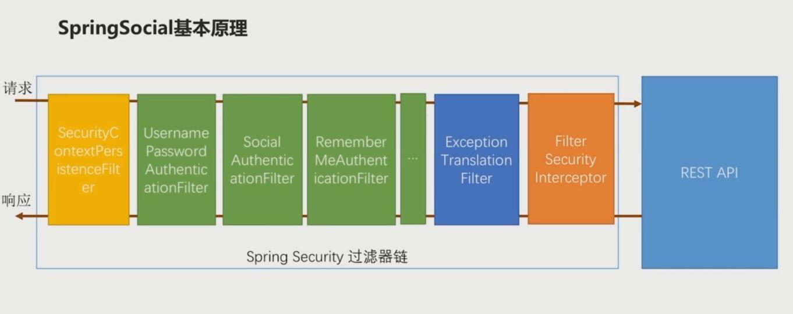
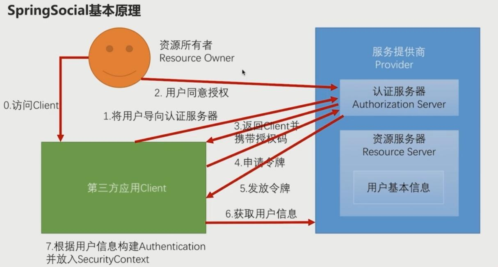
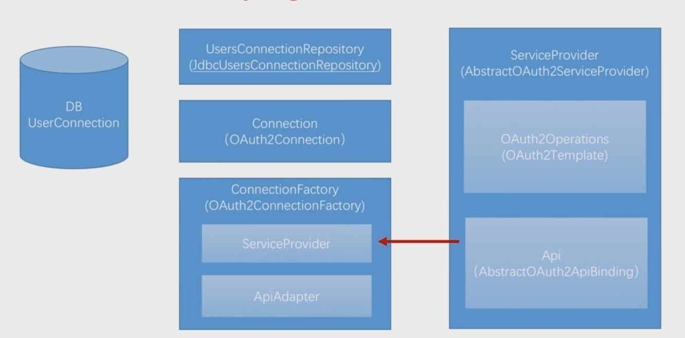
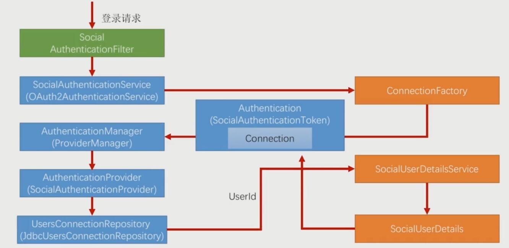

# SpringSocial简介
`SpringSocial`是基于`SpringSecurity`框架的，
它是在`SpringSecurity`的过滤器链中添加了`SocialAuthenticationFilter`过滤器，并使其生效，
`SpringSecurity`的基本原理在`SpringSocial`中也适用，只不过`SpringSocial`中有一些特定的实现。

## ⒈常用的pom依赖
```
<dependency>
    <groupId>org.springframework.social</groupId>
    <artifactId>spring-social-core</artifactId>
    <version>1.1.6.RELEASE</version>
</dependency>
```
## ⒉一些常用接口及实现

 <br/>
 <br/>
 <br/>
 <br/>

### 1.ServiceProvider =》AbstractOAuth2ServiceProvider

服务提供商抽象接口，针对每一个服务提供商，例如QQ、微信、微博等，都需要提供一个ServiceProvider实现。

SpringSocial给我们提供了一个AbstractOAuth2ServiceProvider抽象类，它帮我们实现了一些共有的东西，我们实现服务提供商的时候只需要继承这个抽象类就可以了。

### 2.OAuth2Operations =》 OAuth2Template

OAuth2Operations 接口封装了OAuth2协议的从①步到第⑤步，实际上OAuth2协议的第①步到第⑤步是一个标准的流程，第⑥步是一个个性化的流程，因为第⑥步每一个服务提供商所提供的用户信息数据结构是不一样的。SpringSocial给我们提供了一个OAuth2Operations标准的实现类OAuth2Template。

### 3.Api（SpringSocial没有提供，需要我们自己来写） =》 AbstractOAuth2ApiBinding

因为每一个服务提供商对用户基本信息的调用都是不同的，所以需要我们自己去写一个Api接口来封装获取用户信息（第⑥步）的方法。SpringSocial给我们提供了一个AbstractOAuth2ApiBinding抽象类来帮助我们更快的完成第⑥步的实现。

### 4.ConnectionFactory =》OAuth2ConnectionFactory

负责创建我们Connection实例，也就是包含前6步获取到的用户信息的对象。为了创建Connection实例，ConnectionFactory 需要系统前6步的流程，走前6步的流程就需要ServiceProvider，因此，ConnectionFactory包含着一个ServiceProvider实例，在开发中，我们需要调用ConnectionFactory的ServiceProvider实例来完成前6步的流程，将获取到的用户信息封装成一个Connection。

### 5.Connection =》 OAuth2Connection

封装我们前6步获取到的用户信息，由ConnectionFactory创建（一个连接工厂）。Connection 是一个固定的数据结构（字段名和字段都是固定的），每一个服务提供商的用户数据定义都是不一样的，我们需要通过ApiAdapter将每个服务商不一样的数据结构转化成Connection这样一个标准的数据结构。

### 6.ApiAdapter

顾名思义，就是在我们的Api接口和Connection接口之间做一个适配，将每个服务商不一样的数据结构转化成Connection这样一个标准的数据结构。

### 7.UsersConnectionRepository =》JdbcUsersConnectionRepository

将Connection 信息（即前6步获取到的用户信息）存储到数据库UserConnection表中。
