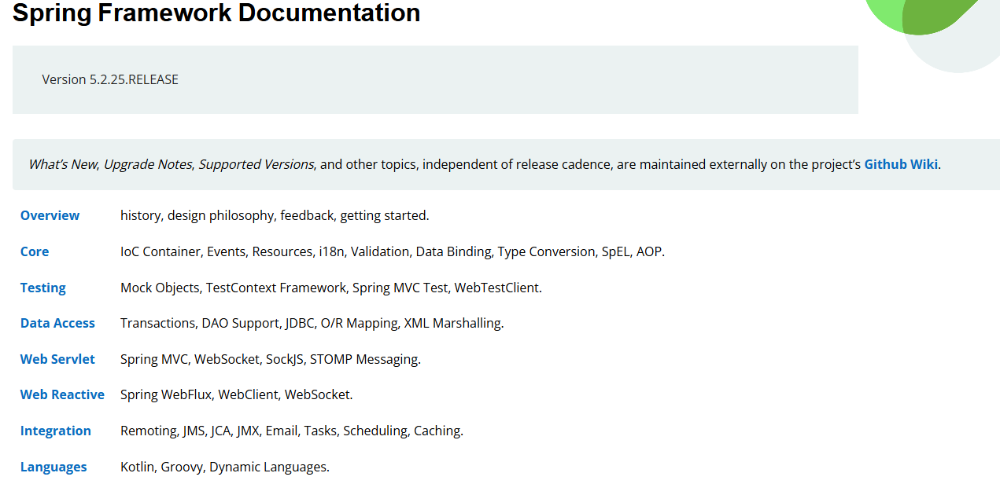
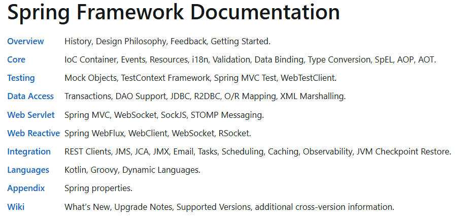

# Spring

`Spring`是⼀款开源的轻量级`Java`开发框架，旨在提⾼开发⼈员的开发效率以及系统的可维护性。

`Spring`框架指的是[`Spring Framework`](https://github.com/spring-projects/spring-framework)

项目地址：https://github.com/spring-projects/spring-framework

官网地址：https://spring.io/

## 
Spring特点

- 轻量：`Spring`是轻量的，基本的版本大约2MB。
- 控制反转：`Spring`通过控制反转实现了松散耦合，对象们给出它们的依赖，而不是创建或查找依赖的对象们。
- 面向切面的编程(`AOP`)：`Spring`支持面向切面的编程，并且把应用业务逻辑和系统服务分开。
- 容器：`Spring`包含并管理应用中对象的生命周期和配置。
- `MVC`框架：`Spring`的`WEB`框架是个精心设计的框架，是`Web`框架的一个很好的替代品。
- 事务管理：`Spring`提供一个持续的事务管理接口，可以扩展到上至本地事务下至全局事务（`JTA`，即`Java Transaction API`）。
- 异常处理：`Spring`提供方便的`API`把具体技术相关的异常（比如由`JDBC`，`Hibernate` or `JDO`抛出的）转化为一致的`unchecked`异常。

**最重要的一点使用的人多，生态完善！！！**

## 
Spring的核心组件

目前`Spring`框架已集成了`20`多个模块。这些模块主要被分如下图所示的核心容器、数据访问、集成、`Web`、`AOP`（面向切面编程）、工具、消息和测试模块。

下图取自spring4.3.30版本的：https://docs.spring.io/spring-framework/docs/4.3.30.RELEASE/spring-framework-reference/htmlsingle/#overview-modules

spring5.2.25版本：https://docs.spring.io/spring-framework/docs/5.2.25.RELEASE/spring-framework-reference/

spring6.1.x版本：https://docs.spring.io/spring-framework/reference/6.1-SNAPSHOT/

### `Core Container`
`Spring`框架的核⼼模块，也可以说是基础模块，主要提供`IoC`依赖注⼊功能的⽀持，`Spring`其他所有的功能基本都需要依赖于该模块。
- `spring-core`：`Spring`框架基本的核⼼⼯具类。
- `spring-beans`：提供对`bean`的创建、配置和管理等功能的⽀持。
- `spring-context`：提供对国际化、事件传播、资源加载等功能的⽀持。
- `spring-expression`：提供对表达式语⾔（`Spring Expression Language`）`SpEL`的⽀持，只依赖于`core`模块，不依赖于其他模块，可以单独使⽤。

### `AOP`
- `spring-aspects`：该模块为与`AspectJ`的集成提供⽀持。
- `spring-aop`：提供了⾯向切⾯的编程实现。
- `spring-instrument`：提供了为`JVM`添加代理（`agent`）的功能。
  具体来讲，它为`Tomcat`提供了⼀个织⼊代理，能够为`Tomcat`传递类⽂件，就像这些⽂件是被类加载器加载的⼀样。

### `Data Access/Integration`
- `spring-jdbc`：提供了对数据库访问的抽象`JDBC`。不同的数据库都有⾃⼰独⽴的`API`⽤于操作数据库，⽽`ava`程序只需要和`JDBC API`交互，这样就屏蔽了数据库的影响。
- `spring-tx`：提供对事务的⽀持。
- `spring-orm`： 提供对`Hibernate`、`JPA`、`iBatis`等`ORM`框架的⽀持。
- `spring-oxm`：提供⼀个抽象层⽀撑`OXM`(`Object-to-XML-Mapping`)，例如：`JAXB`、`Castor`、`XMLBeans`、`JiBX`和`XStream`等。
- `spring-jms`: 消息服务。⾃`Spring Framework 4.1`以后，它还提供了对`spring-messaging`模块的继承。

### `Spring Web`
- `spring-web`：对`Web`功能的实现提供⼀些最基础的⽀持。
- `spring-webmvc`： 提供对`Spring MVC`的实现。
- `spring-websocket`： 提供了对`WebSocket`的⽀持，`WebSocket`可以让客户端和服务端进⾏双向通信。
- `spring-webflux`：提供对`WebFlux`的⽀持。`WebFlux`是`Spring Framework 5.0`中引⼊的新的响应式框架。与`Spring MVC`不同，它不需要`Servlet API`，是完全异步。

### `Messaging`
- `spring-messaging`是从`Spring4.0`开始新加⼊的⼀个模块，主要职责是为`Spring`框架集成⼀些基础的报⽂传送应⽤。

### Spring Test
- `Spring`团队提倡测试驱动开发（`TDD`）。有了控制反转 (`IoC`)的帮助，单元测试和集成测试变得更简单。
- `Spring`的测试模块对`JUnit`（单元测试框架）、`TestNG`（类似`JUnit`）、`Mockito`（主要⽤来`Mock`对象）、
  `PowerMock`（解决`Mockito`的问题⽐如⽆法模拟`final`，`static`，`private`⽅法）等等常⽤的测试框架⽀持的都比较好。

## 
Spring的常用模块

### `Spring Core`
核心容器：核心容器提供`Spring`框架的基本功能。`Spring`以`bean`的方式组织和管理`Java`应用中的各个组件及其关系。
`Spring`使用`BeanFactory`来产生和管理`Bean`，它是工厂模式的实现。
`BeanFactory`使用控制反转(`IoC`)模式将应用的配置和依赖性规范与实际的应用程序代码分开

### `Spring Context`
应用上下文：是一个配置文件，向`Spring`框架提供上下文信息。`Spring`上下文包括企业服务，如：`JNDI`、`EJB`、电子邮件、国际化、校验和调度功能

### `Spring AOP`
面向切面编程：是面向对象编程的有效补充和完善，`Spring`的`AOP`是基于动态代理实现的，实现的方式有两种分别是`Schema`和`AspectJ`这两种方式

### `Spring Dao`
`JDBC`和`Dao`模块：`JDBC`、`DAO`的抽象层提供了有意义的异常层次结构，可用该结构来管理异常处理，和不同数据库供应商所抛出的错误信息。
异常层次结构简化了错误处理，并且极大的降低了需要编写的代码数量，比如打开和关闭链接

### `Spring ORM`
对象实体映射：`Spring`框架插入了若干个`ORM`框架，从而提供了`ORM`对象的关系工具，
其中包括了`Hibernate`、`JDO`和`IBatis SQL Map`等，所有这些都遵从`Spring`的通用事物和`DAO`异常层次结构。

### `Spring Web`
`Web`模块：`Web`上下文模块建立在应用程序上下文模块之上，为基于`web`的应用程序提供了上下文。
所以`Spring`框架支持与`Struts`集成，`web`模块还简化了处理多部分请求以及将请求参数绑定到域对象的工作

### `Spring Web MVC`
`MVC`模块：`MVC`框架是一个全功能的构建`Web`应用程序的`MVC`实现。通过策略接口，`MVC`框架变成为高度可配置的。
`MVC`容纳了大量视图技术，其中包括`JSP`、`POI`等，模型由`JavaBean`构成，存放于`m`当中，而视图是一个接口，负责实现模型，控制器表示逻辑代码，由`c`的事情。
`Spring`框架的功能可以用在任何`J2EE`服务器当中，大多数功能也适用于不受管理的环境。
`Spring`的核心要点就是支持不绑定到特定`J2EE`服务的可重用业务和数据的访问的对象，毫无疑问这样的对象可以在不同的`J2EE`环境，独立应用程序和测试环境之间重用。

## 
Spring框架使用的设计模式

- 简单工厂模式：`Spring`中的`BeanFactory`就是简单工厂模式的体现。
根据传入一个唯一的标识来获得`Bean`对象，但是在传入参数后创建还是传入参数前创建，要根据具体情况来定。

- 工厂模式：`Spring`中的`FactoryBean`就是典型的工厂方法模式，实现了`FactoryBean`接口的`bean`是一类叫做`factory`的`bean`。
其特点是，`spring`在使用`getBean()`调用获得该`bean`时，会自动调用该`bean`的`getObject()`方法，
所以返回的不是`factory`这个`bean`，而是这个`bean.getOjbect()`方法的返回值。

- 单例模式：在`spring`中用到的单例模式有：`scope="singleton"`，注册式单例模式，`bean`存放于`Map`中。`bean name`当做`key`，`bean`当做`value`。

- 原型模式：在`spring`中用到的原型模式有：`scope="prototype"`，每次获取的是通过克隆生成的新 实例，对其进行修改时对原有实例对象不造成任何影响。

- 迭代器模式：在`Spring`中有个`CompositeIterator`实现了`Iterator`，`Iterable`接口和`Iterator`接口，这两个都是迭代相关的接口。
可以这么认为，实现了`Iterable`接口，则表示某个对象是可被迭代的。
  - `Iterator`接口相当于是一个迭代器，实现了`Iterator`接口，等于具体定义了这个可被迭代的对象时如何进行迭代的。

- 代理模式：`Spring`中经典的`AOP`，就是使用动态代理实现的，分`JDK`和`CGlib`动态代理。

- 适配器模式：`Spring`中的`AOP`中`AdvisorAdapter`类，
  - 它有三个实现：`MethodBeforeAdviceAdapter`、`AfterReturningAdviceAdapter`、`ThrowsAdviceAdapter`。
  `Spring`会根据不同的`AOP`配置来使用对应的`Advice`，与策略模式不同的是，一个方法可以同时拥有多个`Advice`。
  `Spring`存在很多以`Adapter`结尾的，大多数都是适配器模式。

- 观察者模式：`Spring`中的`Event`和`Listener`。
  - `spring`事件：`ApplicationEvent`，该抽象类继承了`EventObject`类，`JDK`建议所有的事件都应该继承自`EventObject`。
  - `spring`事件监听器：`ApplicationListener`，该接口继承了`EventListener`接口，`JDK`建议所有的事件监听器都应该继承`EventListener`。

- 模板模式：`Spring`中的`org.springframework.jdbc.core.JdbcTemplate`就是非常经典的模板模式的应用，里面的`execute`方法，把整个算法步骤都定义好了。

- 责任链模式：`DispatcherServlet`中的`doDispatch()`方法中获取与请求匹配的处理器`HandlerExecutionChain`，`this.getHandler()`方法的处理使用到了责任链模式。

**注意：这里只是列举了部分设计模式，其实里面用到了还有享元模式、建造者模式等**

## 
Spring常用的注解

### `@Controller`注解
是在`Spring`的`org.springframework.stereotype`包下，`org.springframework.stereotype.Controller`注解类型用于指示`Spring`类的实例是一个控制器
使用`@Controller`注解的类不需要继承特定的父类或者实现特定的接口，相对之前的版本实现`Controller`接口变的更加简单。

而`Controller`接口的实现类只能处理一个单一的请求动作，而`@Controller`注解注解的控制器可以同时支持处理多个请求动作，使程序开发变的更加灵活。
`@Controller`用户标记一个类，使用它标记的类就是一个`Spring MVC Controller`对象，即：一个控制器类。
`Spring`使用扫描机制查找应用程序中所有基于注 解的控制器类，分发处理器会扫描使用了该注解的方法，并检测该方法是否使用了`@RequestMapping`注解，而使用`@RequestMapping`注解的方法才是真正处理请求的处理器。

### `@RestController`注解
`@RestController`注解是`@Controller`和`@ResponseBody`注解的组合注解，

### `@ResponseBody`
注解实现将`controller`方法返回对象转化为`json`对象响应给客户。

### `@RequestMapping`
用于处理请求`url`映射的注解，可用于类或方法上。用于类上，则表示类中的所有响应请求的方法都是以该地址作为父路径。

### `@RequestBody`
注解实现接收`http`请求的`json`数据，将`json`转换为`java`对象。

### `@RequestParam`
该注解类型用于将指定的请求参数赋值给方法中的形参。

它有4种属性
- `name`属性该属性的类型是`String`类型，它可以指定请求头绑定的名称；
- `value`属性该属性的类型是`String`类型，它可以设置是`name`属性的别名；
- `required`属性该属性的类型是`boolean`类型，它可以设置指定参数是否必须绑定；
- `defaultValue`属性该属性的类型是`String`类型，它可以设置如果没有传递参数可以使用默认值。

### `@RequestHeader`
该注解类型可以把`Request`请求中`Header`中的参数绑定到方法参数上。

### `@PathVariable`
该注解类型可以非常方便的获得请求`url`中的动态参数。

`@PathVariable`注解只支持一个属性`value`，类型`String`，表示绑定的名称，如果省略则默认绑定同名参数。

### `@Component`
泛指某一个组件，当组件不好归类的时候，可以使用这个注解进行标注。

### `@Service`
用于标注业务层组件。

### `@Repository`
用于标注`dao`层组件，以便于Spring管理这些类的实例，并且可以方便地进行事务管理。

现在基本不适用此注解，通常使用`mybatis`的`@Mapper`注解。

### `@Valid`和`@Validated`
参数前面加上`@Valid`注解，表示我们对这个对象属性需要进行验证。
`@Validated`是在`@Valid`基础上，做的一个升级版。

### `@Autowired`和`@Resource`
`@Autowired`通过类型来实现自动注入`bean`。
和`@Qualifier`注解配合使用可以实现根据`name`注入`bean`。

`@Resource`根据`name`注入`bean`的，可以通过设置类型来实现通过类型来注入。

| 对比项  | `@Autowire`       | `@Resource`   |
|------|-------------------|---------------|
| 注解来源 | `Spring`注解        | `JDK`注解       |
| 装配方式 | 优先按类型             | 优先按名称         |
| 属性   | `required`        | `name`、`type` |
| 作用范围 | 字段、`setter`方法、构造器 | 字段、`setter`方法 |

----
