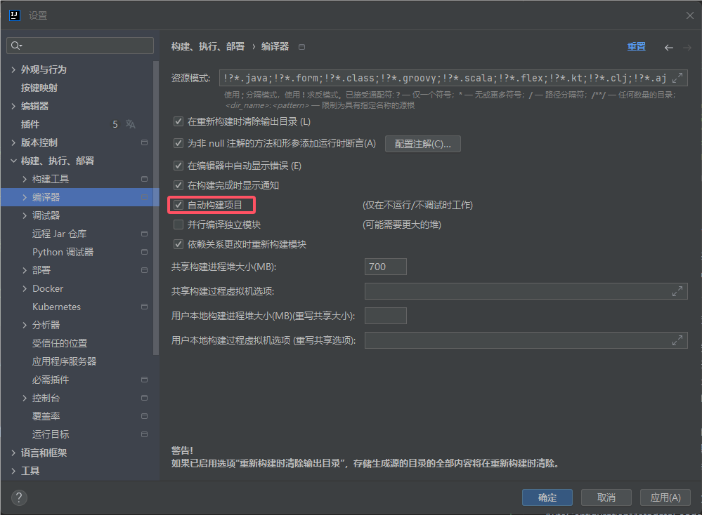
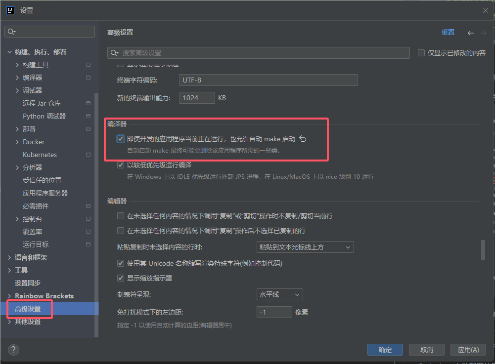

# `Spring Boot`

`Spring Boot` 是由`Pivotal`团队提供的全新框架，其设计目的是用来简化新`Spring`应用的初始搭建以及开发过程。
该框架使用了特定的方式来进行配置，从而使开发人员不再需要定义样板化的配置。
通过这种方式，`Spring Boot`致力于在蓬勃发展的快速应用开发领域(`rapid application development`)成为领导者。 

### <div id="td">其特点如下：</div>
- 创建独立的`Spring`应用程序
- 嵌入的`Tomcat`，无需部署`WAR`文件
- 简化`Maven`配置
- 自动配置`Spring`
- 提供生产就绪型功能，如指标，健康检查和外部配置
- 没有代码生成和对`XML`没有要求配置

### <div id="ydyypz">`Spring Boot`约定优于配置</div>
`Spring Boot Starter`、`Spring Boot Jpa`都是**约定优于配置**的一种体现。
都是通过**约定优于配置**的设计思路来设计的，`Spring Boot Starter`在启动的过程中会根据约定的信息对资源进行初始化；
`Spring Boot Jpa`通过约定的方式来自动生成`Sql`，避免大量无效代码编写。

### <div id="cshhjbl">`Spring Boot`初始化环境变量</div>
- 调用`prepareEnvironment`方法去设置环境变量
- `getOrCreateEnvironment`去初始化系统环境变量
- `configureEnvironment`去初始化命令行参数
- `environmentPrepared`当广播到来的时候调用`onApplicationEnvironmentPreparedEvent`方法
  - 去使用`postProcessEnvironment`方法`load yml`和`properties`变量

### <div id="smlc">`Spring Boot`扫描流程</div>
- 调用`run`方法中的`refreshContext`方法
- 调用`AbstractApplicationContext`中的`refresh`方法
- 委托给`invokeBeanFactoryPostProcessors`去处理调用链
- 其中一个方法`postProcessBeanDefinitionRegistry`会去调用`processConfigBeanDefinitions`解析`beanDefinitions`
- 在`processConfigBeanDefinitions`中有一个`parse`方法，其中有`componentScanParser.parse`的方法，这个方法会扫描当前路径下所有`Component`组件

### <div id="pzjzsx">`Spring Boot`配置加载顺序</div>
使用`Spring Boot`会涉及到各种各样的配置，如开发、测试、线上就至少 3 套配置信息了。

`Spring Boot`可以轻松的帮助我们使用相同的代码就能使开发、测试、线上环境使用不同的配置。

在`Spring Boot`里面，可以使用以下几种方式来加载配置：

- properties文件；
- YAML文件；
- 系统环境变量；
- 命令行参数；
- ……

**配置属性加载的顺序如下：**

- 开发者工具 `Devtools` 全局配置参数；
- 单元测试上的 `@TestPropertySource` 注解指定的参数；
- 单元测试上的 `@SpringBootTest` 注解指定的参数；
- 命令行指定的参数，如 `java -jar springboot.jar --name="HaoHaoDaYouXi"`；
- 命令行中的 `SPRING_APPLICATION_JSONJSON` 指定参数, 如 `java -Dspring.application.json='{"name":"HaoHaoDaYouXi"}' -jar springboot.jar`
- `ServletConfig` 初始化参数；
- `ServletContext` 初始化参数；
- JNDI参数（如 `java:comp/env/spring.application.json`）；
- Java系统参数（来源：`System.getProperties()`）；
- 操作系统环境变量参数；
- `RandomValuePropertySource` 随机数，仅匹配：`ramdom.*`；
- JAR包外面的配置文件参数（`application-{profile}.properties（YAML）`）
- JAR包里面的配置文件参数（`application-{profile}.properties（YAML）`）
- JAR包外面的配置文件参数（`application.properties（YAML）`）
- JAR包里面的配置文件参数（`application.properties（YAML）`）
- `@Configuration`配置文件上 `@PropertySource` 注解加载的参数；
- 默认参数（通过 `SpringApplication.setDefaultProperties` 指定）；

**数字小的优先级越高，即数字小的会覆盖数字大的参数值**

### <div id="pzjzsx">`Spring Boot`多套不同环境配置</div>

- `application.properties`
- `application-dev.properties`
- `application-test.properties`
- `application-prod.properties`

然后在`application.properties`文件中指定当前的环境`spring.profiles.active=test`,这时候读取的就是`application-test.properties`文件，`yaml`文件是同理。

### <div id="hxpzwj">`Spring Boot`核心配置文件</div>
`Spring Boot`的核心配置文件是`application`和`bootstrap`配置文件。
- `application`配置文件主要用于`Spring Boot`项目的自动化配置。
- `bootstrap`配置文件有以下几个应用场景。
  - 使用`Spring Cloud Config`配置中心时，这时需要在`bootstrap`配置文件中添加连接到配置中心的配置属性来加载外部配置中心的配置信息；
  - 一些固定的不能被覆盖的属性；
  - 一些加密/解密的场景；

### <div id="hxzj">`Spring Boot`核心注解</div>
启动类上面的注解是`@SpringBootApplication`，它也是`Spring Boot`的核心注解，

主要组合包含了以下`3`个注解：
- `@SpringBootConfiguration`：组合了`@Configuration`注解，实现配置文件的功能。
- `@EnableAutoConfiguration`：打开自动配置的功能，也可以关闭某个自动配置的选项，如关闭数据源自动配置功能：`@SpringBootApplication(exclude = { DataSourceAutoConfiguration.class })`。
- `@ComponentScan`：`Spring`组件扫描。

### <div id="sxlbs">`Spring Boot`实现热部署</div>
主要有两种方式：
- `Spring Loaded`
- `Spring-boot-devtools`

#### 热部署的实现原理
深层原理是使用了两个`ClassLoader`，
一个`Classloader`加载那些不会改变的类（第三方`Jar`包），
另一个`ClassLoader`加载会更改的类，称为`restart ClassLoader`,

这样在有代码更改的时候，原来的`restart ClassLoader`被丢弃，
重新创建一个`restart ClassLoader`，由于需要加载的类相比较少，所以实现了较快的重启时间。

#### `Spring Loaded`
`Spring Loaded`是一个`JVM`的代理，用于运行时的加载类进行一个更新和修改，`Spring Loaded`是先运行已经改变的`Class`然后在适当的时候进行一个重新加载过程。

`Spring Loaded`允许您添加/修改/删除方法/字段/构造函数。 类型/方法/字段/构造函数上的注释也可以修改，并且可以在枚举类型中添加/删除/更改值。

`Spring Loaded`可用于可能在`JVM`上运行的任何字节码，实际上是`Grails 2`中使用的重新加载系统。

在`Tomcat`运行参数添加：`-javaagent:springloaded-1.2.8.RELEASE.jar -noverify`

#### `Spring-boot-devtools`

**引入`devtools`依赖**

在你的`pom.xml`配置文件中，引入`devtools`依赖包：
```xml
<dependency>
    <groupId>org.springframework.boot</groupId>
    <artifactId>spring-boot-devtools</artifactId>
    <version>3.3.0</version>
    <optional>true</optional>
</dependency>
```
**设置`optional`为`true`，是避免父子项目依赖继承冲突。**

**`yml`文件`devtools`的配置**

```yml
spring:
  devtools:
    restart:
      #是否开启DevTools自动重启功能，默认为true
      enabled: true 
      # 配置触发重启的文件路径，多个路径使用逗号分隔，默认为src/main/java,src/main/resources
      additional-paths: 'src/main/java,src/main/resources'
      # 配置触发重启的文件扩展名，默认为.trigger
      trigger-file: '.trigger'
      # 配置重启时需要排除的文件路径，多个路径使用逗号分隔，默认为META-INF/maven, META-INF/resources, resources, static, public, templates
      exclude: 'WEB-INF/**,META-INF/**,resources/**,static/**,public/**,templates/**'
```

**`Intellij Idea`修改**

如果你是使用的idea工具开发，那你还需要改以下两个地方：

`IDEA`中开启自动编译的配置


2021版之后的`IDEA`的`compiler.automake.allow.when.app.running`转移了

打开 设置 -> 高级配置



2021版之前的`IDEA`的，打开`Idea`注册表`Shift + Ctrl + Alt + /`，找到`compiler.automake.allow.when.app.running`勾选配置。


----


----
