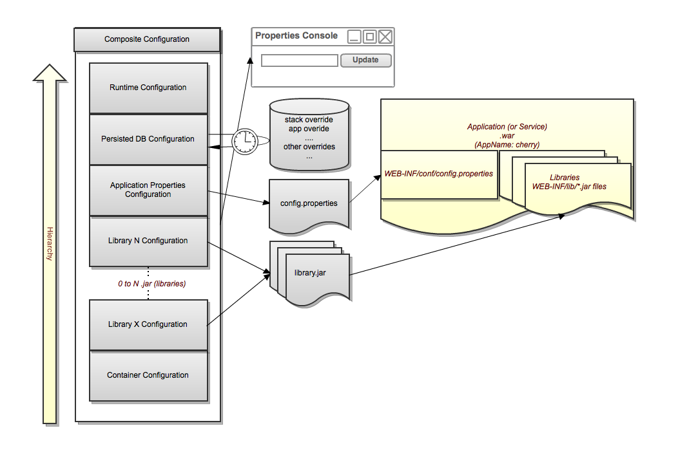

# Archaius

`Archaius`是一个提供获取可以运行时动态改变的属性的`API`的`Java`类库，它主要实现为`Apache Commons Configuration`库的扩展。

## Archaius特性

### 1. 动态属性
- 可以使用简洁的代码去动态获取类型特定的属性
- 可以对某个属性发生修改之后创建`callback`
```java
DynamicIntProperty prop = DynamicPropertyFactory.getInstance().getIntProperty("myProperty", DEFAULT_VALUE);
// prop.get() may change value at runtime
myMethod(prop.get());

// 创建callback
prop.addCallback(new Runnable() {
  public void run() {
      // ...
  }
});
```

### 2. 循环读取配置源数据信息

`DynamicPropertyFactory`将会按照一定的间隔（默认`1`分钟）取获取类路径下或者通过参数指定的`url`的配置，实现动态更新

我们可以实现相关的接口来自定义数据源、定时加载更新逻辑等
```java
PolledConfigurationSource source = createMyOwnSource();
AbstractPollingScheduler scheduler = createMyOwnScheduler();
ConfigurationManager.install(new DynamicConfiguration(source, scheduler));
```

### 3. 完成对部分配置源的实现

- 完成`JDBC`、`DynamoDB`、`Zookeeper`等数据源的实现，开箱即用
- 可以自定义配置源，参考：[官方文档](https://github.com/Netflix/archaius/wiki/Users-Guide)

### 4. 配置和发布上下文管理

- `com.netflix.config.ConfigurationManager`是用来管理全系统配置的管理器
- 它是`archaius`的核心处理类，后面的自定义配置源加载也需要经过这个类

### 5. 高吞吐且线程安全的获取配置

### 6. 支持scala

## 简易混合配置架构

- `archaius`核心概念是混合配置，能够维护一到多个配置源，如`JDBC`、`REST`、本地配置、`Zookeeper`、容器配置等
- 当某个配置在多个配置源中都存在时，那么最终生效的配置优先级取决于下图的层级顺序；比如在数据库中配置了属性`A`（`value=1`），`config.properties`中也配置属性`A`（`value=2`），那么从架构图上看，最终生效的是`value=1`

架构图：


## 使用Archaius配置

### `Maven`依赖
```xml
<dependency>
    <groupId>com.netflix.archaius</groupId>
    <artifactId>archaius-core</artifactId>
</dependency>
```

### 使用本地文件作为配置源

- 默认`archaius`可以会使用类路径下的`config.properties`文件作为配置源
- `jar`中的`config.properties`也会作为配置源，不过这个优先级比当前工程类路径的低
- 也可以在类路径下配置`config.properties`，通过获取配置方式来动态获取配置

### 使用外部的URLS作为配置源

可以使用如下配置来指定配置源，它的优先级高于`config.properties`
```properties
-Darchaius.configurationSource.additionalUrls=http://myserver/properties
```

### `archaius`的默认配置参数

- `archaius.configurationSource.defaultFileName`，默认值`config.properties`，表示本地配置文件名
- `archaius.fixedDelayPollingScheduler.initialDelayMills`，默认`30000`，表示初始化时拉取配置的延迟时间
- `archaius.fixedDelayPollingScheduler.delayMills`，默认`60000`，表示定时拉取配置的间隔时间

可以通过系统参数对这三个参数进行重置

### 使用配置

```java
// 推荐使用这种方式获取属性
System.out.println(DynamicPropertyFactory.getInstance()
                .getStringProperty("test.archaius", "fail").get());

System.out.println(DynamicProperty.getInstance("test.archaius").getString());
```

### 总结

- `ConfigurationManager`时`archaius`用来管理所有配置的管理器，包括管理系统、`dynamicUrl`、环境、自定义的配置源等的配置
- `ConfigurationManager`是通过实例化一个`CompositionConfiguration`来进行管理的
- 我们可以通过`ConfigurationManager.getConfigInstance()`获取一个系统全局的配置，包含了所有层级的配置数据

----
