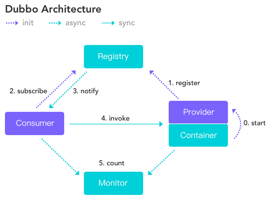
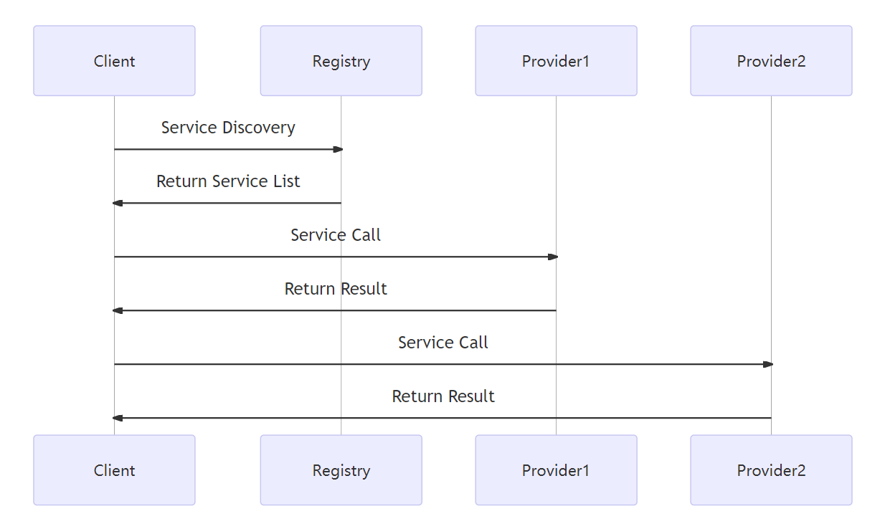

# Dubbo

`Dubbo`是阿里巴巴开源的基于`Java`的高性能`RPC`分布式服务框架，现已成为`Apache`基金会孵化项目。

地址：https://cn.dubbo.apache.org/zh-cn/

## <a id="lct">服务注册与发现的流程图</a>

下图来自`Dubbo`官网

## <a id="jdjs">Dubbo节点角色</a>

| 节点        | 角色说明                |
|-----------|---------------------|
| Provider  | 暴露服务的服务提供方          |
| Consumer  | 调用远程服务的服务消费方        |
| Registry  | 服务注册与发现的注册中心        |
| Monitor   | 统计服务的调用次数和调用时间的监控中心 |
| Container | 服务运行容器              |

## <a id="fwzl">`Dubbo` 服务治理</a>
`Dubbo`服务治理是一种服务管理和协调的解决方案，它主要是为分布式系统提供服务管理、服务调度、服务监控、服务负载均衡等功能。

`Dubbo`服务治理可以有效地管理和调度分布式系统中的服务，通过提供丰富的管理工具可以方便地实现服务的监控、调度和负载均衡等功能。
在分布式系统中，`Dubbo`服务治理可以提供一种方式，让不同的应用程序通过调用远程服务实现互联互通。

以下是一个简单的`Dubbo`服务治理的时序图，展示了`Dubbo`服务注册、发现和调用的过程：

在这个时序图中，`Client`是服务的消费者，`Registry`是服务注册中心，`Provider1`和`Provider2`是服务的提供者。

整个过程分为三个步骤：
- 服务发现：`Client`向`Registry`发起服务发现请求，`Registry`返回可用的服务列表。
- 服务调用：
  - `Client`向`Provider1`发起服务调用请求，`Provider1`返回结果。
  - `Client`向`Provider2`发起服务调用请求，`Provider2`返回结果。
- 结果返回：`Provider1`和`Provider2`返回结果给`Client`。

`Dubbo`服务治理的重要性在于，它可以帮助开发人员管理和协调不同的服务和组件，并确保服务的可用性和可靠性。
通过`Dubbo`服务治理，开发团队可以通过一个单一的入口管理所有服务，这对于大规模分布式服务的管理非常重要。

## <a id="zcxy">`Dubbo`支持的协议</a>

- `dubbo`(推荐使用的协议)：单一长连接和`NIO`异步通讯，适合大并发小数据量的服务调用，以及消费者远大于提供者。传输协议`TCP`，异步，`Hessian`序列化
  - 优点：支持异步通信，性能较高。
  - 缺点：只能在`Java`环境下使用。

- `hessian`：集成`Hessian`服务，基于`HTTP`通讯，采用`Servlet`暴露服务，`Dubbo`内嵌`Jetty`作为服务器时默认实现，提供与`Hessian`服务互操作。
  多个短连接，同步`HTTP`传输，`Hessian`序列化，传入参数较大，提供者大于消费者，提供者压力较大，可传文件
  - 优点：采用二进制序列化，传输效率高。
  - 缺点：只能在`Java`环境下使用

- `rmi`：采用`JDK`标准的`RMI`协议实现，传输参数和返回参数对象需要实现`Serializable`接口，
  使用`java`标准序列化机制，使用阻塞式短连接，传输数据包大小混合，消费者和提供者个数差不多，可传文件，传输协议`TCP`。
  多个短连接，`TCP`协议传输，同步传输，适用常规的远程服务调用和`rmi`互操作。
  在依赖低版本的`Common-Collections`包，`java`序列化存在安全漏洞
  - 优点：使用`JDK`标准的`RMI`协议，易于使用。
  - 缺点：只能在`Java`环境下使用。

- `http`：基于`Http`表单提交的远程调用协议，使用`Spring`的`HttpInvoke`实现。多个短连接，传输协议`HTTP`，传入参数大小混合，
  提供者个数多于消费者，需要给应用程序和浏览器`JS`调用。
  - 优点：支持跨语言调用，使用方便。
  - 缺点：传输效率相对较低。

- `webservice`：基于`WebService`的远程调用协议，集成`CXF`实现，提供和原生`WebService`的互操作。
  多个短连接，基于`HTTP`传输，同步传输，适用系统集成和跨语言调用
  - 优点：采用SOAP协议，支持跨语言调用。
  - 缺点：传输效率相对较低。

- `GRPC`：`GRPC`是谷歌开源的基于`HTTP2`的通信协议，支持多种编程语言，包括`C++`，`Java`，`Python`，`Go`等，适用于各种语言环境下的服务调用。
  - 优点：使用`HTTP2`协议，显著降低带宽消耗和提高性能。
  - 缺点：尚未提供连接池，基于`HTTP2`，绝大部多数`HTTP Server`、`Nginx`都尚不支持。

- `memcache`：基于`memcached`实现的`RPC`协议

- `redis`：基于`redis`实现的`RPC`协议

## <a id="xlhkj">`Dubbo`序列化框架</a>

默认使用`Hessian`序列化，还有`Duddo`、`FastJson`、`Java`自带序列化。

`Hessian`是一个采用二进制格式传输的服务框架，相对传统更轻量、更快速。

### <a id="Hessian">`Hessian`原理与协议</a>

`HTTP`的协议约定了数据传输的方式，`Hessian`无法改变太多

- `Hessian`中`client`与`server`的交互，基于`HTTP-POST`方式。
- `Hessian`将辅助信息，封装在`HTTP Header`中，比如`授权token`等，我们可以基于`http-header`来封装关于`安全校验`、`meta数据`等。`Hessian`提供了简单的`校验`机制。
- 对于`Hessian`的交互核心数据，比如`调用的方法`和参数列表信息，将通过`POST`请求的`body`体直接发送，格式为字节流。
- 对于`Hessian`的`server`端响应数据，将在`response`中通过字节流的方式直接输出。
  `Hessian`的协议本身并不复杂，所谓协议(`protocol`)就是约束数据的格式，
  `client`按照协议将请求信息序列化成字节序列发送给`server`端，
  `server`端根据协议，将数据反序列化成`对象`，然后执行指定的方法，
  并将方法的返回值再次按照协议序列化成字节流，响应给`client`，
  `client`按照协议将字节流反序列话成`对象`。

`Hessian`的对象序列化机制有8种原始类型:

- 原始二进制数据
- `boolean`
- `64-bit date`(64位毫秒值的日期)
- `64-bit double`
- `32-bit int`
- `64-bit long`
- `enull`
- `UTF-8`编码的`string`

另外还包括`3`种递归类型:

- `list for lists and arrays`
- `map for maps and dictionaries`
- `object for objects`

还有一种特殊的类型:

- `ref`：用来表示对共享对象的引用。

### <a id="PB">`PB`</a>

`PB`是指`Protocol Buffer`是`Google`出品的一种轻量并且高效的结构化数据存储格式，性能比`JSON`、`XML`要高很多。

`PB`之所以性能如此好，主要得益于两个：
- 它使用`proto`编译器，自动进行序列化和反序列化，速度非常快，应该比`XML`和`JSON`快上了`20~100`倍；
- 它的数据压缩效果好，就是说它序列化后的数据量体积小。因为体积小，传输起来带宽和速度上会有优化。

##  Dubbo 核心的配置

| 配置                | 说明     | 描述                                             |
|-------------------|--------|------------------------------------------------|
| dubbo:service     | 服务配置   | 暴露服务，定义服务的元信息，服务可以多协议暴露也可以注册到多个注册中心            |
| dubbo:reference   | 引用配置   | 创建远程服务代理，可以指向多个注册中心                            |
| dubbo:protocol    | 协议配置   | 配置提供服务的协议信息，协议由提供方指定，消费方被动获取                   |
| dubbo:application | 应用配置   | 配置当前应用信息                                       |
| dubbo:module      | 模块配置   | 配置当前模块信息                                       |
| dubbo:registry    | 注册中心配置 | 配置注册中心信息                                       |                             
| dubbo:monitor     | 监控中心配置 | 配置监控中心信息                                       |
| dubbo:provider    | 提供方配置  | 当ProtocolConfig和ServiceConfig某一个配置没有配置时，使用此配置的 |
| dubbo:consumer    | 消费方配置  | 当RegistryConfig某一个配置没有配置时，使用此配置的               |
| dubbo:method      | 方法配置   | ServiceConfig和RegistryConfig 指定方法级的配置          |
| dubbo:argument    | 参数配置   | 指定方法参数配置                                       |
